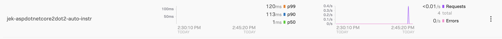
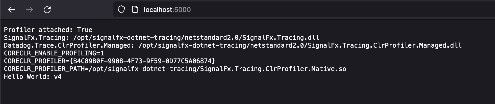

Steps:

1. Use Visual Studio 2019 to create an empty project for .NET Core 2.2 with the name aspdotnetcore2dot2-auto-instr by selecting New > App > ASP.NET Core > Empty

2. Open terminal and run dotnet run

3. Test that it is working by navigating to `http://localhost:5000/`

4. Use Visual Studio 2019 to auto generate a Dockerfile by right clicking on Project Name > Add > Add Docker Support It would generate a Dockerfile like below
```
FROM mcr.microsoft.com/dotnet/core/aspnet:2.2.8 AS base
WORKDIR /app
EXPOSE 80

FROM mcr.microsoft.com/dotnet/core/sdk:2.2.207 AS build
WORKDIR /src
COPY ["aspdotnet2dot2-auto-instr.csproj", "."]
RUN dotnet restore "./aspdotnet2dot2-auto-instr.csproj"
COPY . .
WORKDIR "/src/."
RUN dotnet build "aspdotnet2dot2-auto-instr.csproj" -c Release -o /app/build

FROM build AS publish
RUN dotnet publish "aspdotnet2dot2-auto-instr.csproj" -c Release -o /app/publish

FROM base AS final
WORKDIR /app
COPY --from=publish /app/publish .
ENTRYPOINT ["dotnet", "aspdotnet2dot2-auto-instr.dll"]

```

5. Open termanal and run the build command arguments:
- Name the image aspdotnetcore3dot1.
- Look for the Dockerfile in the current folder (the period at the end) as per https://docs.microsoft.com/en-us/aspnet/core/host-and-deploy/docker/building-net-docker-images?view=aspnetcore-3.1
- Run without taking from cache
`docker build -t jekbao/aspdotnetcore2dot2 . --no-cache`

6. The run command arguments:
    Allocate a pseudo-TTY and keep it open even if not attached. (Same effect as --interactive --tty.)
    Automatically remove the container when it exits.
    Map port 5000 on the local machine to port 80 in the container.
    Name the container aspnetcore_sample.
    Specify the aspnetapp image.

`docker run -it --rm -p 5000:80 --name jek_aspnetcore2dot2 jekbao/aspdotnetcore2dot2`

7. Download CLRProfiler from https://github.com/signalfx/signalfx-dotnet-tracing/releases/latest

8. In Dockerfile add the CLRProfiler by copying the distribution into container Note: Take note of the version e.g. signalfx-dotnet-tracing_0.1.xxxxxxx_amd64.deb
```
WORKDIR /app
COPY signalfx-dotnet-tracing* .
RUN dpkg -i signalfx-dotnet-tracing_0.XXXXXXXXXXXXXXXXXXXXXXX_amd64.deb
RUN mkdir /opt/tracelogs
COPY --from=publish /app/publish .
ENTRYPOINT ["dotnet", "aspdotnet2dot2-auto-instr.dll"]
```

9. Add code to print if profiler is attached 

10. Update the version in the return route of hello world e.g. Hello World v1 v2 v3 etc...

11. Build the image `docker build -t jekbao/aspdotnetcore2dot2 . --no-cache`

12. Add environment variables to config for sending DIRECTLY to Splunk O11y without going through OTel Collector
```
docker run -it --rm \
-e SIGNALFX_SERVICE_NAME=jek-aspdotnetcore2dot2-auto-instr \
-e SIGNALFX_ENDPOINT_URL=https://ingest.<the realm>.signalfx.com/v2/trace \
-e SIGNALFX_ACCESS_TOKEN=<the token> \
-e SIGNALFX_ENV=jek-playground-env \
-e CORECLR_ENABLE_PROFILING=1 \
-e CORECLR_PROFILER="{B4C89B0F-9908-4F73-9F59-0D77C5A06874}" \
-e CORECLR_PROFILER_PATH=/opt/signalfx-dotnet-tracing/SignalFx.Tracing.ClrProfiler.Native.so \
-e SIGNALFX_INTEGRATIONS=/opt/signalfx-dotnet-tracing/integrations.json \
-e SIGNALFX_DOTNET_TRACER_HOME=/opt/signalfx-dotnet-tracing \
-e SIGNALFX_PROPAGATOR=W3C \
-e SIGNALFX_TRACE_DEBUG=true \
-e SIGNALFX_STDOUT_LOG_ENABLED=true \
-p 5000:80 --name jek_aspdotnetcore2dot2 jekbao/aspdotnetcore2dot2
```

Misc

- Proof: 

- Proof 2: 
