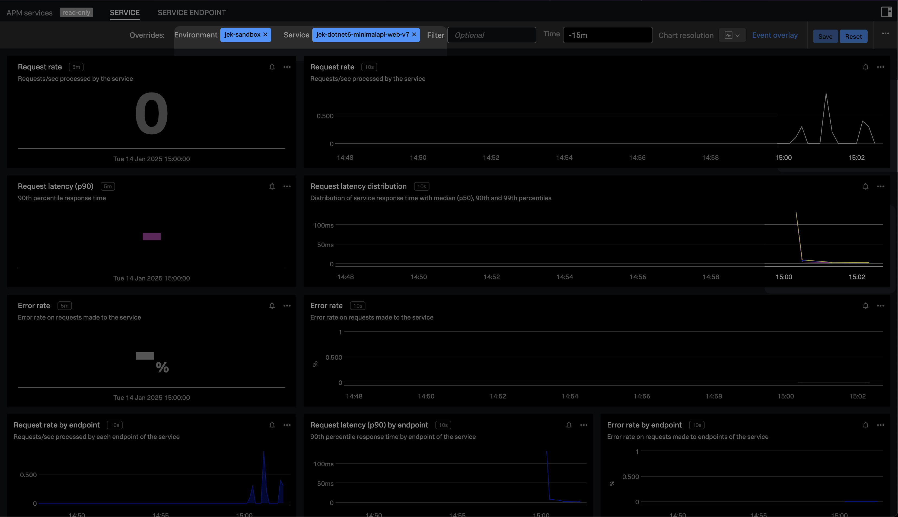

# .NET Development Setup Guide

This guide provides comprehensive instructions for setting up a .NET development environment and creating API projects using different approaches.

## Prerequisites

### .NET SDK Installation

1. Download the .NET 6.0.428 SDK from https://dotnet.microsoft.com/en-us/download/dotnet/6.0

In the folder with global.json run `dotnet --version` to check that the version is 6.0.428.

 Minimal APIs

Minimal APIs provide a streamlined approach ideal for microservices and small applications. They offer a simplified architecture with reduced boilerplate code.

**Documentation:**
https://learn.microsoft.com/en-us/aspnet/core/tutorials/min-web-api?view=aspnetcore-6.0&tabs=visual-studio-code

1. `dotnet new web -o jek-dotnet6-minimalapi-web`

2. Navigate to the project directory:
   ```
   cd jek-dotnet6-minimalapi-web
   ```

3. Configure HTTPS certificate:
   ```
   dotnet dev-certs https --trust
   ```

4. Add NuGets
```
dotnet add package Microsoft.EntityFrameworkCore.InMemory --version 6.0.28
dotnet add package Microsoft.AspNetCore.Diagnostics.EntityFrameworkCore --version 6.0.28
dotnet add package Splunk.OpenTelemetry.AutoInstrumentation --version 1.8.0
dotnet list package
```

It is very important to add `Splunk.OpenTelemetry.AutoInstrumentation --version 1.8.0`

```
dotnet clean


dotnet restore


dotnet build


dotnet list package
```

5. Run the application:
   ```
   dotnet run
   ```

6. Another terminal to test it:
```
curl http://localhost:<the port number>
```

## Building the Application
In the folder of jek-dotnet6-minimalapi-web run
```
docker build -t jek-dotnet6-minimalapi-web:7.0 .
```

```
docker run -d -p 8080:80 --name jek-dotnet6-minimalapi-web-container jek-dotnet6-minimalapi-web:7.0
```

Test it
```
curl http://localhost:8080
```

## Push the Image to a Docker Registry
```
docker tag jek-dotnet6-minimalapi-web:7.0 jchoo/jek-dotnet6-minimalapi-web:7.0
```

```
docker push jchoo/jek-dotnet6-minimalapi-web:7.0
```

## Kubernetes Deployment

This approach uses a custom deployment configuration in a YAML file. You can use any Kubernetes cluster (local, EKS, AKS, GKE, etc.).

1. Install the Splunk OTel Collector Chart:
   https://github.com/signalfx/splunk-otel-collector-chart

2. Deploy the application:
   ```
   kubectl apply -f deployment-miniapi-with-agent.yaml
   ```

3. Set up port forwarding:
   ```
   kubectl port-forward deployment/jek-dotnet6-minimalapi-web 3009:80
   ```

4. Test the deployment:
   ```
   # Test general endpoint
   curl http://localhost:3009

   # View deployment logs
   kubectl logs deployment/jek-dotnet6-minimalapi-web

   # Check out the logs
   kubectl exec --stdin --tty deploy/jek-dotnet6-minimalapi-web -- /bin/bash

   cd /var/log/opentelemetry/dotnet

   ls

   # then cat the logs   
   ```



# Troubleshooting
If you run into problem such as Assembly version conflict issue:

https://docs.splunk.com/observability/en/gdi/get-data-in/application/otel-dotnet/troubleshooting/common-dotnet-troubleshooting.html#assembly-version-conflicts and https://github.com/open-telemetry/opentelemetry-dotnet-instrumentation/blob/main/docs/troubleshooting.md#assembly-version-conflicts

```
File name: 'System.Diagnostics.DiagnosticSource, Version=8.0.0.0, Culture=neutral, PublicKeyToken=cc7b13ffcd2ddd51'
   --- End of inner exception stack trace ---
   at System.RuntimeMethodHandle.InvokeMethod(Object target, Span`1& arguments, Signature sig, Boolean constructor, Boolean wrapExceptions)
   at System.Reflection.RuntimeMethodInfo.Invoke(Object obj, BindingFlags invokeAttr, Binder binder, Object[] parameters, CultureInfo culture)
   at System.Reflection.MethodBase.Invoke(Object obj, Object[] parameters)
   at OpenTelemetry.AutoInstrumentation.Loader.Loader.TryLoadManagedAssembly() in /_/src/OpenTelemetry.AutoInstrumentation.Loader/Loader.cs:line 59
   at OpenTelemetry.AutoInstrumentation.Loader.Loader..cctor() in /_/src/OpenTelemetry.AutoInstrumentation.Loader/Loader.cs:line 35
   --- End of inner exception stack trace ---
   at OpenTelemetry.AutoInstrumentation.Loader.Loader..ctor()
   at System.RuntimeType.CreateInstanceDefaultCtor(Boolean publicOnly, Boolean wrapExceptions)
   --- End of inner exception stack trace ---
   at System.RuntimeType.CreateInstanceDefaultCtor(Boolean publicOnly, Boolean wrapExceptions)
   at System.Activator.CreateInstance(Type type, Boolean nonPublic, Boolean wrapExceptions)
   at System.RuntimeType.CreateInstanceImpl(BindingFlags bindingAttr, Binder binder, Object[] args, CultureInfo culture)
   at System.Activator.CreateInstance(Type type, BindingFlags bindingAttr, Binder binder, Object[] args, CultureInfo culture, Object[] activationAttributes)
   at System.Reflection.Assembly.CreateInstance(String typeName, Boolean ignoreCase, BindingFlags bindingAttr, Binder binder, Object[] args, CultureInfo culture, Object[] activationAttributes)
   at System.Reflection.Assembly.CreateInstance(String typeName)
   at StartupHook.Initialize() in /_/src/OpenTelemetry.AutoInstrumentation.StartupHook/StartupHook.cs:line 41
```

Or this 
```
root@jek-dotnet6-minimalapi-web-74dffb4669-xzrck:/var/log/opentelemetry/dotnet# cat otel-dotnet-auto-1-jek-dotnet6-minimalapi-web-Loader-20250110.log
[2025-01-10T09:04:11.8467387Z] [Information] Managed Loader TryLoadManagedAssembly()
[2025-01-10T09:04:11.9405664Z] [Error] Error when loading managed assemblies. Exception has been thrown by the target of an invocation.
Exception: Exception has been thrown by the target of an invocation.
System.Reflection.TargetInvocationException: Exception has been thrown by the target of an invocation.
 ---> System.IO.FileNotFoundException: Could not load file or assembly 'System.Diagnostics.DiagnosticSource, Version=8.0.0.0, Culture=neutral, PublicKeyToken=cc7b13ffcd2ddd51'. The system cannot find the file specified.

File name: 'System.Diagnostics.DiagnosticSource, Version=8.0.0.0, Culture=neutral, PublicKeyToken=cc7b13ffcd2ddd51'
   --- End of inner exception stack trace ---
   at System.RuntimeMethodHandle.InvokeMethod(Object target, Span`1& arguments, Signature sig, Boolean constructor, Boolean wrapExceptions)
   at System.Reflection.RuntimeMethodInfo.Invoke(Object obj, BindingFlags invokeAttr, Binder binder, Object[] parameters, CultureInfo culture)
   at System.Reflection.MethodBase.Invoke(Object obj, Object[] parameters)
   at OpenTelemetry.AutoInstrumentation.Loader.Loader.TryLoadManagedAssembly() in /_/src/OpenTelemetry.AutoInstrumentation.Loader/Loader.cs:line 59
```

How to view this? 

Activate debugging https://docs.splunk.com/observability/en/gdi/get-data-in/application/otel-dotnet/troubleshooting/common-dotnet-troubleshooting.html#activate-debug-logging

```
# Check out the logs
kubectl exec --stdin --tty deploy/jek-dotnet6-minimalapi-web -- /bin/bash

cd /var/log/opentelemetry/dotnet

ls
```

In short, the gist is to have


`<PackageReference Include=“Splunk.OpenTelemetry.AutoInstrumentation” Version=“1.8.0" />`

this package and version in the csproj.

And using this image and version in the initContainer of the deployment.yaml

`image: ghcr.io/signalfx/splunk-otel-dotnet/splunk-otel-dotnet:v1.8.0` 

