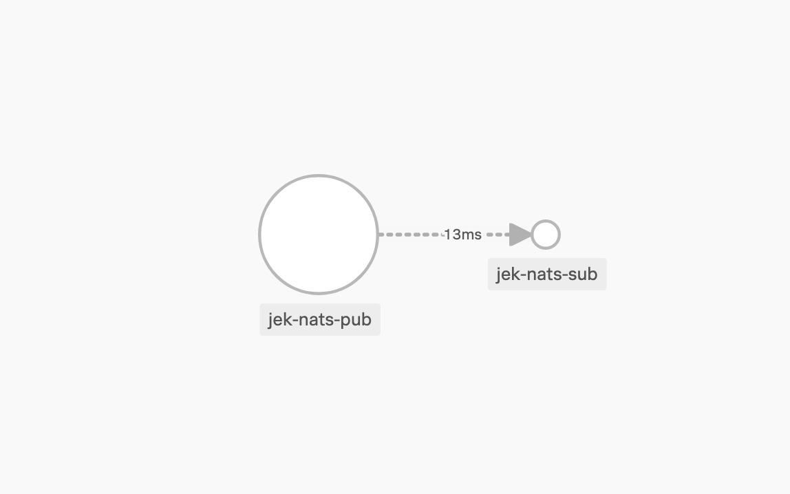
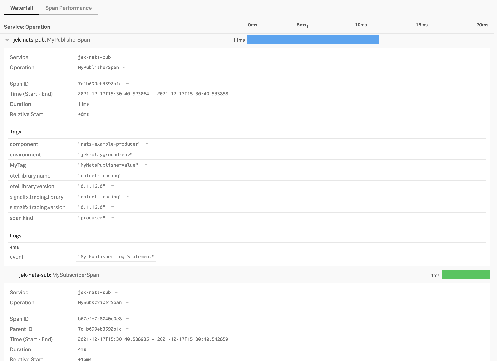

Todo: How to make topic show up?

---


# Terminal 1 to run NATS
$ `docker run -p 4222:4222 -p 8222:8222 -p 6222:6222 --name nats-server -ti nats:latest`


---


# Terminal 2 in subscriber folder to run subscriber

$ `cd subscriber`

$ `dotnet run -verbose`

$ `docker build -t jekbao/natssub . --no-cache`

$ 
```
docker run -it --rm \
-e SIGNALFX_SERVICE_NAME=jek-nats-sub \
-e SIGNALFX_ENDPOINT_URL=https://ingest.<the realm>.signalfx.com/v2/trace \
-e SIGNALFX_ACCESS_TOKEN=<the token> \
-e SIGNALFX_ENV=jek-playground-env \
-e CORECLR_ENABLE_PROFILING=1 \
-e CORECLR_PROFILER="{B4C89B0F-9908-4F73-9F59-0D77C5A06874}" \
-e CORECLR_PROFILER_PATH=/opt/signalfx-dotnet-tracing/SignalFx.Tracing.ClrProfiler.Native.so \
-e SIGNALFX_INTEGRATIONS=/opt/signalfx-dotnet-tracing/integrations.json \
-e SIGNALFX_DOTNET_TRACER_HOME=/opt/signalfx-dotnet-tracing \
-e SIGNALFX_PROPAGATOR=W3C \
-p 19228:80 \
--network=host \
--name jek_nats_sub jekbao/natssub
```
Note that to test web if CLR profile is load do not include --network=host.
--network=host is for docker container local to local interaction because this is easier to test nats context propagation.


docker run -it --rm \
-e SIGNALFX_SERVICE_NAME=jek-nats-sub \
-e SIGNALFX_ENDPOINT_URL=https://ingest.us1.signalfx.com/v2/trace \
-e SIGNALFX_ACCESS_TOKEN=HysDu9eWcFv3XA6arBUD0Q \
-e SIGNALFX_ENV=jek-playground-env \
-e CORECLR_ENABLE_PROFILING=1 \
-e CORECLR_PROFILER="{B4C89B0F-9908-4F73-9F59-0D77C5A06874}" \
-e CORECLR_PROFILER_PATH=/opt/signalfx-dotnet-tracing/SignalFx.Tracing.ClrProfiler.Native.so \
-e SIGNALFX_INTEGRATIONS=/opt/signalfx-dotnet-tracing/integrations.json \
-e SIGNALFX_DOTNET_TRACER_HOME=/opt/signalfx-dotnet-tracing \
-e SIGNALFX_PROPAGATOR=W3C \
-p 19228:80 \
--network=host \
--name jek_nats_sub jekbao/natssub


---


# Terminal 4 in publisher folder run to run publisher

$ `cd publisher`

$ `dotnet run -payload helloworldv1`

$ `docker build -t jekbao/natspub . --no-cache`

$ 
```
docker run -it --rm \
-e SIGNALFX_SERVICE_NAME=jek-nats-pub \
-e SIGNALFX_ENDPOINT_URL=https://ingest.<the realm>.signalfx.com/v2/trace \
-e SIGNALFX_ACCESS_TOKEN=<the token> \
-e SIGNALFX_ENV=jek-playground-env \
-e CORECLR_ENABLE_PROFILING=1 \
-e CORECLR_PROFILER="{B4C89B0F-9908-4F73-9F59-0D77C5A06874}" \
-e CORECLR_PROFILER_PATH=/opt/signalfx-dotnet-tracing/SignalFx.Tracing.ClrProfiler.Native.so \
-e SIGNALFX_INTEGRATIONS=/opt/signalfx-dotnet-tracing/integrations.json \
-e SIGNALFX_DOTNET_TRACER_HOME=/opt/signalfx-dotnet-tracing \
-e SIGNALFX_PROPAGATOR=W3C \
-p 5000:80 \
--network=host \
--name jek_nats_pub jekbao/natspub
```
Note that to test web if CLR profile is load do not include --network=host.
--network=host is for docker container local to local interaction because this is easier to test nats context propagation.


docker run -it --rm \
-e SIGNALFX_SERVICE_NAME=jek-nats-pub \
-e SIGNALFX_ENDPOINT_URL=https://ingest.us1.signalfx.com/v2/trace \
-e SIGNALFX_ACCESS_TOKEN=HysDu9eWcFv3XA6arBUD0Q \
-e SIGNALFX_ENV=jek-playground-env \
-e CORECLR_ENABLE_PROFILING=1 \
-e CORECLR_PROFILER="{B4C89B0F-9908-4F73-9F59-0D77C5A06874}" \
-e CORECLR_PROFILER_PATH=/opt/signalfx-dotnet-tracing/SignalFx.Tracing.ClrProfiler.Native.so \
-e SIGNALFX_INTEGRATIONS=/opt/signalfx-dotnet-tracing/integrations.json \
-e SIGNALFX_DOTNET_TRACER_HOME=/opt/signalfx-dotnet-tracing \
-e SIGNALFX_PROPAGATOR=W3C \
-p 5000:80 \
--network=host \
--name jek_nats_pub jekbao/natspub


---

#Misc
Proof: 
Proof 2: 

Last updated: 17 Dec 2021

