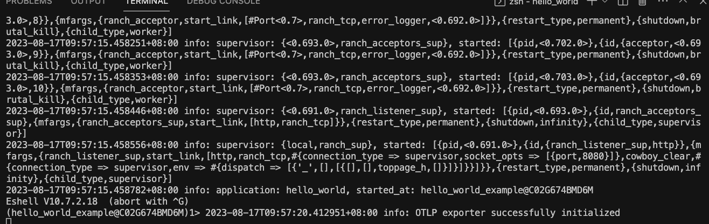
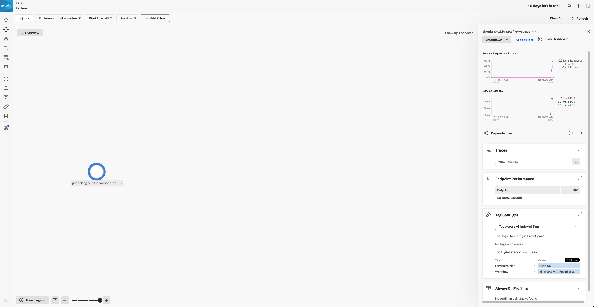
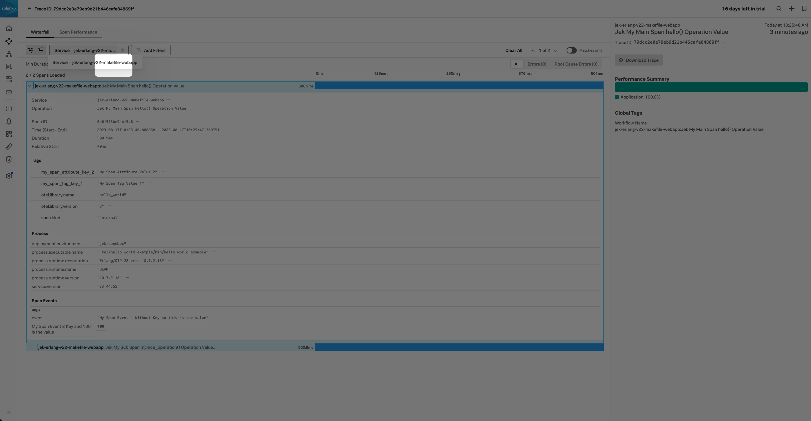

# Setup

Install Make on macOS https://erlang.mk/guide/installation.html#_on_unix


- Also make sure git and erlang are available too. Follow the helloworld guide in the root folder of /apm-erl

```
brew install make
```

Sure! Here's a simple Erlang "Hello World" program with a `Makefile` instead of `rebar`.

1. First, create the Erlang module `hello.erl`:

**hello.erl**
```erlang
-module(hello).
-export([world/0]).

world() ->
    io:format("Hello, World!~n").
```

2. Now, create the `Makefile`:

**Makefile**
```make
ERLC=erlc
ERL=erl
EFLAGS=-W

all: compile

compile: hello.beam

hello.beam: hello.erl
	$(ERLC) $(EFLAGS) hello.erl

run: compile
	$(ERL) -noshell -s hello world -s init stop

clean:
	rm -rf *.beam
```

3. Use the commands:

To compile the module:
```bash
make
```

To run the hello world function:
```bash
make run
```

To clean compiled files:
```bash
make clean
```

This example provides a basic structure. As the project grows, you may want to adjust the `Makefile` accordingly. Note that this is a simple example; real-world projects may involve more complex structures and dependencies.

# Hello World Cowboy Web App

### Step 1: Project structure

Create a project with this folder structure:

```
hello_world/
|-- src/
|   |-- hello_world_app.erl
|   |-- hello_world_sup.erl
|   |-- toppage_h.erl
|-- Makefile
|-- erlang.mk
|-- relx.config
```

### Step 2: Code

**toppage_h.erl** (inside `src` directory)

```erlang
-module(toppage_h).

-export([init/2]).

init(Req0, Opts) ->
	Req = cowboy_req:reply(200, #{
		<<"content-type">> => <<"text/plain">>
	}, <<"Hello Jek this is Makefile hello world app v1!">>, Req0),
	{ok, Req, Opts}.
```

**hello_world_app.erl** (inside `src` directory)

```erlang
%% @private
-module(hello_world_app).
-behaviour(application).

%% API.
-export([start/2]).
-export([stop/1]).

%% API.

start(_Type, _Args) ->
	Dispatch = cowboy_router:compile([
		{'_', [
			{"/", toppage_h, []}
		]}
	]),
	{ok, _} = cowboy:start_clear(http, [{port, 8080}], #{
		env => #{dispatch => Dispatch}
	}),
	hello_world_sup:start_link().

stop(_State) ->
	ok = cowboy:stop_listener(http).
```

**hello_world_sup.erl** (inside `src` directory)

```erlang
%% @private
-module(hello_world_sup).
-behaviour(supervisor).

%% API.
-export([start_link/0]).

%% supervisor.
-export([init/1]).

%% API.

-spec start_link() -> {ok, pid()}.
start_link() ->
	supervisor:start_link({local, ?MODULE}, ?MODULE, []).

%% supervisor.

init([]) ->
	Procs = [],
	{ok, {{one_for_one, 10, 10}, Procs}}.
```

### Step 3: Makefile

```make
PROJECT = hello_world
PROJECT_DESCRIPTION = Cowboy Hello World example
PROJECT_VERSION = 1

DEPS = cowboy
dep_cowboy_commit = master

REL_DEPS = relx

include ./erlang.mk
```

The correct way to get erlang.mk is from https://erlang.mk/guide/getting_started.html
Alternatively, get erlang.mk from https://github.com/ninenines/cowboy and put it in the root folder of the project.

### Step 4: Instructions

To try this example, you need GNU make (version 4; ensure not version 3 or lower) and git in your PATH.

To build and run the example, use the following command:

```bash
make run
```

Then point your browser to http://localhost:8080

This hello_world example app is referencing https://github.com/ninenines/cowboy/tree/master/examples

# Add OTel Erlang to the project
- Specify the OTel Erlang Dependency in Your Project's Makefile: In the Makefile of the project where you want to add the dependency, specify the dependency using the DEPS variable and the corresponding git URL and version or branch:

```
DEPS = cowboy my_dependency
dep_cowboy_commit = 2.9.0
dep_my_dependency = git https://github.com/user/my_dependency master
```

But need to use sub-folder because https://github.com/ninenines/erlang.mk/issues/917#issuecomment-735419333 which came from this thread https://github.com/open-telemetry/opentelemetry-erlang/issues/178
    - Learn more about it from https://erlang.mk/guide/deps.html 

So the recommended way is to do this.

```
PROJECT = hello_world
PROJECT_DESCRIPTION = Cowboy Hello World example
PROJECT_VERSION = 2

DEPS = cowboy opentelemetry_api opentelemetry opentelemetry_exporter opentelemetry_cowboy
dep_cowboy_commit = master

# OpenTelemetry dependencies
dep_opentelemetry_api = hex 1.0.3
dep_opentelemetry = hex 1.0.5
dep_opentelemetry_exporter = hex 1.0.4
dep_opentelemetry_cowboy = hex 0.2.1

REL_DEPS = relx

include ./erlang.mk
```

In Makefile add the `dep_opentelemetry...` using `hex <version>`.

- Fetching and Building: With erlang.mk, you can fetch and build your dependencies using:
```
make deps

make run
```


- Next create config/sys.config

```erlang
[
 {mywebapp, 
  [
   {key1, value1},
   {key2, value2}
  ]
 },
 {opentelemetry,
  [
   {span_processor, batch},
   {traces_exporter, otlp},
   {resource, [
     {service, #{name => "jek-erlang-v22-makefile-webapp", version => "33.44.55"}},
     {deployment, #{environment => "jek-sandbox"}}
   ]},
   {readers, [#{module => otel_metric_reader,
                config => #{export_interval_ms => 1000,
                            exporter => {opentelemetry_exporter, #{}}}}]}
  ]
 },
 {opentelemetry_exporter, 
  [
   {otlp_protocol, grpc},
   {otlp_endpoint, "http://localhost:4317"}
  ]
 },
 {kernel,
  [
   {logger_level, debug},
   {logger,
    [
     {handler, default, logger_std_h,
      #{formatter => {logger_formatter, #{}}}
     }
    ]
   }
  ]
}
].
```

- The key here is the opentelemetry_exporter section. We are using OTLP exporter and the endpoint is http://localhost:4317. This is the default endpoint for the collector. Also well as the opentelemetry section. We are using the batch span processor and the OTLP exporter. We also specify the service name and version as well as the deployment environment.


```makefile
make run
```

 We would see OTLP exporter successfully initialized.

- Add the code to create a span and add attributes to toppage_h.erl

```erlang
-module(toppage_h).

-export([init/2]).

-include_lib("opentelemetry_api/include/otel_tracer.hrl").

init(Req0, Opts) ->
	hello(),
	Req = cowboy_req:reply(200, #{
		<<"content-type">> => <<"text/plain">>
	}, <<"Hello Jek this is Makefile hello world app v2!">>, Req0),
	{ok, Req, Opts}.

hello() ->
    %% start an active span and run a local function
    ?with_span(<<"Jek My Main Span hello() Operation Value">>, #{}, fun mynice_operation/1).

mynice_operation(_SpanCtx) ->
    ?add_event(<<"My Span Event 1 Without Key so this is the value">>, [{<<"My Span Event 2 Key and 100 is the value">>, 100}]),
    ?set_attributes([{my_span_tag_key_1, <<"My Span Tag Value 1">>}]),
    ?set_attributes([{my_span_attribute_key_2, <<"My Span Attribute Value 2">>}]),

    %% start an active span and run an anonymous function
    ?with_span(<<"Jek My Sub Span mynice_operation() Operation Value...">>, #{},
                fun(_ChildSpanCtx) ->
                      timer:sleep(500),
                      ?set_attributes([{my_sub_span_tag_key_1, <<"my sub tag tag valuE 1">>}]),
                      ?add_event(<<"Jek My Sub Span Event Value!">>, []),
                      ok % to indicate that the anonymous function is done
                end).
```

the include library in the above code is important to include the otel_tracer.hrl file. Without it, the ?with_span macro will not work.

- Run the app again

```makefile
make run   
```

- When done can clean up
```makefile
make clean
```

# Proof



# Updates from my colleague that we can use the latest version of OTel Erlang for Erlang/OTP v 22 now. Colleague made some changes.
-  Accordin to colleague can use: hex 1.2.2 for the api and hex 1.3. for the sdk (dep_opentelemetry) now. and hex 1.6.0 for the exporter.
- Update it in the Makefile

```erlang
PROJECT = hello_world
PROJECT_DESCRIPTION = Cowboy Hello World example
PROJECT_VERSION = 3

DEPS = cowboy opentelemetry_api opentelemetry opentelemetry_exporter opentelemetry_cowboy
dep_cowboy_commit = master

# OpenTelemetry dependencies
dep_opentelemetry_api = hex 1.2.2
dep_opentelemetry = hex 1.3.1
dep_opentelemetry_exporter = hex 1.6.0
dep_opentelemetry_cowboy = hex 0.2.1

REL_DEPS = relx

include ./erlang.mk
```

```makefile
make clean

rm -rf deps .erlang.mk _rel 

make deps

make run
```

Hence, it is confirmed that the latest versions as of 17 Aug 2023 work with Erlang/OTP v22.

# Ref
- https://github.com/ninenines/cowboy/tree/master/examples
- Also thank 