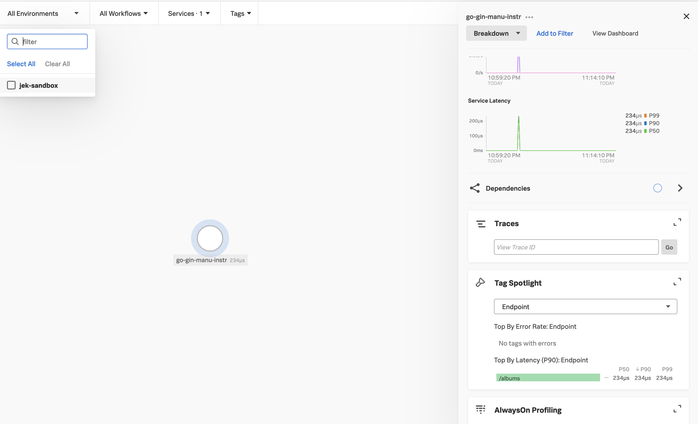
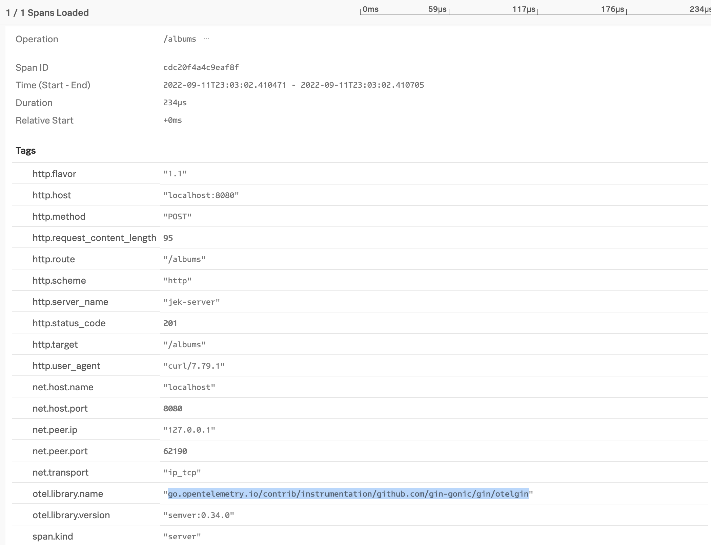

# Develop a RESTful API with Go and Gin
- Follow this instruction https://go.dev/doc/tutorial/web-service-gin
    - Outcome: go.mod, main.go, and go.sum

# Add splunk-otel-go library for telemetry
- Ensure the following requirements are met https://docs.splunk.com/Observability/gdi/get-data-in/application/go/go-otel-requirements.html#ensure-you-are-using-supported-go-versions
    - See go.mod for the minimum version.
    - For splunk-otel-go support of go version 1.16, please use splunk-otel-go v1.0.0 because go version 1.16 support is dropped in splunk-otel-go v1.10 https://github.com/signalfx/splunk-otel-go/releases/tag/v1.1.0 so we go back to the latest previous supported version.
- Follow the instruction here https://github.com/signalfx/splunk-otel-go

## Install the distribution
Run the below command in the folder where go.mod is
```bash
go get github.com/signalfx/splunk-otel-go/distro
```

## Configure OpenTelemetry using the Splunk distro package by adding the following code to main.go
```go
package main

import (
	"context"

	"github.com/signalfx/splunk-otel-go/distro"
)

func main() {
	sdk, err := distro.Run()
	if err != nil {
		panic(err)
	}
	// Ensure all spans are flushed before the application exits.
	defer func() {
		if err := sdk.Shutdown(context.Background()); err != nil {
			panic(err)
		}
	}()

	// ...
```

## Add the relevant Go Gin OTel module
```go
import (
	"context"
	"net/http"

	"github.com/gin-gonic/gin"
	"github.com/signalfx/splunk-otel-go/distro"                                   
	"go.opentelemetry.io/contrib/instrumentation/github.com/gin-gonic/gin/otelgin" // Add this for OTel Go Gin
)

```

```go
// ... omitted for brevity

func main() {

	// ... omitted for brevity

	router := gin.Default()

	router.Use(otelgin.Middleware("jek-server")) // Add this for OTel Go Gin

	router.GET("/albums", getAlbums)
	router.GET("/albums/:id", getAlbumByID)
	router.POST("/albums", postAlbums)

	router.Run("localhost:8080")
}

// ... omitted for brevity
```

## Add manual instrumentation to have Server-Timing for RUM <> APM linkage
- There is no need to add Splunk net/http because Gin is not compatible with Go http/net package hence not compatible with net/http/splunkhttp.
- With that said, we need to create our own middleware to add “RUM support” if they need android, ios, or web linkage to Go Gin.
    - here is the code that you can "use" to create it https://github.com/signalfx/splunk-otel-go/blob/ca189b7887ef5f4fc81106f7e02b66b772399fba/instrumentation/net/http/splunkhttp/handler.go#L40-L49 
    - here are the docs how to create a custom middleware in Gin: https://github.com/gin-gonic/gin#custom-middleware 
- Therefore, the way to add "RUM support" would NOT be similar to the reference example listed here
    - Reference this example https://github.com/signalfx/splunk-otel-go/blob/main/example/main.go
    - Also understand the difference between Splunk net/http/splunkhttp vs net/http from OTel Go


## Add the relevant environment variables
```bash
export OTEL_RESOURCE_ATTRIBUTES="service.name=my-app-2,service.version=99.99.99,deployment.environment=jek-sandbox"

export OTEL_SERVICE_NAME=go-gin-manu-instr

export SPLUNK_ACCESS_TOKEN=<REDACTED FOR SECURITY>

export SPLUNK_REALM=<realm>

# Remember we do not need OTEL_EXPORTER_OTLP_ENDPOINT if we are sending directly to Splunk O11y Cloud

# When things are not working, a good first step is to restart the program with debug logging enabled. Do this by setting the OTEL_LOG_LEVEL environment variable to debug.
export OTEL_LOG_LEVEL="debug" 
# Make sure to unset the environment variable after the issue is resolved, as its output might overload systems if left on indefinitely.
unset OTEL_LOG_LEVEL
```


After adding, run the code and test to invoke traffic
```bash
go run .

curl http://localhost:8080/albums \
    --include \
    --header "Content-Type: application/json" \
    --request "POST" \
    --data '{"id": "4","title": "The Modern Sound of Betty Carter","artist": "Betty Carter","price": 49.99}'

curl http://localhost:8080/albums \
    --header "Content-Type: application/json" \
    --request "GET"

curl http://localhost:8080/albums/2
```

# Proof

