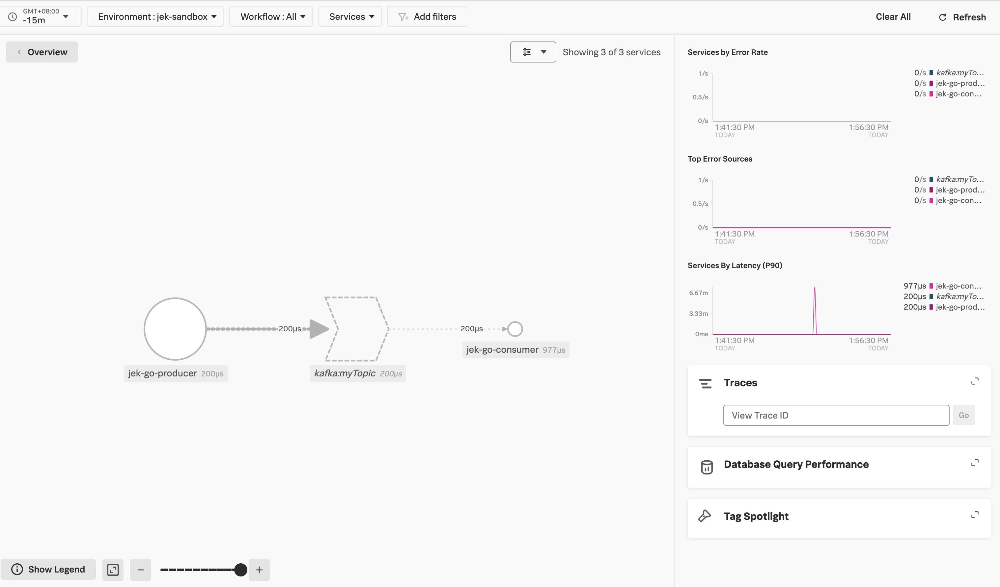

Optional read for setting up Kafka: https://www.digitalocean.com/community/developer-center/how-to-deploy-kafka-on-docker-and-digitalocean-kubernetes

- Start up your kafka cluster
- Start OTel Collector
- `go get .`
- `go run consumer.go`
- `go run producer.go`

- Ref: https://github.com/signalfx/splunk-otel-go/blob/main/instrumentation/github.com/confluentinc/confluent-kafka-go/kafka/splunkkafka/example_test.go