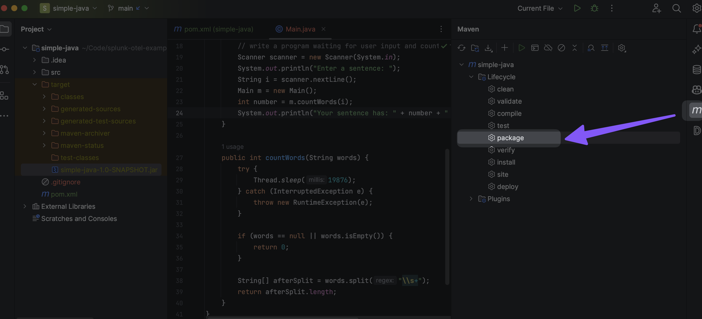

Create an empty project using IntelliJ.

Create a simple java module called `my-simple-java` (folder structure would be `./my-simple-java`) that even after instrumenting splunk-otel-java agent, it should not show any traces in Splunk Observability UI.

Add the following dependency in `pom.xml` file
```xml
...
<build>
        <plugins>
            <plugin>
                <groupId>org.apache.maven.plugins</groupId>
                <artifactId>maven-jar-plugin</artifactId>
                <version>3.3.0</version>
                <configuration>
                    <archive>
                        <manifest>
                            <mainClass>org.learningextension.Main</mainClass>
                        </manifest>
                    </archive>
                </configuration>
            </plugin>
        </plugins>
    </build>
...

```

Package the my simple java program using IntelliJ UI that has Maven support 

## Steps to package and run via command line
```bash

cd my-simple-java

mvn clean package

java -jar target/my-simple-java-1.0-SNAPSHOT.jar

# Download splunk-otel-java.jar
curl -L https://github.com/signalfx/splunk-otel-java/releases/latest/download/splunk-otel-javaagent.jar -o ../splunk-otel-javaagent.jar


java -javaagent:../splunk-otel-javaagent.jar -Dotel.resource.attributes=service.name=jek-simple-java-v1-with-agent-no-auto-instr,deployment.environment=jek-sandbox -Dsplunk.metrics.enabled=true -Dsplunk.realm='your_realm'  -Dsplunk.access.token='your_access_token' -jar target/my-simple-java-1.0-SNAPSHOT.jar


```


## Steps to run package with otel java extension
```bash

# be in root folder of extension-starter

# Download splunk-otel-java.jar
curl -L https://github.com/signalfx/splunk-otel-java/releases/latest/download/splunk-otel-javaagent.jar -o ../splunk-otel-javaagent.jar

java -javaagent:../splunk-otel-javaagent.jar -Dotel.resource.attributes=service.name=jek-simple-java-v2-with-agent-with-auto-instr,deployment.environment=jek-sandbox -Dsplunk.metrics.enabled=true -Dotel.javaagent.extensions=./my-opentelemetry-custom-instrumentation/target/my-opentelemetry-custom-instrumentation-1.0-SNAPSHOT.jar
 -Dsplunk.realm='your_realm' -Dsplunk.access.token='your_access_token' -jar ./my-simple-java/target/my-simple-java-1.0-SNAPSHOT.jar


```

