Optional read for setting up Kafka: https://www.digitalocean.com/community/developer-center/how-to-deploy-kafka-on-docker-and-digitalocean-kubernetes

# Zookeeper and Kafka #
- Start Kafka on port 9092 and start Zookeeper
    - Using Docker, run the docker-compose.yml in this folder https://towardsdatascience.com/how-to-install-apache-kafka-using-docker-the-easy-way-4ceb00817d8b with `docker-compose -f docker-compose.yml up`
        - After compose successfully, exec into kafka container `docker exec -it kafka /bin/sh` to test that it works
        - See the Kafka version running with `ls /opt` because the kafka is in that folder of the Kafka container.
    - Alternatively, install and start Zookeeper and Kafka using local machine or Mac Homebrew https://jek-bao-choo.medium.com/jeks-kafka-get-started-notes-24f1aaad9212 

- Go to folder containing kafka, then go to `bin` and create the topic `kafka-topics.sh --create --bootstrap-server localhost:9092 --topic my-topic --partitions 3 --replication-factor 1`
- After that check the topic `kafka-topics.sh --describe --bootstrap-server localhost:9092 --topic my-topic`
- List all available topics `kafka-topics.sh --list --bootstrap-server localhost:9092`
- Push messages to my-topic `kafka-console-producer.sh --bootstrap-server localhost:9092 --topic my-topic`
```bash
> abc
> xyz
```
- Pull messages using Kafka console consumer `kafka-console-consumer.sh --bootstrap-server localhost:9092 --topic my-topic --from-beginning`

# Producer.java
- Open IntelliJ
- Create a new project calling it e.g., Jek-Kafka-Java-Producer
- Take note of the GroupId 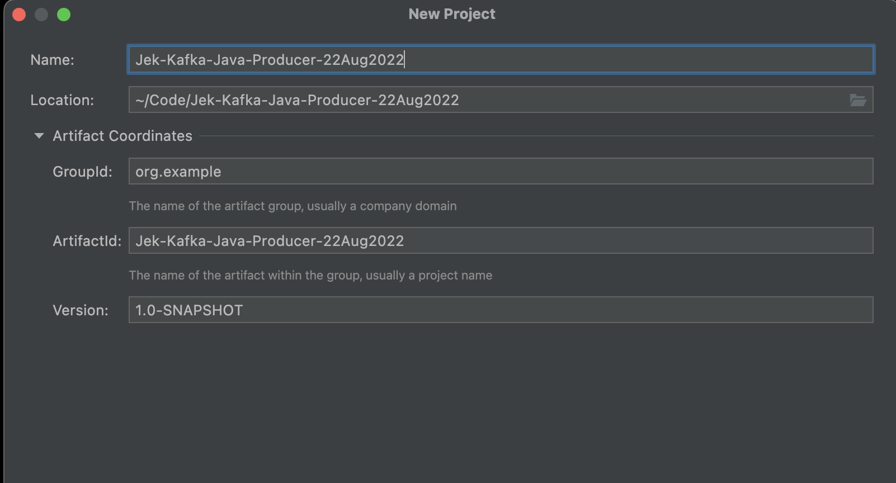
- Make sure it has Maven e.g. Maven 3 in the Preference > Build section 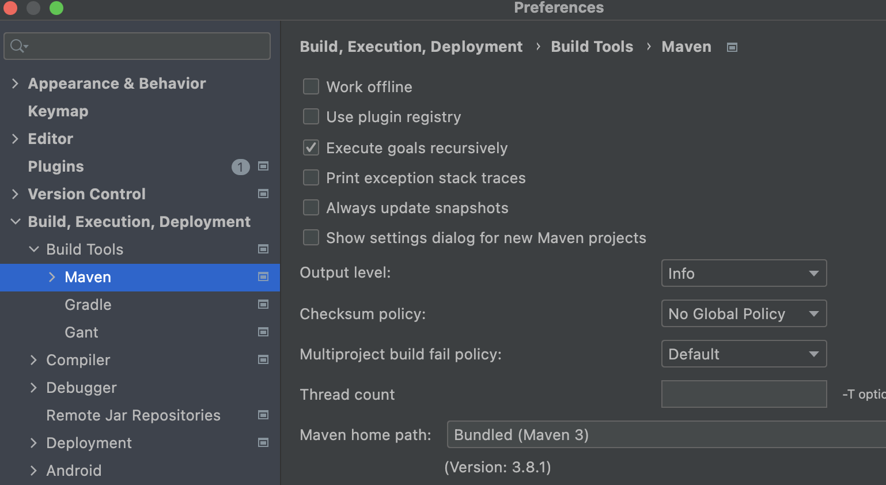
- Create new project using Maven
- Go to Kafka Apache API docs https://kafka.apache.org/documentation/ 
    - We need to install Maven dependencies for Kafka from https://kafka.apache.org/documentation/#producerapi to get the dependencies snippet.
    - Go to pom.xml file in Intellij
    - Add dependency by using Command + N in IntelliJ to add Dependency
    - Search for Kafka in IntelliJ Add dependency UI wizard
    - Alternative add the dependency to pom.xml 
```xml
    <dependencies>
        <dependency>
            <groupId>org.apache.kafka</groupId>
            <artifactId>kafka-clients</artifactId>
            <version>3.2.1</version>
        </dependency>
    </dependencies>
```
Also add `slf4j-simple`
```xml
    <dependencies>
        <dependency>
            <groupId>org.apache.kafka</groupId>
            <artifactId>kafka-clients</artifactId>
            <version>3.2.1</version>
        </dependency>
        <dependency>
            <groupId>org.slf4j</groupId>
            <artifactId>slf4j-simple</artifactId>
            <version>1.7.36</version>
        </dependency>
    </dependencies>
```

- Load changes 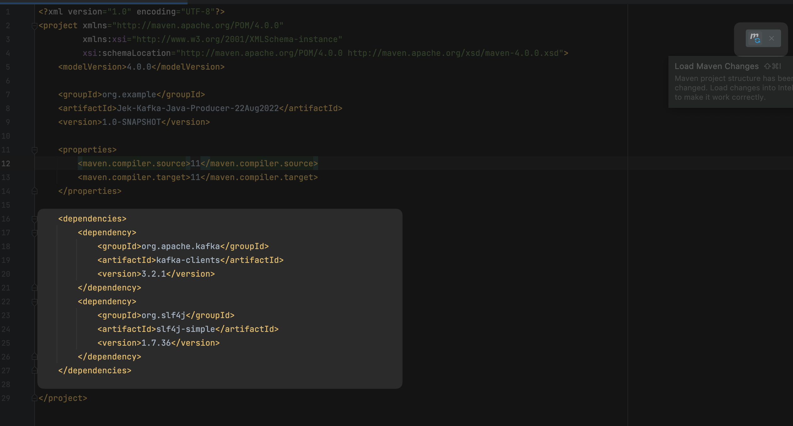

- Reload all Maven dependencies 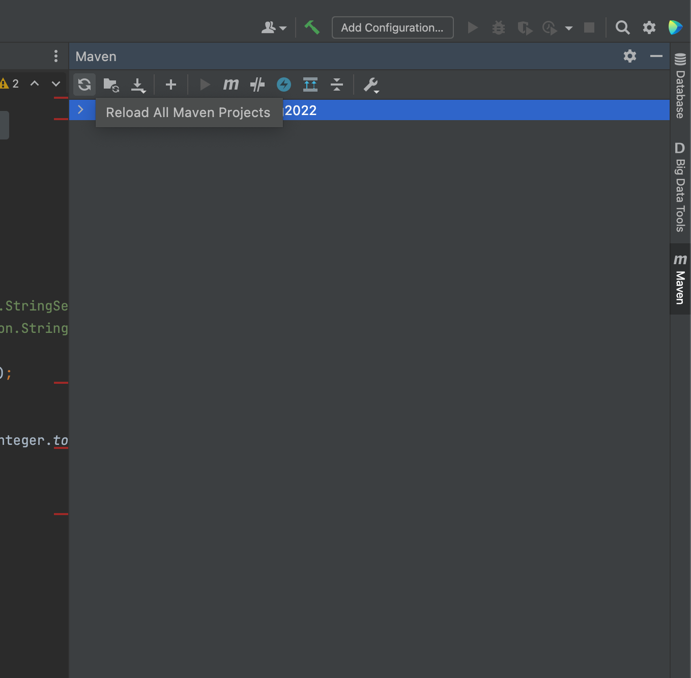

- After which, go to Kafka javadocs for basic examples of how to create producer.java and consumer.java 

- Create a package in src > main as org.example 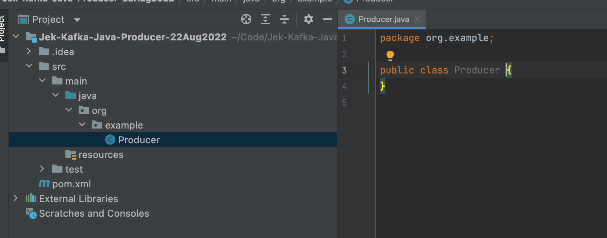

- Create Producer.java file in src > main > java folder https://kafka.apache.org/32/javadoc/org/apache/kafka/clients/producer/KafkaProducer.html <-- the example code for Producer.java is here.

It would like this.
```java
package org.example;

import org.apache.kafka.clients.producer.KafkaProducer;
import org.apache.kafka.clients.producer.ProducerRecord;

import java.util.Properties;

public class Producer {
    public static void main(String[] args) {
        Properties props = new Properties();
        props.put("bootstrap.servers", "localhost:9092");
        props.put("linger.ms", 1);
        props.put("key.serializer", "org.apache.kafka.common.serialization.StringSerializer");
        props.put("value.serializer", "org.apache.kafka.common.serialization.StringSerializer");

        KafkaProducer<String, String> producer = new KafkaProducer<>(props);
        for (int i = 0; i < 100; i++) {
            System.out.println("Messages: " + i);
            producer.send(new ProducerRecord<String, String>("my-topic", Integer.toString(i), Integer.toString(i)));
        }

        producer.close();
    }
}
```

- Test run it with 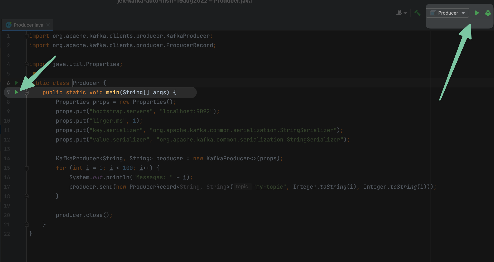

- Go to terminal and run a consumer from the terminal `docker exec -it kafka /bin/sh` and `cd bin` and `kafka-console-consumer.sh --bootstrap-server localhost:9092 --topic my-topic`

- Re-run with  to produce the messages to consumer.

- Add the following to Jek-Kafka-Java-Producer pom.xml

```xml
 <build>
        <plugins>
            <plugin>
                <artifactId>maven-assembly-plugin</artifactId>
                <executions>
                    <execution>
                        <phase>package</phase>
                        <goals>
                            <goal>single</goal>
                        </goals>
                    </execution>
                </executions>
                <configuration>
                    <descriptorRefs>
                        <descriptorRef>jar-with-dependencies</descriptorRef>
                    </descriptorRefs>
                    <archive>
                        <manifest>
                            <mainClass>org.example.Producer</mainClass>
                        </manifest>
                    </archive>
                </configuration>
            </plugin>
            <plugin>
                <!-- Building an executable jar -->
                <groupId>org.apache.maven.plugins</groupId>
                <artifactId>maven-jar-plugin</artifactId>
                <version>3.2.2</version>
                <configuration>
                    <archive>
                        <manifest>
                            <!-- give full qualified name of your main class-->
                            <mainClass>org.example.Producer</mainClass>
                        </manifest>
                    </archive>
                </configuration>
            </plugin>
        </plugins>
    </build>
```

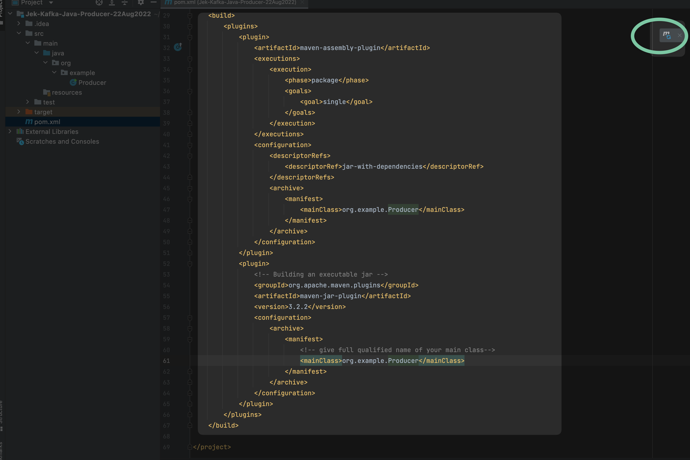

Ref: https://stackoverflow.com/a/49451658/3073280 

- Package Jek-Kafka-Java-Producer into .jar and run 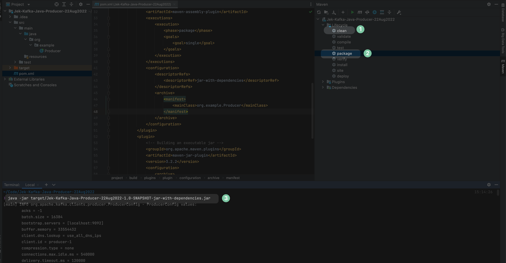

# Consumer.java

- Open another IntelliJ for Java Kafka Consumer.

- Create another new project calling it e.g., Jek-Kafka-Java-Consumer and follow the above steps.

 add the dependency to pom.xml 
```xml
    <dependencies>
        <dependency>
            <groupId>org.apache.kafka</groupId>
            <artifactId>kafka-clients</artifactId>
            <version>3.2.1</version>
        </dependency>
    </dependencies>
```
Also add `slf4j-simple`
```xml
    <dependencies>
        <dependency>
            <groupId>org.apache.kafka</groupId>
            <artifactId>kafka-clients</artifactId>
            <version>3.2.1</version>
        </dependency>
        <dependency>
            <groupId>org.slf4j</groupId>
            <artifactId>slf4j-simple</artifactId>
            <version>1.7.36</version>
        </dependency>
    </dependencies>
```

- Load changes 

- Reload all Maven dependencies 

 
- Create a package in src > main as org.example 


- Create Consumer.java file in src > main > java folder

https://kafka.apache.org/32/javadoc/org/apache/kafka/clients/consumer/KafkaConsumer.html <-- the example code for Consumer.java is here.

It would like this.
```java
import org.apache.kafka.clients.consumer.ConsumerRecord;
import org.apache.kafka.clients.consumer.ConsumerRecords;
import org.apache.kafka.clients.consumer.KafkaConsumer;

import java.time.Duration;
import java.util.Arrays;
import java.util.Properties;

public class Consumer {
    public static void main(String[] args) {
        Properties props = new Properties();
        props.setProperty("bootstrap.servers", "localhost:9092");
        props.setProperty("group.id", "test");
        props.setProperty("enable.auto.commit", "true");
        props.setProperty("auto.commit.interval.ms", "1000");
        props.setProperty("key.deserializer", "org.apache.kafka.common.serialization.StringDeserializer");
        props.setProperty("value.deserializer", "org.apache.kafka.common.serialization.StringDeserializer");
        KafkaConsumer<String, String> consumer = new KafkaConsumer<>(props);
        consumer.subscribe(Arrays.asList("my-topic"));
        try {
            while (true) {
                ConsumerRecords<String, String> records = consumer.poll(Duration.ofMillis(100));
                for (ConsumerRecord<String, String> record : records)
                    System.out.printf("offset = %d, key = %s, value = %s, partition = %s%n", record.offset(), record.key(), record.value(), record.partition());
            }
        } catch (Exception e) {
            e.printStackTrace();
        } finally {
            consumer.close();
        }
    }
}
```

- Test run it with 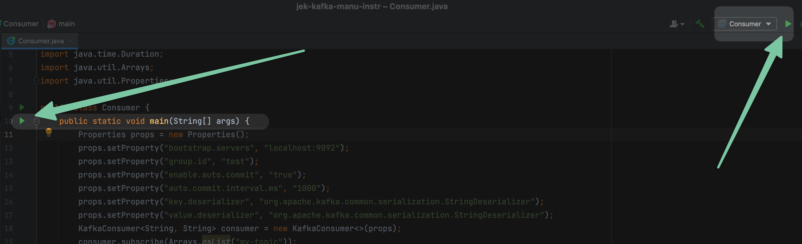

- Go to terminal and run a consumer from the terminal `docker exec -it kafka /bin/sh` and `cd bin` and `kafka-console-producer.sh --bootstrap-server localhost:9092 --topic my-topic`

- Push messages to my-topic
```bash
> jekv1
> jekv2
```

- Test with the other IntelliJ project called Jek-Kafka-Java-Consumer  and we should see the messages populated in Java Consumer console.

- Add the following to Jek-Kafka-Java-Consumer pom.xml

```xml
 <build>
        <plugins>
            <plugin>
                <artifactId>maven-assembly-plugin</artifactId>
                <executions>
                    <execution>
                        <phase>package</phase>
                        <goals>
                            <goal>single</goal>
                        </goals>
                    </execution>
                </executions>
                <configuration>
                    <descriptorRefs>
                        <descriptorRef>jar-with-dependencies</descriptorRef>
                    </descriptorRefs>
                    <archive>
                        <manifest>
                            <mainClass>org.example.Consumer</mainClass>
                        </manifest>
                    </archive>
                </configuration>
            </plugin>
            <plugin>
                <!-- Building an executable jar -->
                <groupId>org.apache.maven.plugins</groupId>
                <artifactId>maven-jar-plugin</artifactId>
                <version>3.2.2</version>
                <configuration>
                    <archive>
                        <manifest>
                            <!-- give full qualified name of your main class-->
                            <mainClass>org.example.Consumer</mainClass>
                        </manifest>
                    </archive>
                </configuration>
            </plugin>
        </plugins>
    </build>
```


Ref: https://stackoverflow.com/a/49451658/3073280 

- Package Jek-Kafka-Java-Producer into .jar and run 


# Add splunk-otel-java agent to trace through Kafka

## Run the consumer .jar with splunk-otel-agent and run the consumer .jar to make sure the messages are shown in consumer .jar console.
- Run the jar file with splunk-otel-java to send traces directly to Splunk backend
```bash
curl -L https://github.com/signalfx/splunk-otel-java/releases/latest/download/splunk-otel-javaagent.jar \
-o splunk-otel-javaagent.jar
```

- Execute the built jar file with splunk-otel-javaagent.jar
```bash
export OTEL_RESOURCE_ATTRIBUTES=deployment.environment=jek-sandbox
```
---
```bash
export OTEL_SERVICE_NAME=jek-java-kafka-consumer
```
---
```bash
export OTEL_EXPORTER_OTLP_ENDPOINT=https://ingest.<YOUR REALM>.signalfx.com
```
Note: 
- For Java to send directly to the backend using OTLP endpoint is https://ingest.<YOUR REALM>.signalfx.com without the path
- While for Python the OTLP endpoint is https://ingest.<YOUR REALM>.signalfx.com/v2/trace with the /v2/trace path.
- Alternatively, can you use Jaeger Thrift to send directly https://docs.splunk.com/Observability/gdi/get-data-in/application/java/instrumentation/instrument-java-application.html#send-data-directly-to-observability-cloud
- To configure the endpoint variable it can be complex, this is the doc for Java https://github.com/open-telemetry/opentelemetry-java/blob/main/sdk-extensions/autoconfigure/README.md
---
```bash
export SPLUNK_ACCESS_TOKEN=<REDACTED FOR SECURITY>
```
---
```bash
java -javaagent:./splunk-otel-javaagent.jar -jar target/Jek-Java-Kafka-Consumer-22Aug2022-1.0-SNAPSHOT-jar-with-dependencies.jar
```

## Run the producer .jar with splunk-otel-agent and verify that consumer can read from it.
- Run the jar file with splunk-otel-java to send traces directly to Splunk backend
```bash
curl -L https://github.com/signalfx/splunk-otel-java/releases/latest/download/splunk-otel-javaagent.jar \
-o splunk-otel-javaagent.jar
```

- Execute the built jar file with splunk-otel-javaagent.jar
```bash
export OTEL_RESOURCE_ATTRIBUTES=deployment.environment=jek-sandbox
```
---
```bash
export OTEL_SERVICE_NAME=jek-java-kafka-producer
```
---
```bash
export OTEL_EXPORTER_OTLP_ENDPOINT=https://ingest.<YOUR REALM>.signalfx.com
```
Note: 
- For Java to send directly to the backend using OTLP endpoint is https://ingest.<YOUR REALM>.signalfx.com without the path
- While for Python the OTLP endpoint is https://ingest.<YOUR REALM>.signalfx.com/v2/trace with the /v2/trace path.
- Alternatively, can you use Jaeger Thrift to send directly https://docs.splunk.com/Observability/gdi/get-data-in/application/java/instrumentation/instrument-java-application.html#send-data-directly-to-observability-cloud
- To configure the endpoint variable it can be complex, this is the doc for Java https://github.com/open-telemetry/opentelemetry-java/blob/main/sdk-extensions/autoconfigure/README.md
---
```bash
export SPLUNK_ACCESS_TOKEN=<REDACTED FOR SECURITY>
```
---
```bash
java -javaagent:./splunk-otel-javaagent.jar -jar target/Jek-Kafka-Java-Producer-22Aug2022-1.0-SNAPSHOT-jar-with-dependencies.jar 
```

## Go to Splunk Observability console to verify that it is tracing through.

# Proof

- Proof 1 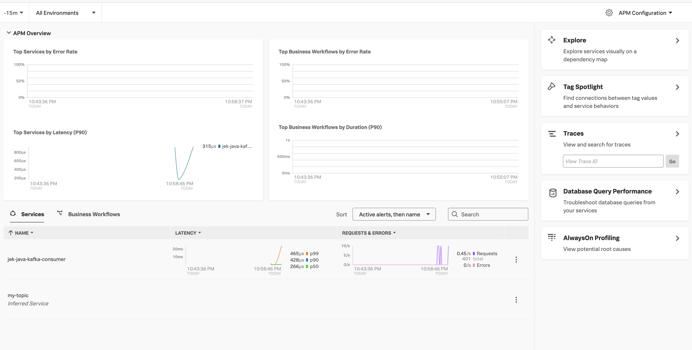
- Proof 2 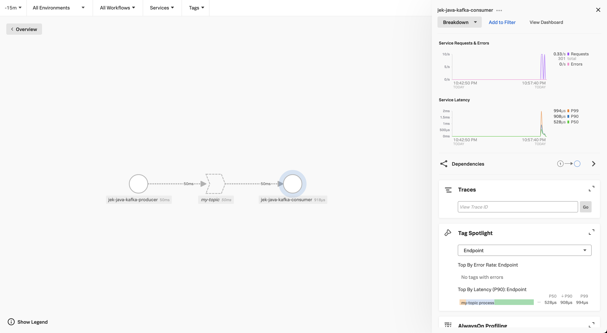
- Proof 3 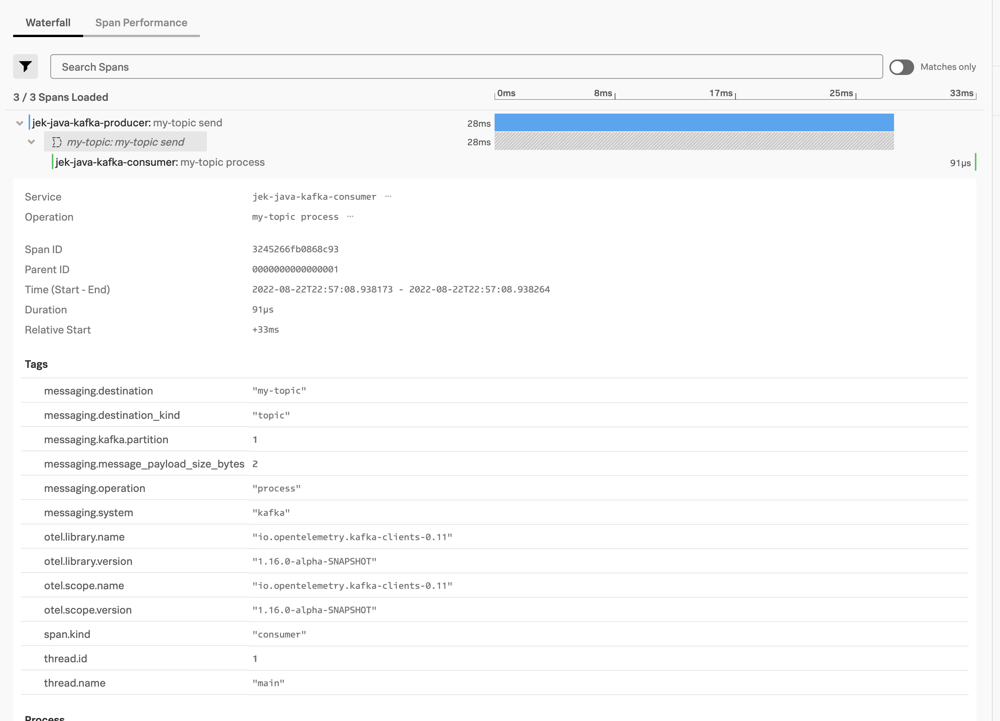
 
# Ref

- https://learning.oreilly.com/videos/apache-kafka-complete 