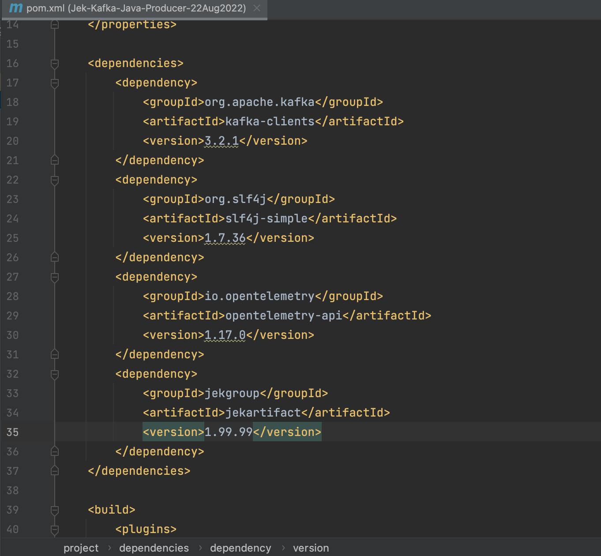
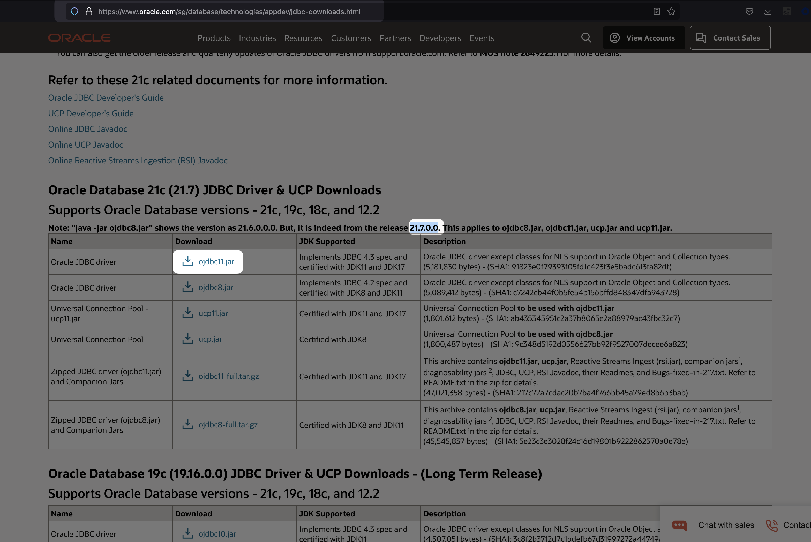
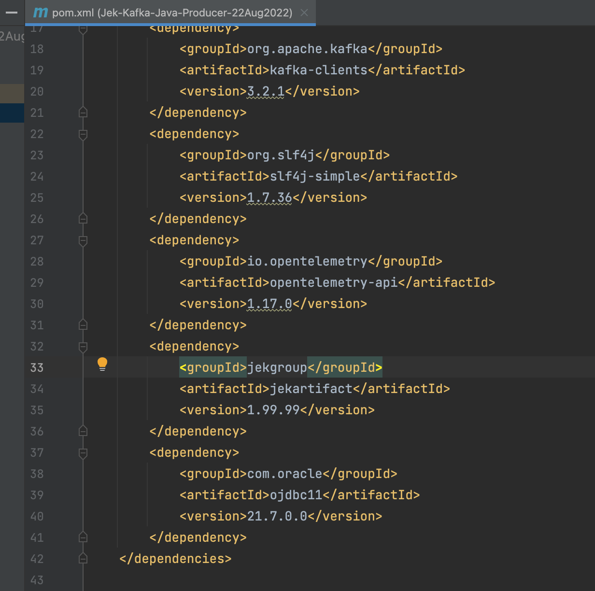

- Create maven webapp without IDE e.g. IntelliJ and Eclipse. Just using simple command line.
    - `mvn archetype:generate -DgroupId=jekgroup -DartifactId=jekartifact -DarchetypeArtifactId=maven-archetype-quickstart -DinteractiveMode=false` 
    - OR
    - `mvn archetype:generate -DgroupId=jekgroup -DartifactId=jekartifact -DarchetypeArtifactId=maven-archetype-webapp -Dpackaging=jar -DinteractiveMode=false` 
    - The various archetypeArtifactIds are listed here https://maven.apache.org/guides/introduction/introduction-to-archetypes.html
    - `cd jekartifact`
- Add properties to pom.xml
```xml
  <properties>
    <maven.compiler.source>18</maven.compiler.source>
    <maven.compiler.target>18</maven.compiler.target>
  </properties>
```
- So it should look like this
```xml
<project xmlns="http://maven.apache.org/POM/4.0.0" xmlns:xsi="http://www.w3.org/2001/XMLSchema-instance"
  xsi:schemaLocation="http://maven.apache.org/POM/4.0.0 http://maven.apache.org/maven-v4_0_0.xsd">
  <modelVersion>4.0.0</modelVersion>
  <groupId>jekgroup</groupId>
  <artifactId>jekartifact</artifactId>
  <packaging>jar</packaging>
  <version>1.0-SNAPSHOT</version>
  <properties>
    <maven.compiler.source>18</maven.compiler.source>
    <maven.compiler.target>18</maven.compiler.target>
  </properties>
  <name>jekartifact</name>
  <url>http://maven.apache.org</url>
  <dependencies>
    <dependency>
      <groupId>junit</groupId>
      <artifactId>junit</artifactId>
      <version>3.8.1</version>
      <scope>test</scope>
    </dependency>
  </dependencies>
</project>

```

- `mvn clean`
- `mvn compile`
- `mvn package`
- Find the jar file in `ls target/jekartifact-1.0-SNAPSHOT.jar`
- Install the jar find to the local maven repo
    - Before `ls /Users/<my machine user name>/.m2/repository`
    - Install `mvn install:install-file -Dfile=target/jekartifact-1.0-SNAPSHOT.jar -DgroupId=jekgroup -DartifactId=jekartifact -Dversion=1.99.99 -Dpackaging=jar`
        - https://maven.apache.org/guides/mini/guide-3rd-party-jars-local.html
    - After `ls /Users/<my machine user name>/.m2/repository` 
- Can explore adding the command line install command to pom.xml by using maven-install-plugin
    - https://stackoverflow.com/a/50788552/3073280 so the project will continue to build even when you take it to another computer (given that it has all the jar files in the path specified by the property local.sdk).
    - https://stackoverflow.com/a/38339518/3073280
  - Alternatively, add the jar to a Maven repository such as Nexus.
- Lastly, import the dependency in pom.xml to the main project that uses the dependency.
```xml
  <dependency>
    <groupId>jekgroup</groupId>
    <artifactId>jekartifact</artifactId>
    <version>1.99.99</version>
  </dependency>
```
for example 

---

- Now try add Oracle JDBC jar manually - this is a third party jar not hosted in Maven repository. So this is a good example.
- Download the Oracle JDBC from https://www.oracle.com/sg/database/technologies/appdev/jdbc-downloads.html 
    - Before `ls /Users/<my machine user name>/.m2/repository`
    - Install `mvn install:install-file -Dfile=ojdbc11.jar -DgroupId=com.oracle -DartifactId=ojdbc11 -Dversion=21.7.0.0 -Dpackaging=jar`
        - https://maven.apache.org/guides/mini/guide-3rd-party-jars-local.html
    - After `ls /Users/<my machine user name>/.m2/repository/com/oracle`
- Now, import the dependency in pom.xml to the main project that uses the dependency.
```xml
     <dependency>
        <groupId>com.oracle</groupId>
        <artifactId>ojdbc11</artifactId>
          <version>21.7.0.0</version>
      </dependency>
```
for example 