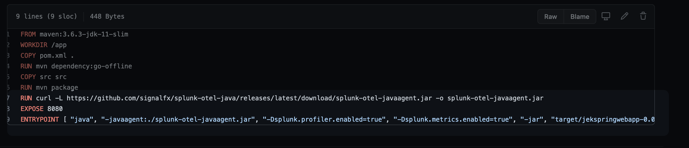
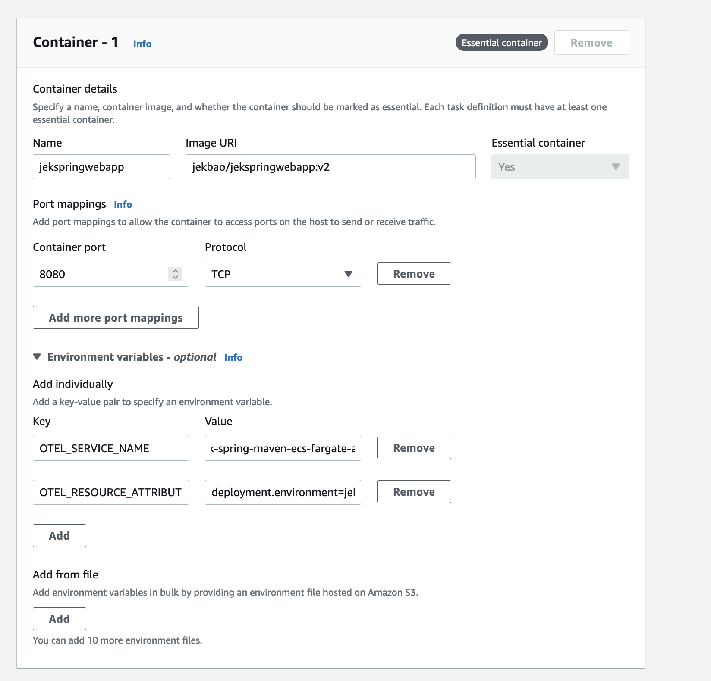
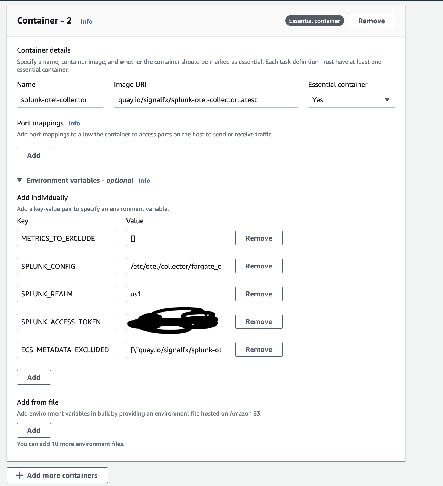
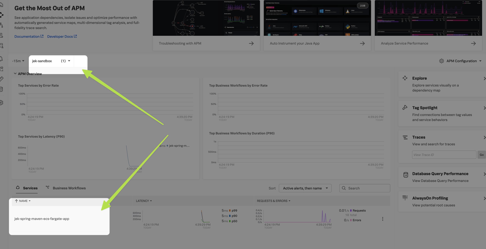
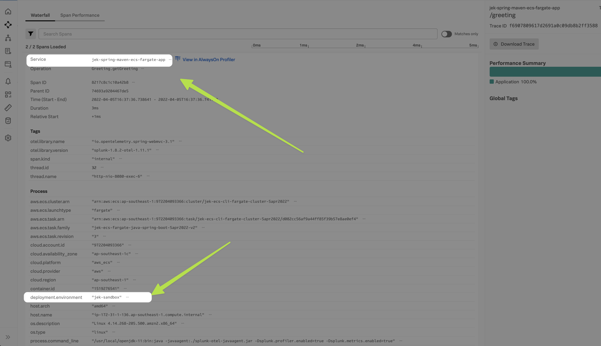

This is a continuation of spring-maven-docker-auto-instr; should have completed the spring-maven-docker-auto-instr setup before doing this.
The spring-maven-docker-auto-instr setup sends directly to Splunk O11y backend.
This setup sends traces to Splunk OTel Collector which then send to Splunk O11y backend.

# 1. Install Splunk OTel Collector in ECS Fargate as sidecar.
Follow the steps in infrastructure-ecs/ecs-fargate

# 2. Get the image from Dockerhub 
The URL to docker hub is https://hub.docker.com/repository/docker/jekbao/jekspringwebapp
For example `jekbao/jekspringwebapp:v2`
How the dockerfile looks: 

# 3. Add the environment variables to the app container in ECS task definition
Create a new revision to add the environment variables to container 1.
- Container 1: 
- Container 2: 

# 4. Deploy the new Task Definition just like how we would deploy the yaml file

Reference the sample task definitions at `reference-sample-task-definitions.json` in this folder

# Misc
- Ref: https://github.com/signalfx/splunk-otel-java
- Proof: 
- Proof: 
- Last updated: 4 Apr 2022
