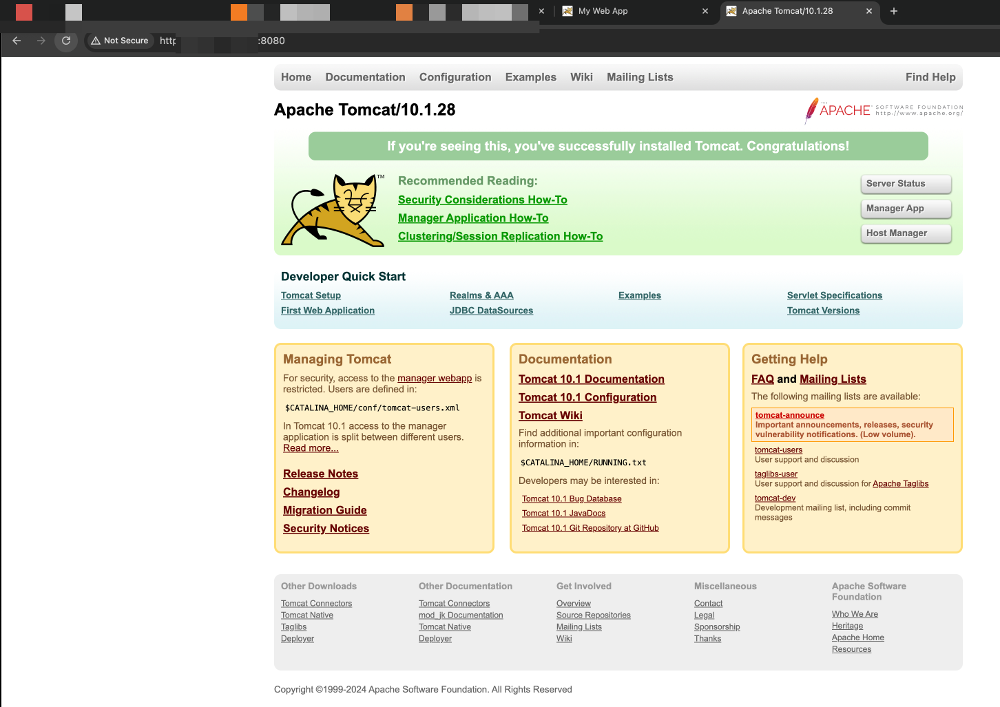
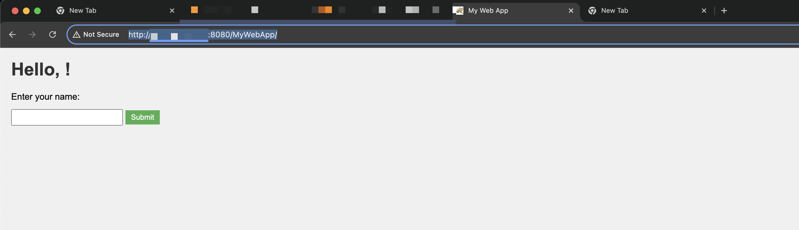
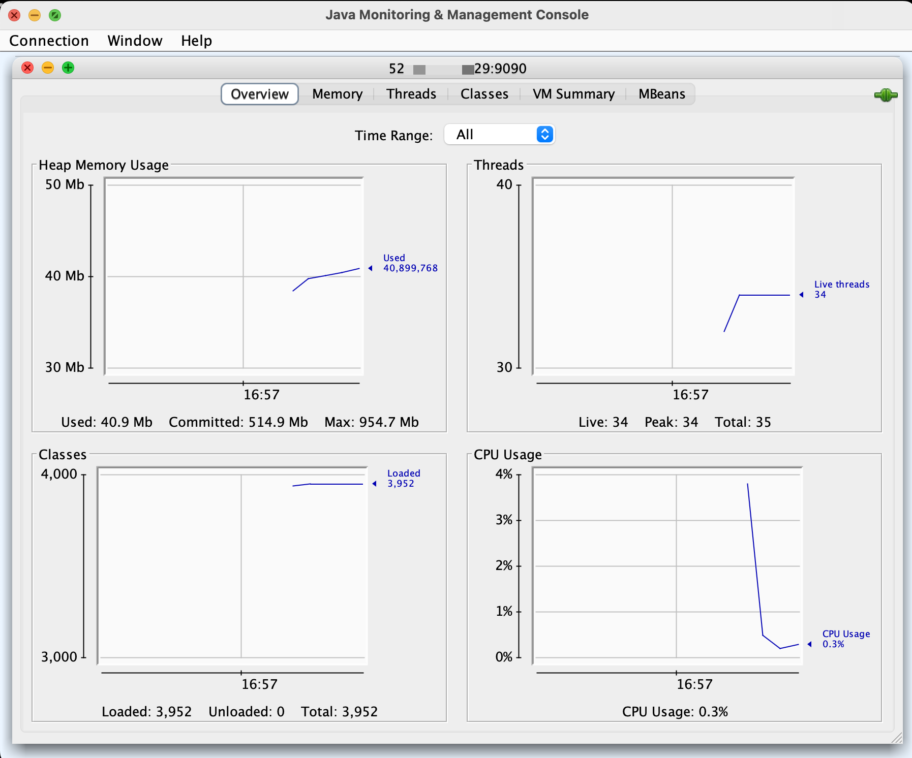
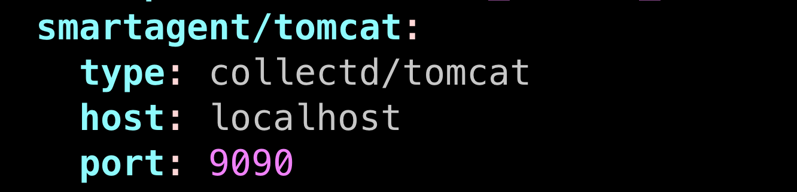

Must read https://www.digitalocean.com/community/tutorials/how-to-install-apache-tomcat-10-on-ubuntu-20-04



Follow the steps to install Tomcat 10 on Ubuntu 20.04.

Next add a Java appplication to Tomcat.

Go to `cd MyWebApp` and run `mvn clean package`. This will create a MyWebApp.war file in the target/ directory.

    This simple application allows users to enter their name, which is then displayed on the page. It demonstrates the basic structure of a Java web application with a frontend (JSP and CSS) and backend (Servlet).
    To enhance this application with OpenTelemetry:
        Add the OpenTelemetry dependencies to your pom.xml.
        Configure a TracerProvider in your application.
        Instrument your Servlet using OpenTelemetry annotations or manual instrumentation.

Transfer the WAR file: Use SCP or SFTP to transfer your WAR file to the Ubuntu server where Tomcat is running:

`scp -i ~/.ssh/my-ec2-key.pem ~/MyWebApp.war ubuntu@ec2-xx-xx-xx-xx.compute-1.amazonaws.com:~`

Check that the WAR file is in the correct location: ~/MyWebApp.war

After which, `sudo cp ~/MyWebApp.war /opt/tomcat/webapps/`

Ensure Tomcat has the right permissions to read and execute your application:
`sudo chown tomcat:tomcat /opt/tomcat/webapps/MyWebApp.war`
`sudo chmod 644 /opt/tomcat/webapps/MyWebApp.war`

Check Tomcat logs for any errors:
`sudo journalctl -u tomcat`
`sudo tail -f /opt/tomcat/logs/catalina.out`

Restart the Tomcat service to deploy your application:
`sudo systemctl restart tomcat`
`sudo systemctl status tomcat`

Access your application through a web browser:
http://your-server-ip:8080/MyWebApp



---

Configure Tomcat for remote JMX access:
Edit the Tomcat startup script (create a setenv.sh)

Add the following lines:
```bash
export CATALINA_OPTS="$CATALINA_OPTS -Dcom.sun.management.jmxremote -Dcom.sun.management.jmxremote.port=9090 -Dcom.sun.management.jmxremote.rmi.port=9091 -Dcom.sun.management.jmxremote.ssl=false -Dcom.sun.management.jmxremote.authenticate=false -Djava.rmi.server.hostname=<your_server_ip e.g. public ip or localhost or 127.0.0.1>"
```

To verify the JMX connection:

Restart Tomcat after making these changes.
`sudo systemctl restart tomcat`

`sudo systemctl status tomcat`

Verify Process Arguments:
Check if the JMX arguments are actually being passed to the Java process:

`ps aux | grep tomcat | grep jmxremote`

Check Tomcat Logs:
After enabling JMX and restarting Tomcat, check the Tomcat logs for any JMX-related messages:

`sudo tail -f /opt/tomcat/logs/catalina.out`

Use lsof (List Open Files):
On Unix-like systems, you can use lsof to check if Java (Tomcat) has the JMX port open:

`sudo lsof -i :9090`

`sudo lsof -i :9091`

Firewall Settings:
Make sure your firewall allows connections on port 9090 9091:

`sudo ufw status`

If UFW is active, you might need to add a rule:

`sudo ufw allow 9090/tcp`

`sudo ufw allow 9091/tcp`

Use netstat to Check Open Ports:
You can use netstat to verify that Tomcat is listening on the JMX port:

`sudo apt update`

`sudo apt install net-tools`

`netstat --version`

`sudo netstat -tulpn | grep 9090`

`sudo netstat -tulpn | grep 9091`

Security Group (if on EC2):
If you're on EC2, ensure that the security group allows inbound traffic on port 9090 9091.

Test Local Connection:
Try connecting to JMX locally on the server:

`telnet localhost 9090`

`telnet localhost 9091`

In my Mac terminal `jconsole <the ec2 public ip>:9090`



---

# Install OpenTelemetry Collector

```bash
curl -sSL https://dl.signalfx.com/splunk-otel-collector.sh > /tmp/splunk-otel-collector.sh && \
sudo sh /tmp/splunk-otel-collector.sh --realm us1 -- < ACCESS TOKEN HERE > --mode agent --without-instrumentation --discovery

```

`sudo systemctl restart splunk-otel-collector`

`sudo systemctl status splunk-otel-collector`

`sudo journalctl -u splunk-otel-collector -f`

`sudo vim /etc/otel/collector/agent_config.yaml`

Add to the receiver. https://docs.splunk.com/observability/en/gdi/monitors-hosts/apache-tomcat.html 


---

# Install OpenTelemetry Java Agent

Modify the Tomcat startup script (usually /etc/systemd/system/tomcat.service) to include the agent:
`Environment="CATALINA_OPTS=-javaagent:/path/to/opentelemetry-javaagent.jar"`

Reload the systemd configuration and restart Tomcat:
`sudo systemctl daemon-reload`
`sudo systemctl start tomcat`
`sudo systemctl status tomcat`