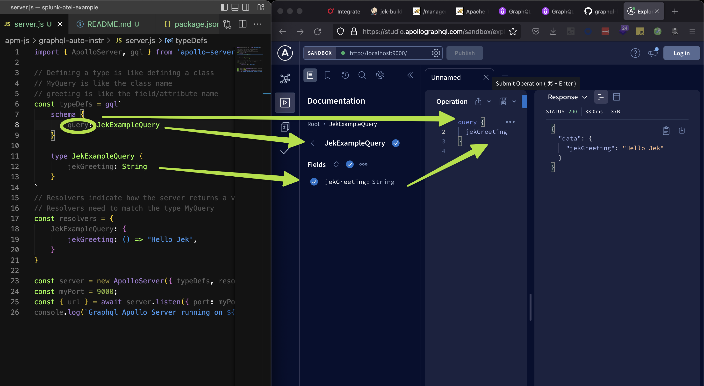

# Set up server.js with package.json
- Create server.js
- `npm init`
- Install Apollo Server https://www.npmjs.com/package/apollo-server `npm i apollo-server --save`
- Install GraphQL https://www.npmjs.com/package/graphql `npm i graphql --save`
- Add `type: module` to package.json
```json
{
  "name": "graphql-auto-instr",
  "type": "module",
  "dependencies": {
    "apollo-server": "^3.10.0",
    "graphql": "^16.5.0"
  }
}
```
- Add code to server.js
```javascript
import { ApolloServer, gql } from 'apollo-server';

// Defining a type is like defining a class
// MyQuery is like the class name
// greeting is like the field/attribute name
const typeDefs = gql`
    schema {
        query: JekExampleQuery
    }

    type JekExampleQuery {
        jekGreeting: String
    }
`
// Resolvers indicate how the server returns a value
// Resolvers need to match the type MyQuery
const resolvers = {
    JekExampleQuery: {
        jekGreeting: () => "Hello Jek",
    }
}

const server = new ApolloServer({ typeDefs, resolvers})
const myPort = 9000;
const { url } = await server.listen({ port: myPort })
console.log(`Graphql Apollo Server running on ${myPort}`)
```

- Run `node server.js`
- Go to localhost:<the port number> e.g. localhost:9000

# Set up client.js with client.html 

# Instrument server.js with splunk-otel-js plus otel graphql library

# Proof 

# Learning Ref
- https://www.udemy.com/course/graphql-by-example/ 