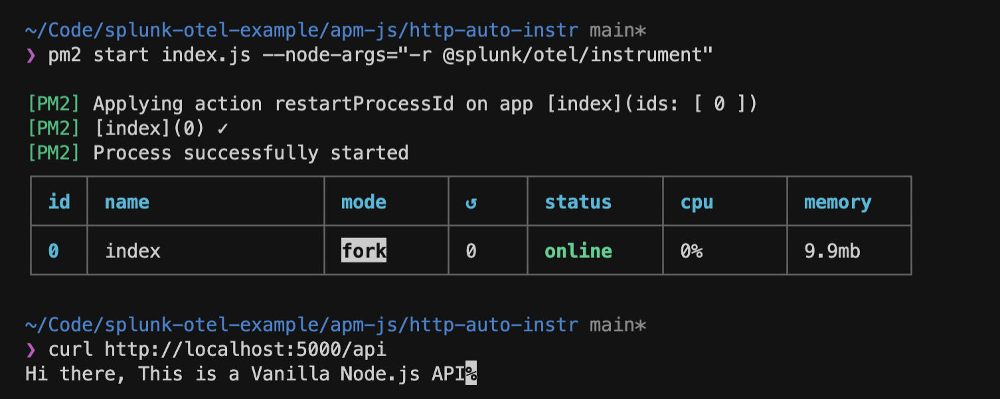
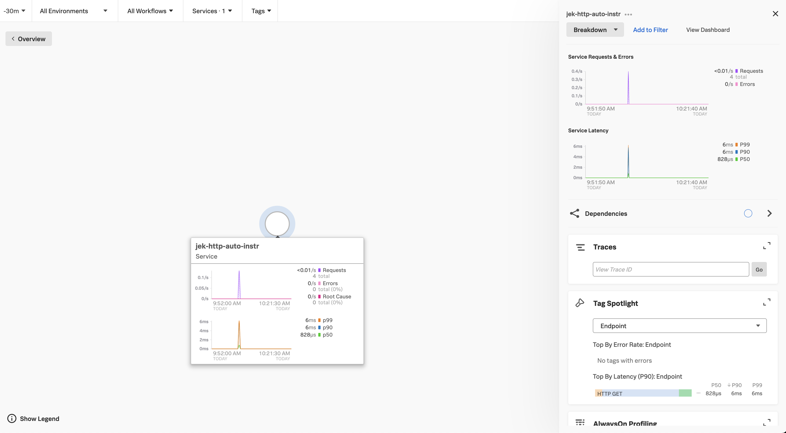

# This is continuation of apm-js/http-auto-instr

- The command to run is 
```bash
pm2 start <your-app.js> --node-args="-r @splunk/otel/instrument"
```

e.g.
```bash
pm2 start index.sg --node-args="-r @splunk/otel/instrument"
```

Ref: https://stackoverflow.com/questions/60680910/how-to-start-pm2-with-node-r-module-or-how-to-deploy-a-module-in-node-js

# Proof
- 