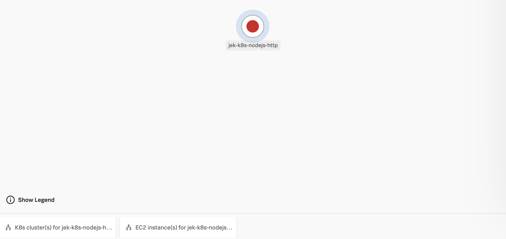

#My setup
- node v16.13.0
- npm v8.1.0

#13 Steps
1. `npm init`


2. `npm install @splunk/otel --save`


3. `npm install @opentelemetry/instrumentation-http --save`

4. Add any other OpenTelemetry registry library as necessary see https://opentelemetry.io/registry/?language=js 

5. Add -r @splunk/otel/instrument to the Dockerfile command
```dockerfile
CMD [ "node", "-r", "@splunk/otel/instrument", "index.js" ]
```

6. Open termanal and run the build command arguments:
- Name the image jekbao/k8snodejs:<version>
- Run without taking from cache
```bash
docker build -t jekbao/k8snodejs:v1.0.2 . --no-cache
```

7. Run your image with -d runs the container in detached mode, leaving the container running in the background. The -p flag redirects a public port to a private port inside the container. Run the image you previously built:
```bash
docker run -d -p 3009:3002 --name jek_k8s_nodejs_http_auto-instr jekbao/k8snodejs:v1.0.2
```
Note: Intentionally port forward to 3009. Internally it is exposing port 3002 to show variation

8. Test with curl
```bash
curl localhost:3009/api
```
If it works, now we can docker push
docker push jekbao/k8snodejs:v1.0.2


9. Update image in k8s-daemonset-nodejs.yaml to latest image v1.0.2 after which create the deployment with the follow command in terminal CLI
```bash
kubectl apply -f k8s-daemonset-nodejs.yaml`
```

10. Test that can connect to pod
```bash
# Invoke success
kubectl run tmp --image=nginx:alpine -i --rm --restart=Never -- curl -m 5 -v <pod ip using kubectl get pod -o wide>:<containerPort>/api

# Invoke error
kubectl run tmp --image=nginx:alpine -i --rm --restart=Never -- curl -m 5 -v <pod ip using kubectl get pod -o wide>:<containerPort>
```

11. Or use port forwarding if permitted
```bash
kubectl port-forward deployment/k8s-daemonset-nodejs-http-auto-instr 3009:<containerPort>

# Invoke success
curl http://localhost:3009/api

# Invoke error
curl http://localhost:3009
```

#Misc

- Ref: https://github.com/signalfx/splunk-otel-js
- Proof: 
- Last updated: 28 Feb 2022