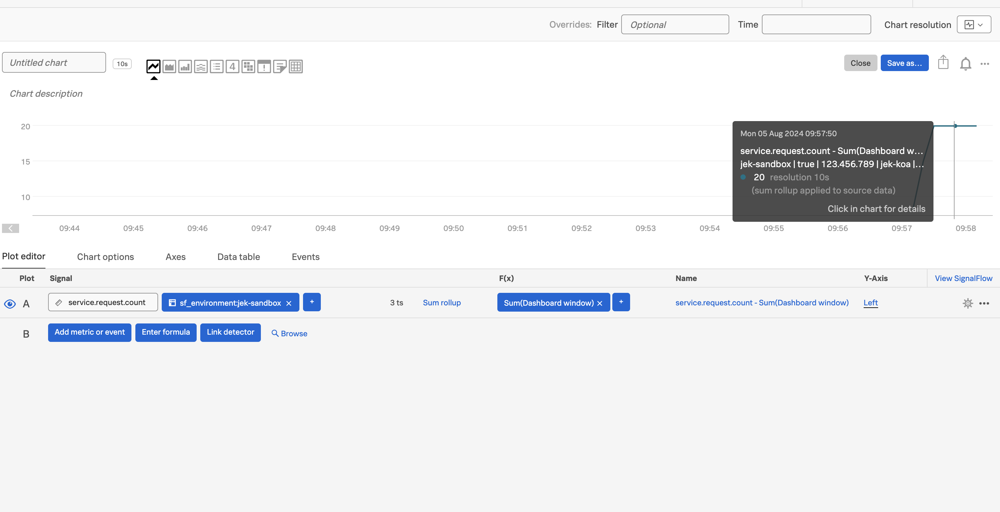
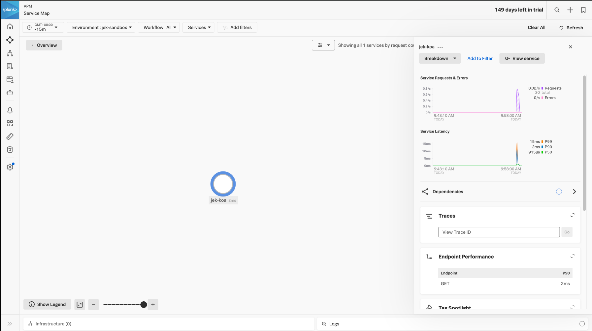
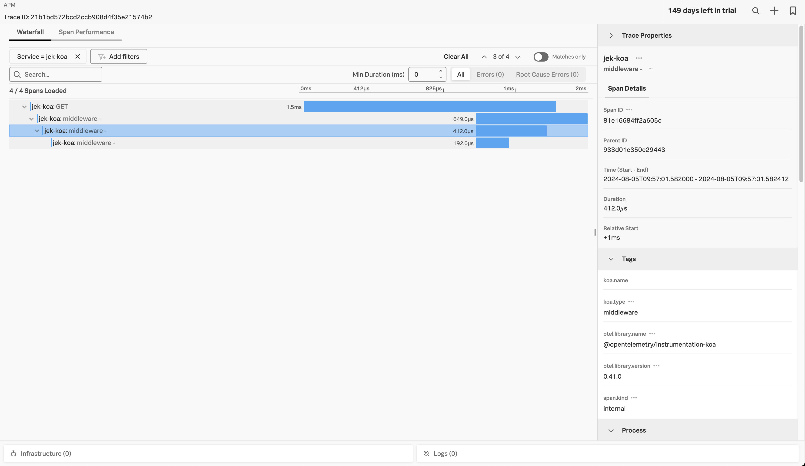

Got started by following https://koajs.com/

Add splunk-otel-js and variables to system

`export OTEL_SERVICE_NAME=<yourServiceName>`

`export OTEL_RESOURCE_ATTRIBUTES='deployment.environment=<envtype>,service.version=<version>'`

`export SPLUNK_ACCESS_TOKEN=<access_token>`

`export SPLUNK_REALM=<realm>`

`npm install @splunk/otel`

`node -r @splunk/otel/instrument app.js`

# Proof

