# Create HelloWorld lambda function
- Make sure to have the relevant IAM role before starting. If you have administrator role, then it is all good. Go ahead.
- Create S3 bucket for uploading lambda fn 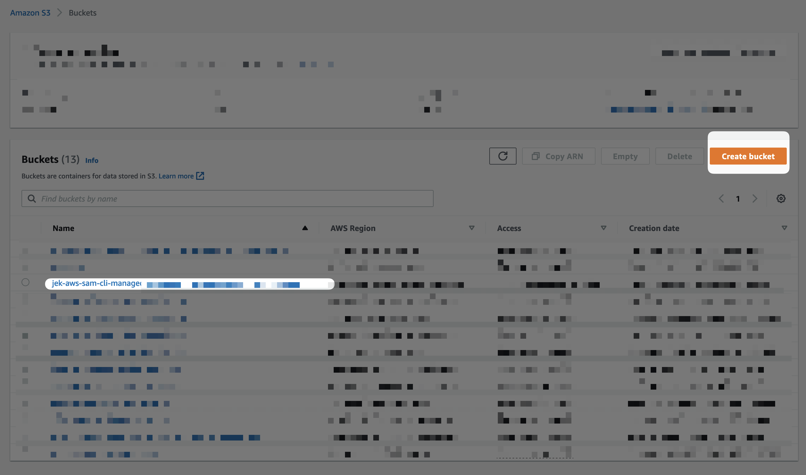
- Create Cloud9 environment 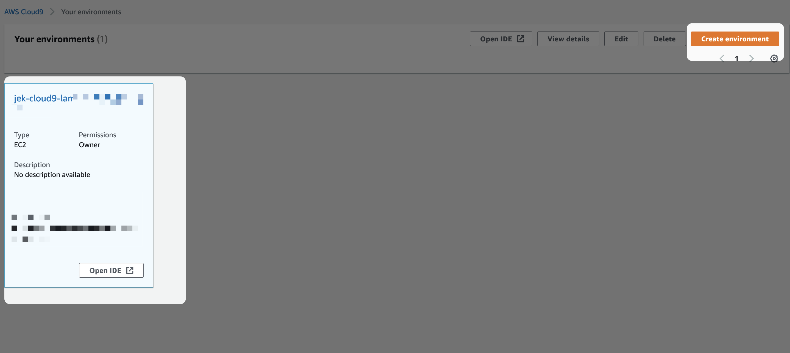
- `sam init` 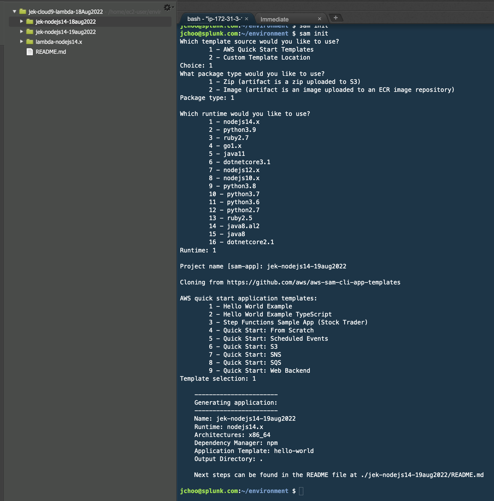
- Change directory and build
```bash
cd <the folder name>

sam build

sam local invoke
``` 
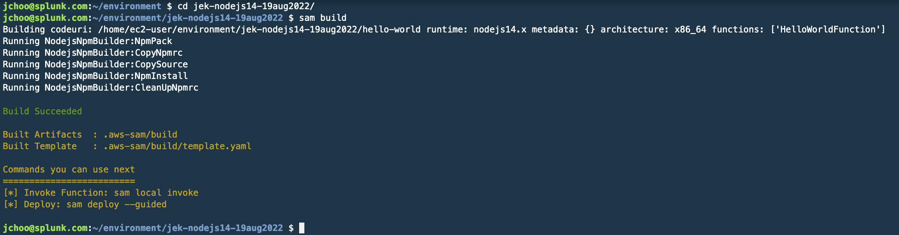

- Deploy using Serverless Application Model
```bash
sam deploy --stack-name jek-lambda-sam-nodejs14-<today date> --guided 
``` 
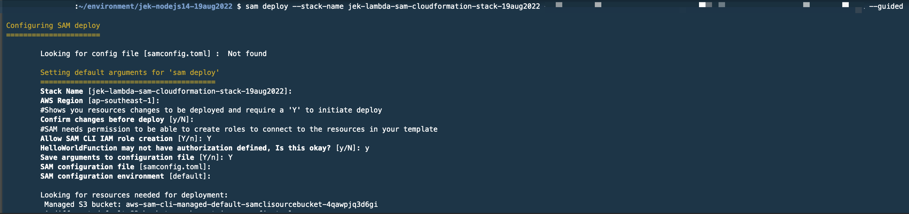

- Change the S3 bucket in the `samconfig.toml` of the S3 bucket to the bucket created earlier 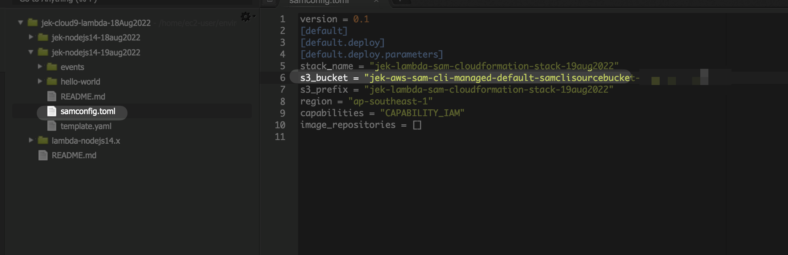

- Run `sam deploy` again without the --guided flag. 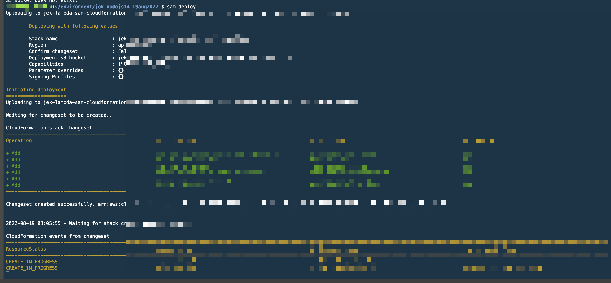

- (Optionally) See other sam flags https://docs.aws.amazon.com/serverless-application-model/latest/developerguide/sam-cli-command-reference-sam-deploy.html 

- Test the deployed lambda function 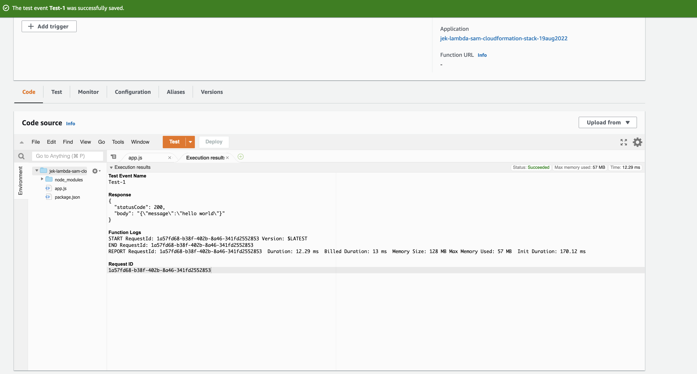
- Curl the deployed lambda function `curl <the url from API Gateway>` 
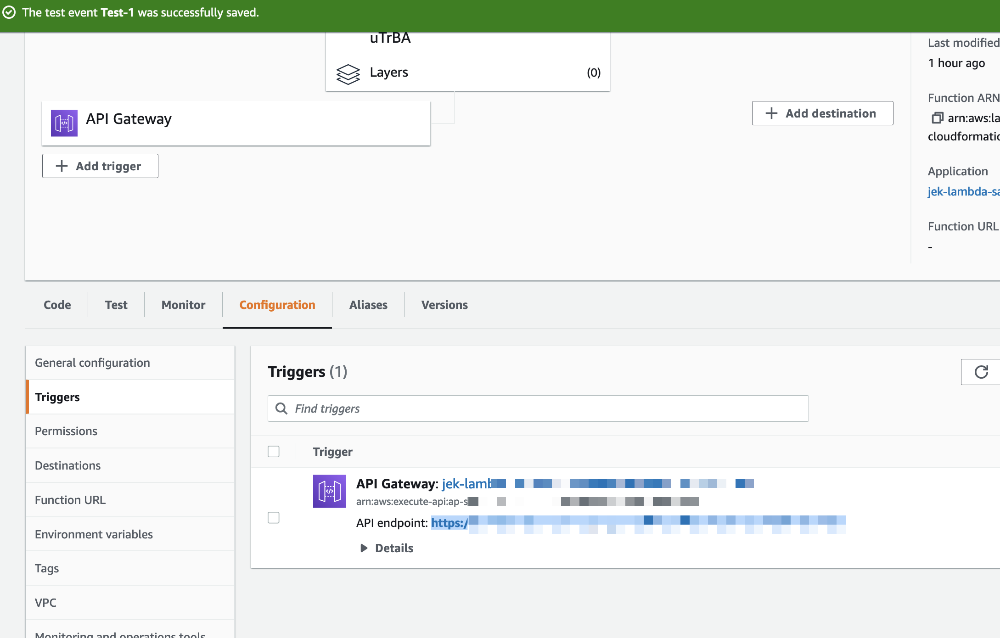


# Add Splunk Lambda Layer for traces
- Follow the steps in Data Setup 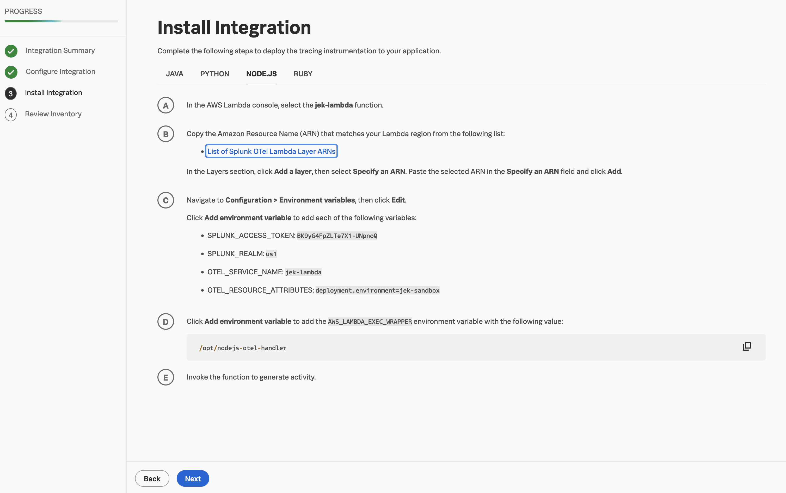
- Open template.yaml in the Cloud9 IDE and add lambda layer by going to template.yaml > Resources > Properties > Layers. Also add add environment variables by staying on template.yaml > Resources > Properties > Environment > Variables
```yml
      Layers:
        - arn:aws:lambda:ap-southeast-1:254067382080:layer:splunk-apm:54
      Environment:
        Variables:
          SPLUNK_ACCESS_TOKEN: <redacted for...>
          SPLUNK_REALM: <redacted for...>
          OTEL_SERVICE_NAME: jek-lambda-nodejs14-19aug2022
          OTEL_RESOURCE_ATTRIBUTES: deployment.environment=jek-sandbox
          AWS_LAMBDA_EXEC_WRAPPER: /opt/nodejs-otel-handler
```

- Run `sam build`
- Run `sam deploy`
- Curl the deployed with instrumentation lambda function `curl <the url from API Gateway>` 


# Add trace_id and span_id to log lines (WIP)
- Setup AWS CloudWatch Logs integration
- Add trace_id and span_id to log line https://jek-bao-choo.medium.com/steps-to-instrument-splunk-observability-cloud-to-monitor-aws-sam-lambda-node-js-microservice-6500bba736cd  (WIP)
- Once this is done, I could do a similar one for Python referencing this https://github.com/smathur-splunk/lambda-apm-workshop#optional-add-custom-span-tags-for-additional-info (WIP)

# Clean up
- `aws cloudformation delete-stack --stack-name jek-lambda-sam-nodejs14-<today date> --region ap-southeast-1`
- We can see that the CloudFormation stack deleted as well as the Lambda function.
- Delete the Cloud9 IDE instance.

# Proof
- 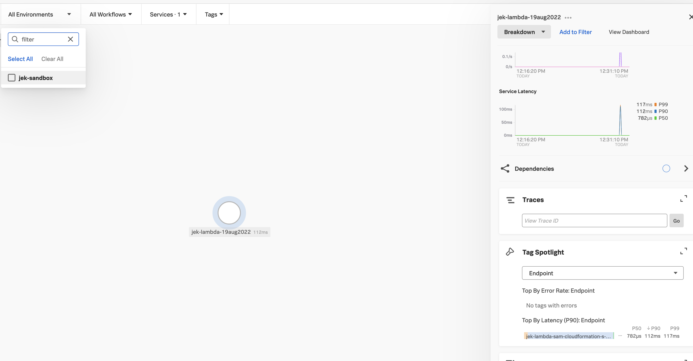
- Date: 19 Aug 2022