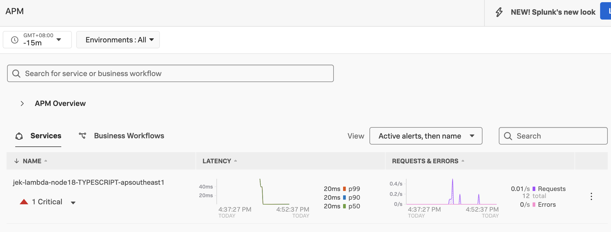
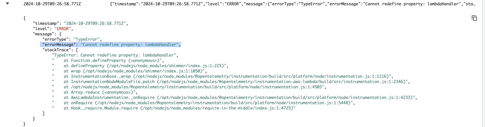

# Note:
- This is for Typescript. Can also be used for Javascript but don't need to adapt for the error mentioned below.
- Remember to add the realm and access token before getting started.

# Step 1: Install Prerequisites
- Make sure to have the relevant IAM role before starting. If you have administrator role, then it is all good. Go ahead.
- You’ll need to install the following if you haven’t already:
- AWS CLI: Install from AWS CLI installation guide.
- AWS SAM CLI: Install from SAM CLI installation guide.

```bash
aws --version
sam --version
```

# Step 2: Initialize a SAM Project
- `sam init` 
    - Choose AWS Starter Template
    - Choose Zip instead of Image
- Change directory and build

```bash
cd <the folder name>

sam build

sam local invoke
``` 


- Deploy using Serverless Application Model
```bash
sam deploy --stack-name jek-lambda-sam-nodejs18-<today date> --guided 
``` 

# Step 3: Modify the Lambda Function

In /hello-world/app.ts
```typescript
exports.lambdaHandler = async (event) => {
    return {
        statusCode: 200,
        body: JSON.stringify({
            message: 'Hello World layer none',
        }),
    };
};
```

# Step 4: Build the Project

```bash
sam build
```

- Run `sam deploy` again without the --guided flag.

- (Optionally) See other sam flags https://docs.aws.amazon.com/serverless-application-model/latest/developerguide/sam-cli-command-reference-sam-deploy.html 

- Test the deployed lambda function
- Curl the deployed lambda function `curl <the url from API Gateway>` 


# Step 5: Add Splunk Lambda Layer for traces (WIP)
- Follow the steps in Splunk O11y Cloud's Data Setup. You can find the layer address here https://github.com/signalfx/lambda-layer-versions/blob/main/splunk-apm/splunk-apm.md
    - To check your architecture use `aws lambda get-function-configuration --function-name <YOUR_FUNCTION_NAME> | grep Architectures -a2`
- Open template.yaml in the IDE and add lambda layer by going to template.yaml > Resources > Properties > Layers. Also add add environment variables by staying on template.yaml > Resources > Properties > Environment > Variables
```yml
      Layers:
      - !Sub arn:aws:lambda:ap-southeast-1:254067382080:layer:splunk-apm:107  # Replace with your layer ARN
      # Add Environment variables here
      Environment:
        Variables:
          AWS_LAMBDA_EXEC_WRAPPER: /opt/nodejs-otel-handler #/opt/otel-handler
          OTEL_SERVICE_NAME: jek-lambda-node18-TYPESCRIPT-apsoutheast1
          OTEL_RESOURCE_ATTRIBUTES: deployment.environment=jek-sandbox
          SPLUNK_REALM: <redacted for...>
          SPLUNK_ACCESS_TOKEN: <redacted for...>
```

- Run `sam build`
- Run `sam deploy`
- Curl the deployed with instrumentation lambda function `curl <the url from API Gateway>` 


# Step 6: Add trace_id and span_id to log lines (WIP)
- Setup AWS CloudWatch Logs integration
- Add trace_id and span_id to log line https://jek-bao-choo.medium.com/steps-to-instrument-splunk-observability-cloud-to-monitor-aws-sam-lambda-node-js-microservice-6500bba736cd  (WIP)
- Once this is done, I could do a similar one for Python referencing this https://github.com/smathur-splunk/lambda-apm-workshop#optional-add-custom-span-tags-for-additional-info (WIP)

# Step 7: Clean up
- `sam delete`
- `aws cloudformation delete-stack --stack-name jek-lambda-sam-nodejs18-<today date> --region ap-southeast-1`
    - We can see that the CloudFormation stack deleted as well as the Lambda function.
- Delete AWS logging, Xray, and application monitoring


# Proof (WIP)
- 
- Date: 29 Oct 2024


# Typescript error explanation
Change ES6 Export to CommonJS export to resolve this error


Here is the error message.
```javascript
{
    "timestamp": "2024-10-29T09:26:58.771Z",
    "level": "ERROR",
    "message": {
        "errorType": "TypeError",
        "errorMessage": "Cannot redefine property: lambdaHandler",
        "stackTrace": [
            "TypeError: Cannot redefine property: lambdaHandler",
            "    at Function.defineProperty (<anonymous>)",
            "    at defineProperty (/opt/nodejs/node_modules/shimmer/index.js:1:225)",
            "    at wrap (/opt/nodejs/node_modules/shimmer/index.js:1:1050)",
            "    at InstrumentationBase._wrap (/opt/nodejs/node_modules/@opentelemetry/instrumentation/build/src/platform/node/instrumentation.js:1:1116)",
            "    at InstrumentationNodeModuleFile.patch (/opt/nodejs/node_modules/@opentelemetry/instrumentation-aws-lambda/build/src/instrumentation.js:1:2346)",
            "    at /opt/nodejs/node_modules/@opentelemetry/instrumentation/build/src/platform/node/instrumentation.js:1:4503",
            "    at Array.reduce (<anonymous>)",
            "    at AwsLambdaInstrumentation._onRequire (/opt/nodejs/node_modules/@opentelemetry/instrumentation/build/src/platform/node/instrumentation.js:1:4233)",
            "    at onRequire (/opt/nodejs/node_modules/@opentelemetry/instrumentation/build/src/platform/node/instrumentation.js:1:5448)",
            "    at Hook._require.Module.require (/opt/nodejs/node_modules/require-in-the-middle/index.js:1:4725)"
        ]
    }
}
```

The error "Cannot redefine property: lambdaHandler" is happening because of how AWS Lambda's OpenTelemetry instrumentation works with exported functions.

## The Root Cause:

- When using export const, TypeScript/ES6 uses Object.defineProperty() under the hood to define the export
- The AWS Lambda OpenTelemetry instrumentation (as seen in the stack trace) tries to wrap the handler function using the shimmer library to add telemetry
- The instrumentation can't redefine the property because export const creates a non-configurable property

```typescript
export const lambdaHandler = async (event) => {...}
```

- This syntax creates an immutable binding
- OpenTelemetry can't wrap this function because the property descriptor is non-configurable
- That's why you see the error coming from shimmer/index.js trying to use defineProperty

```typescript
const lambdaHandler = async (event) => {...}
module.exports = { lambdaHandler };
```

- This uses CommonJS module exports
- The property is configurable when exported this way
- OpenTelemetry SDK can successfully wrap the function for instrumentation

In short, the stack trace shows the error originates from the OpenTelemetry instrumentation trying to patch the Lambda handler. 

- The instrumentation uses the shimmer library to wrap functions for monitoring
- Using module.exports creates configurable properties that can be redefined

All in all, use CommonJS exports (module.exports) instead of ES6 exports!
