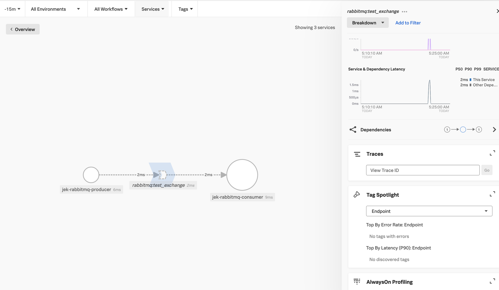

- Create producer.js
- Create consumer.js
-  `npm install @splunk/otel --save`
- Example of RabbitMQ codes https://github.com/amqp-node/amqplib/tree/main/examples/tutorials
- More example of RabbitMQ codes https://www.rabbitmq.com/getstarted.html
- Working code of RabbitMQ codes that generate tracing https://www.cloudamqp.com/blog/how-to-run-rabbitmq-with-nodejs.html
- Docker start RabbitMQ https://www.rabbitmq.com/download.html
- Proof 