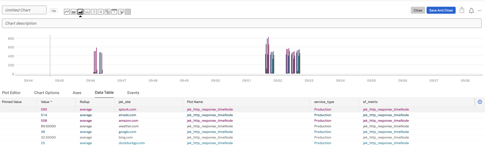

The objective of this guide is to send custom metrics to Signalfx (Splunk O11y Cloud) portal.

Steps:

1. Install the library https://github.com/signalfx/signalfx-nodejs `npm install signalfx --save`

2. Add access token and realm to index.js

3. Run `node index.js`

#Misc

- Ref:
1. Signalfx node.js library https://github.com/signalfx/signalfx-nodejs
2. Splunk Education's "Sending Custom Metrics to Splunk IM" module at https://education.splunk.com/

- Proof: 
- Last updated: 14 Jan 2022