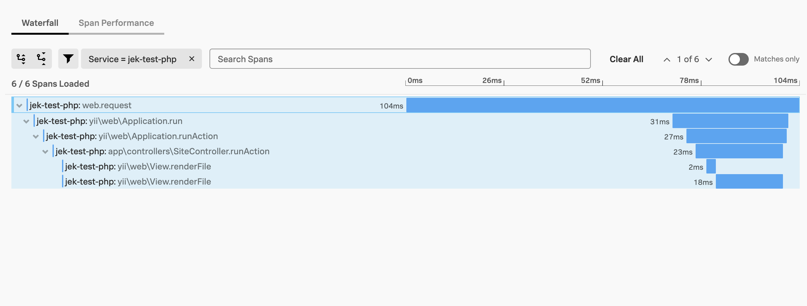

# Yii on PHP 8.1 on Ubuntu 22.04 with additional of php-fpm apache/nginx
Reminder: If coming from DataDog, remove or uninstall DataDog agent https://docs.datadoghq.com/tracing/trace_collection/dd_libraries/php/?tab=containers#removing 

# 1. Create a Ubuntu 22.04 EC2 Instance with 30 GB storage

# 2. Install OTel Collector

# 3. Install PHP 8.1 and Set Up a Local Development Environment on Ubuntu 22.04
https://www.digitalocean.com/community/tutorials/how-to-install-php-8-1-and-set-up-a-local-development-environment-on-ubuntu-22-04

# 4. Install Yii 
https://www.yiiframework.com/doc/guide/2.0/en/start-installation

# 5. Install signalfx-php-tracing using Splunk O11y UI portal's Data Management step for PHP

# 6. Proof up to this point

# Haven't tried the below

## - Install Nginx on Ubuntu 22.04
https://www.digitalocean.com/community/tutorials/how-to-install-nginx-on-ubuntu-22-04 

## - Configure Nginx as a Reverse Proxy on Ubuntu 22.04
https://www.digitalocean.com/community/tutorials/how-to-configure-nginx-as-a-reverse-proxy-on-ubuntu-22-04

## - Install PHP-FPM with Apache on Ubuntu 22.04
https://www.cloudbooklet.com/how-to-install-php-fpm-with-apache-on-ubuntu-22-04/ 

## - How to Configure PHP-FPM with NGINX
https://www.digitalocean.com/community/tutorials/php-fpm-nginx

# REF
- https://github.com/signalfx/signalfx-php-tracing 