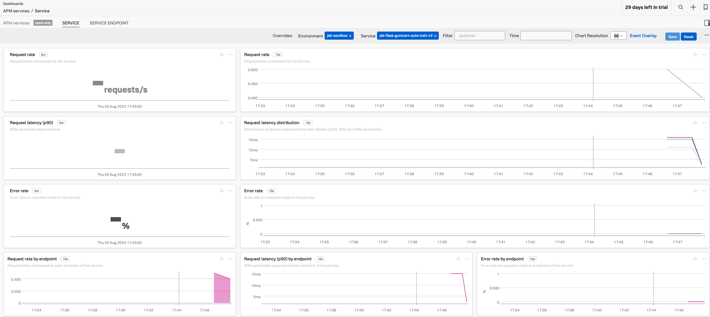

# My setup
- Python v3.10.0

# Steps
- Make sure it is python 3.7 or higher `python --version`
- Create virtual environment `python -m venv venv`
- Activate the virtual environment `source venv/bin/activate`
- Install `pip install 'splunk-opentelemetry[all]' --no-cache-dir`
- Install `splunk-py-trace-bootstrap`
- Add `pip install flask`
- Add `pip install opentelemetry-instrumentation-flask`
- Add `pip install gunicorn`
- View the packages before installing more `pip freeze`
- `pip freeze > requirements.txt`
- `export OTEL_SERVICE_NAME=jek-flask-gunicorn-auto-instr-v2`
- `export OTEL_RESOURCE_ATTRIBUTES='deployment.environment=jek-sandbox,service.version=99.89'`
- `export SPLUNK_ACCESS_TOKEN=< ingest token from splunk o11y cloud >`
- `export OTEL_EXPORTER_OTLP_ENDPOINT=https://ingest.< set the realm >.signalfx.com/v2/trace/otlp`
- Create the app.py file that is available as reference in this folder.

- `splunk-py-trace gunicorn -b 127.0.0.1:8000 --threads 2 --workers 4 --log-level debug app:app`
- In a new terminal, invoke request via `curl http://127.0.01:8000/hello/`
- Deactivate the virtual environment `deactivate`

# Proof

# Containerize this

# Kubernetize this

# Reference
- https://github.com/signalfx/tracing-examples/tree/main/opentelemetry-tracing/opentelemetry-python-tracing/flask-and-gunicorn