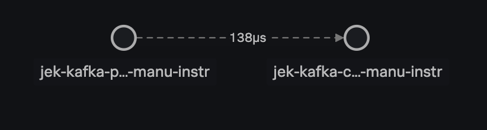

#This is WIP. Not ready yet

# My Setup
- Python v3.10.0
- Pip v21.2.3
- Docker v20.10.8

# 30 Steps
## Terminal 1
1. Start Zookeeper
    

2. Start Kafka

## Terminal 2
    

3. Make sure it is python 3.6 or higher `python --version`

4. Create virtual environment `python -m venv venv`

5. Activate the virtual environment `source venv/bin/activate`

6. Install kafka python library `pip install kafka-python`

7. Install `pip install 'splunk-opentelemetry[all]'` 

8. Install `splunk-py-trace-bootstrap`

9. `export OTEL_SERVICE_NAME=jek-kafka-consumer-manu-instr`

10. `export OTEL_TRACES_EXPORTER="jaeger-thrift-splunk"`

11. `export OTEL_EXPORTER_JAEGER_ENDPOINT=https://ingest.<realm from splunk o11y>.signalfx.com/v2/trace`

12. `export SPLUNK_ACCESS_TOKEN=<ingest token from splunk o11y cloud>`

13. Set environment name `export OTEL_RESOURCE_ATTRIBUTES=deployment.environment=jek-dev`
   

14. Set service version `export OTEL_RESOURCE_ATTRIBUTES=service.version=99.99.99`

15. View the packages before installing more `pip freeze`

16. Create consumer.py file

17. Add the basic code from this Github repo to your newly created consumer.py

18. Run consumer.py `splunk-py-trace python consumer.py`

## Terminal 3

20. Activate the virtual environment `source venv/bin/activate`

21. `export OTEL_SERVICE_NAME=jek-kafka-producer-manu-instr`

22. `export OTEL_TRACES_EXPORTER="jaeger-thrift-splunk"`

23. `export OTEL_EXPORTER_JAEGER_ENDPOINT=https://ingest.<realm from splunk o11y>.signalfx.com/v2/trace`

24. `export SPLUNK_ACCESS_TOKEN=<ingest token from splunk o11y cloud>`

25. Set environment name `export OTEL_RESOURCE_ATTRIBUTES=deployment.environment=jek-dev`
   

26. Set service version `export OTEL_RESOURCE_ATTRIBUTES=service.version=99.99.99`

27. Create producer.py file

28. Add the basic code from this Github repo to your newly created producer.py and consumer.py

29. Run producer.py `splunk-py-trace python producer.py`

30. Deactivate the virtual environment when no longer needed `deactivate`

# Misc

Ref: https://github.com/signalfx/splunk-otel-python

Proof: 

Last updated: 24 Nov 2021