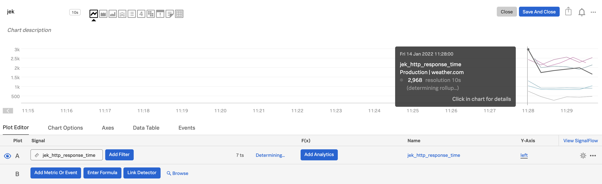

# My setup

- Python v3.10.0
- Pip v21.2.3

# 6 Steps
1. Make sure it is python 3.6 or higher `python --version`

2. Create virtual environment `python -m venv venv`

3. Activate the virtual environment `source venv/bin/activate`

4. Install `pip install signalfx` 

5. Add the access token and realm to app.py

6. Run with `python app.py`

# Misc

Ref: 
1. Signalfx node.js library https://github.com/signalfx/signalfx-python
2. Splunk Education's "Sending Custom Metrics to Splunk IM" module at https://education.splunk.com/

Proof: 

Last updated: 14 Jan 2022