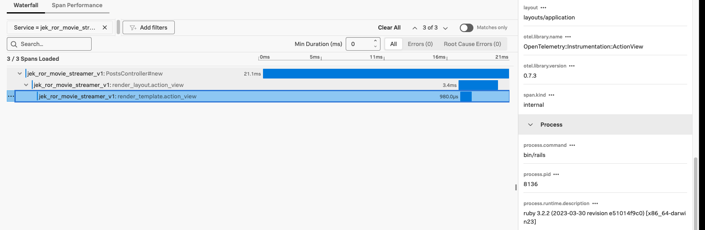

Assuming the basics of ROR is setup. If not refer to the basic hello world example in apm-rb folder.

# Basic ROR app with use of primary database

Step 1: Create a new Rails application

```
rails new ror-activerecord-helloworldblog
cd ror-activerecord-helloworldblog
```

Step 2: Generate a basic Post model:
```
rails generate model Post title:string content:text
rails db:migrate
```

Step 3: Generate the controller:
```
rails generate controller Posts index new create
```

Update the relevant files with these codes.

```ruby

# app/models/post.rb
class Post < ApplicationRecord
  validates :title, presence: true
  validates :content, presence: true
end

# app/controllers/posts_controller.rb
class PostsController < ApplicationController
  def index
    @posts = Post.all
  end

  def new
    @post = Post.new
  end

  def create
    @post = Post.new(post_params)
    if @post.save
      redirect_to posts_path, notice: 'Post created!'
    else
      render :new
    end
  end

  private

  def post_params
    params.require(:post).permit(:title, :content)
  end
end

# config/routes.rb
Rails.application.routes.draw do
  root 'posts#index'
  resources :posts, only: [:index, :new, :create]
end

# app/views/posts/index.html.erb
<h1>Blog Posts</h1>

<%= link_to 'Write New Post', new_post_path %>

<% @posts.each do |post| %>
  <div>
    <h2><%= post.title %></h2>
    <p><%= post.content %></p>
  </div>
<% end %>

# app/views/posts/new.html.erb
<h1>Write New Post</h1>

<%= form_with(model: @post, local: true) do |form| %>
  <div>
    <%= form.label :title %>
    <%= form.text_field :title %>
  </div>

  <div>
    <%= form.label :content %>
    <%= form.text_area :content %>
  </div>

  <%= form.submit 'Create Post' %>
<% end %>

<%= link_to 'Back to Posts', posts_path %>

```

Step 4: Start the server:
```
rails server
```

- Visit http://localhost:3000
- Click "Write New Post" to create a post
- View all posts on the homepage

Step 5: experiment with ActiveRecord in the console
```ruby
rails console

# Create a post
Post.create(title: "HelloJek", content: "World!")

# Find all posts
Post.all

# Find specific post
Post.find_by(title: "HelloJek")
```

# Improve the app to use Primary Database and Replica Database

Step 1: Update database.yml file

``` 
# config/database.yml
# SQLite. Versions 3.8.0 and up are supported.
#   gem install sqlite3
#
#   Ensure the SQLite 3 gem is defined in your Gemfile
#   gem "sqlite3"
#
default: &default
  adapter: sqlite3
  pool: <%= ENV.fetch("RAILS_MAX_THREADS") { 5 } %>
  timeout: 5000

development:
  primary:
    <<: *default
    database: db/primary_development.sqlite3
  replica:
    <<: *default
    database: db/replica_development.sqlite3
    replica: true


# Warning: The database defined as "test" will be erased and
# re-generated from your development database when you run "rake".
# Do not set this db to the same as development or production.
test:
  primary:
    <<: *default
    database: db/primary_test.sqlite3
  replica:
    <<: *default
    database: db/replica_test.sqlite3
    replica: true


# SQLite3 write its data on the local filesystem, as such it requires
# persistent disks. If you are deploying to a managed service, you should
# make sure it provides disk persistence, as many don't.
#
# Similarly, if you deploy your application as a Docker container, you must
# ensure the database is located in a persisted volume.
production:
  <<: *default
  # database: path/to/persistent/storage/production.sqlite3

```

Step 2: Set up the databases:

```
rails db:create        # Creates both primary and replica databases
rails db:migrate       # Run migrations on primary
rails db:setup_replica # Copy primary to replica
```

Step 3: Update the following files:

```
# config/environments/development.rb
require "active_support/core_ext/integer/time"

Rails.application.configure do
  # Settings specified here will take precedence over those in config/application.rb.

  # In the development environment your application's code is reloaded any time
  # it changes. This slows down response time but is perfect for development
  # since you don't have to restart the web server when you make code changes.
  config.enable_reloading = true

  # Do not eager load code on boot.
  config.eager_load = false

  # Show full error reports.
  config.consider_all_requests_local = true

  # Enable server timing.
  config.server_timing = true

  # Enable/disable caching. By default caching is disabled.
  # Run rails dev:cache to toggle caching.
  if Rails.root.join("tmp/caching-dev.txt").exist?
    config.action_controller.perform_caching = true
    config.action_controller.enable_fragment_cache_logging = true

    config.cache_store = :memory_store
    config.public_file_server.headers = { "Cache-Control" => "public, max-age=#{2.days.to_i}" }
  else
    config.action_controller.perform_caching = false

    config.cache_store = :null_store
  end

  # Store uploaded files on the local file system (see config/storage.yml for options).
  config.active_storage.service = :local

  # Don't care if the mailer can't send.
  config.action_mailer.raise_delivery_errors = false

  # Disable caching for Action Mailer templates even if Action Controller
  # caching is enabled.
  config.action_mailer.perform_caching = false

  config.action_mailer.default_url_options = { host: "localhost", port: 3000 }

  # Print deprecation notices to the Rails logger.
  config.active_support.deprecation = :log

  # Raise exceptions for disallowed deprecations.
  config.active_support.disallowed_deprecation = :raise

  # Tell Active Support which deprecation messages to disallow.
  config.active_support.disallowed_deprecation_warnings = []

  # Raise an error on page load if there are pending migrations.
  config.active_record.migration_error = :page_load

  # Highlight code that triggered database queries in logs.
  config.active_record.verbose_query_logs = true

  # Highlight code that enqueued background job in logs.
  config.active_job.verbose_enqueue_logs = true

  # Suppress logger output for asset requests.
  config.assets.quiet = true

  # Raises error for missing translations.
  # config.i18n.raise_on_missing_translations = true

  # Annotate rendered view with file names.
  config.action_view.annotate_rendered_view_with_filenames = true

  # Uncomment if you wish to allow Action Cable access from any origin.
  # config.action_cable.disable_request_forgery_protection = true

  # Raise error when a before_action's only/except options reference missing actions.
  config.action_controller.raise_on_missing_callback_actions = true

  # Apply autocorrection by RuboCop to files generated by `bin/rails generate`.
  # config.generators.apply_rubocop_autocorrect_after_generate!

  # Log database connections
  config.after_initialize do
    ActiveSupport::Notifications.subscribe('sql.active_record') do |*args|
      event = ActiveSupport::Notifications::Event.new(*args)

      # Log database connection info
      Rails.logger.debug "Database Connection: #{ActiveRecord::Base.connection_db_config.configuration_hash}"
      Rails.logger.debug "SQL: #{event.payload[:sql]}"
    end
  end

end

```

Check using the Rails console

```
# Start the Rails console
rails console

# Check primary database
ActiveRecord::Base.connected_to(role: :writing) do
  puts "\n=== Primary Database ==="
  puts "Database: #{ActiveRecord::Base.connection_db_config.configuration_hash[:database]}"
  puts "Post count: #{Post.count}"
  puts "Posts:"
  Post.all.each do |post|
    puts "- #{post.id}: #{post.title}"
  end
end

# Check replica database
ActiveRecord::Base.connected_to(role: :reading) do
  puts "\n=== Replica Database ==="
  puts "Database: #{ActiveRecord::Base.connection_db_config.configuration_hash[:database]}"
  puts "Post count: #{Post.count}"
  puts "Posts:"
  Post.all.each do |post|
    puts "- #{post.id}: #{post.title}"
  end
end
```

Directly checking the SQLite databases

```
# For primary database
sqlite3 db/primary_development.sqlite3 "SELECT * FROM posts;"

# For replica database
sqlite3 db/replica_development.sqlite3 "SELECT * FROM posts;"
```

# Add OpenTelemetry SDK

Add the following lines to your Gemfile:
```
gem 'opentelemetry-sdk'
gem 'opentelemetry-exporter-otlp'
gem 'opentelemetry-instrumentation-rails'
gem 'opentelemetry-instrumentation-all'
```

Run bundle install

```
bundle install
```

Create an initializer config/initializers/opentelemetry.rb:

```
require 'opentelemetry/sdk'
require 'opentelemetry/exporter/otlp'
require 'opentelemetry-instrumentation-rails'
require 'opentelemetry/instrumentation/all'

OpenTelemetry::SDK.configure do |c|
  c.service_name = ENV['OTEL_SERVICE_NAME'] || 'jek_ror_movie_streamer'
  c.use_all() # enables all instrumentation!
end
```

Stop and start the Rails server:

```
rails server 
```

or print to console

```
env OTEL_TRACES_EXPORTER=console rails server -p 8080
```

or export to OTel Collector

```
env OTEL_EXPORTER_OTLP_ENDPOINT="http://127.0.0.1:4318" OTEL_SERVICE_NAME="jek_ror_movie_streamer_v1" rails server -p 3009
```

## Proof


# Add code to call postgresql database instead of sqlite

(perhaps try Aiven)

# Create tagging for call to primary and replica database

(This requires validation)

Use this code snippet to try primary and replica separation.

```
require 'opentelemetry/sdk'
require 'opentelemetry/exporter/otlp'
require 'opentelemetry-instrumentation-rails'
require 'opentelemetry/instrumentation/all'

OpenTelemetry::SDK.configure do |c|
  c.service_name = ENV['OTEL_SERVICE_NAME'] || 'jek-movie-streaming-v1'
  c.use_all() # enables all instrumentation!
end

module PGConnectionPatchers
  def client_attributes
    attributes = {
      'db.system' => 'postgresql',
      'db.user' => user,
      'db.name' => db
    }
    attributes['peer.service'] = "jek-pgdb-#{ActiveRecord::Base.connection_pool.db_config.name}"

    attributes.merge!(transport_attrs)
    attributes.compact!
    attributes
  end
end

::PG::Connection.prepend(PGConnectionPatchers)
```

