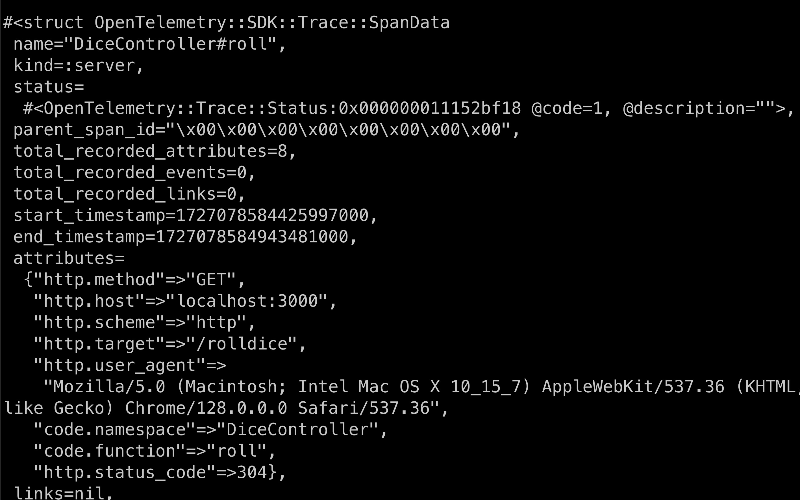
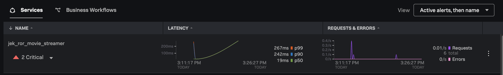
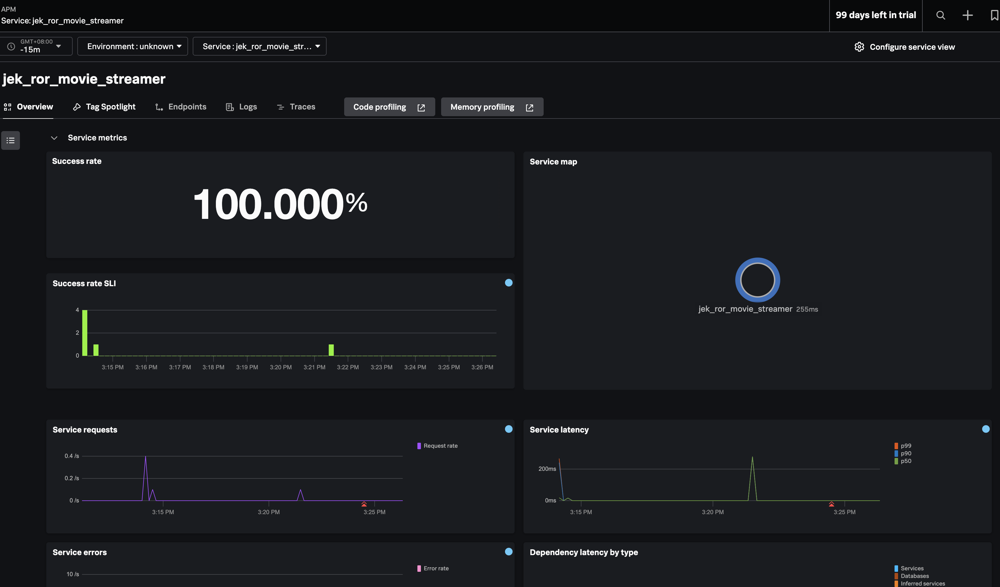

# Hello World with Ruby on Rails

Install Ruby using rbenv:

```bash
brew install rbenv
rbenv init
rbenv install 3.2.2
rbenv global 3.2.2
```

First, make sure you've properly initialized rbenv. Add these lines to your ~/.zshrc or ~/.bash_profile file (depending on which shell you're using):

```
eval "$(rbenv init -)"
export PATH="$PATH:$HOME/.rbenv/shims"
```

Then, reload your shell configuration:

```
source ~/.zshrc
```

Verify that you're using the rbenv-managed Ruby:

```
which ruby
```

Install Rails:

```
gem install rails
```

Create a new Rails application:

```
rails new movie_streamer
cd movie_streamer
```

Generate a controller for our hello world page:
```
rails generate controller Home index
```

Set the root route in config/routes.rb:
```
Rails.application.routes.draw do
  root 'home#index'
end
```

Edit app/views/home/index.html.erb:

```html
<h1>Hello, World Jek!</h1>
```

Start the Rails server:
```bash
rails server
```

# Add OpenTelemetry SDK
Open your project's Gemfile in a text editor. You can do this with any text editor you prefer, or use a command like:
```
code Gemfile
```

Add the following lines to your Gemfile:
```ruby
gem 'opentelemetry-sdk'
gem 'opentelemetry-exporter-otlp'
gem 'opentelemetry-instrumentation-rails'
gem 'opentelemetry-instrumentation-all'
```

Run bundle install
```
bundle install
```

Create an initializer config/initializers/opentelemetry.rb:
```ruby
require 'opentelemetry/sdk'
require 'opentelemetry/exporter/otlp'
require 'opentelemetry-instrumentation-rails'
require 'opentelemetry/instrumentation/all'

OpenTelemetry::SDK.configure do |c|
  c.service_name = 'jek_ror_movie_streamer'
  c.use_all() # This enables automatic instrumentation
end
```

Stop and start the Rails server:

```bash
rails server
```
or print to console
```bash
env OTEL_TRACES_EXPORTER=console rails server -p 8080
```

or export to OTel Collector. 
```
env OTEL_EXPORTER_OTLP_ENDPOINT="http://127.0.0.1:4318" rails server -p 3009
```

## Create another ROR page
Create a controller for rolling a dice:
```
rails generate controller dice
```

This will create a file called app/controllers/dice_controller.rb. Open that file in your preferred editor and update it with the following code:

```ruby
class DiceController < ApplicationController
  def roll
    render json: rand(1..6).to_s
  end
end
```

Next, open the config/routes.rb file and add the following code:
```ruby
Rails.application.routes.draw do
  get 'rolldice', to: 'dice#roll'
end
```

Run the application with the following command and open http://localhost:8080/rolldice in your web browser to ensure it is working.
```
env OTEL_TRACES_EXPORTER=console rails server -p 8080
```


Next export to OTel Collector. Please do not include the `OTEL_TRACES_EXPORTER=console` because it would export to console only.
```
env OTEL_EXPORTER_OTLP_ENDPOINT="http://127.0.0.1:4318" rails server -p 3009
```




Take note that the OTEL_EXPORTER_OTLP_ENDPOINT is set to http://127.0.0.1:4318. This is the default endpoint for the OpenTelemetry Collector. Because it works only on otlp http. It doesn't work with otlp grpc yet.  

In addition, can't use `OTEL_TRACES_EXPORTER=console` with `OTEL_EXPORTER_OTLP_ENDPOINT="http://127.0.0.1:4318"` because it would export to console only.

According to https://opentelemetry.io/docs/languages/ruby/exporters/#otlp-endpoint, by default traces are sent to an OTLP endpoint listening on localhost:4318. You can change the endpoint by setting the OTEL_EXPORTER_OTLP_ENDPOINT accordingly

Finally, there is no need to append /v1/traces to the endpoint because it will be added automatically by the OpenTelemetry Ruby SDK.


## Additional OTel config

According to https://github.com/open-telemetry/opentelemetry-ruby/tree/main/examples/metrics_sdk, configure the metric endpoint:

```bash
env OTEL_EXPORTER_OTLP_ENDPOINT="http://localhost:4318" OTEL_EXPORTER_OTLP_METRICS_ENDPOINT="http://localhost:4318/v1/metrics" rails server -p 8080
```
