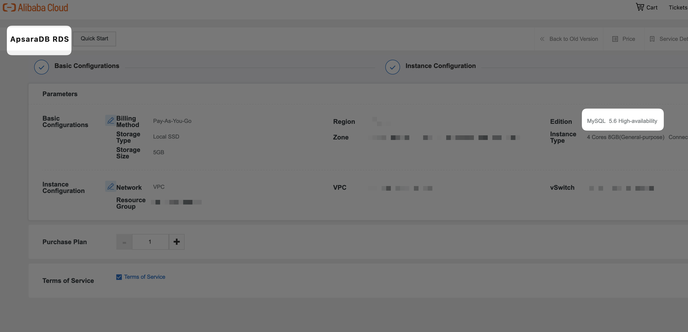
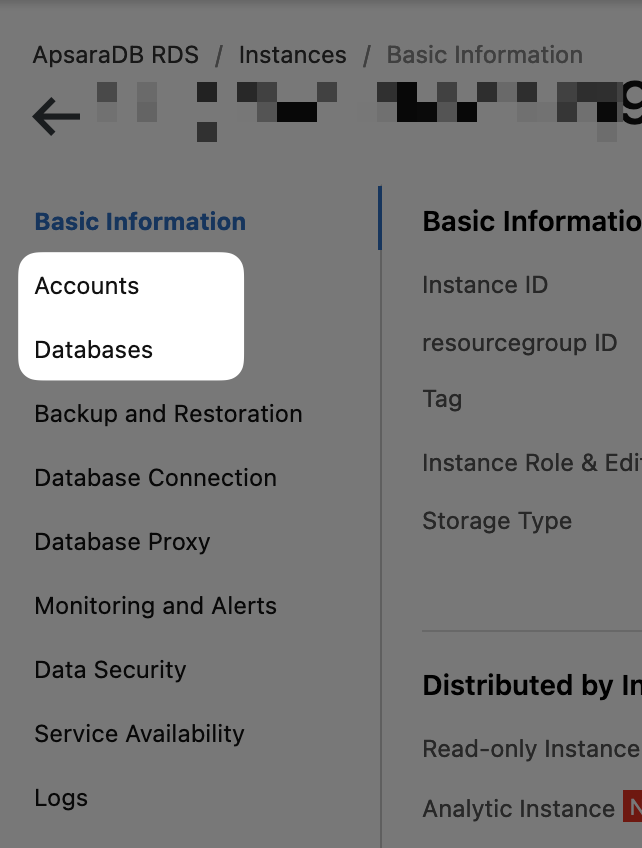
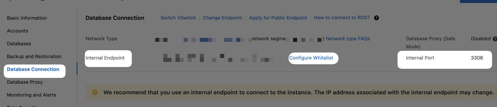
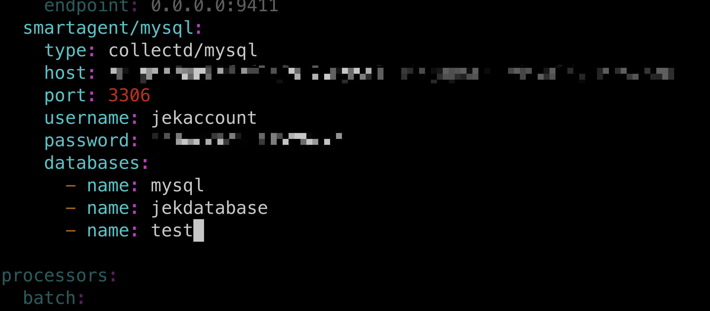
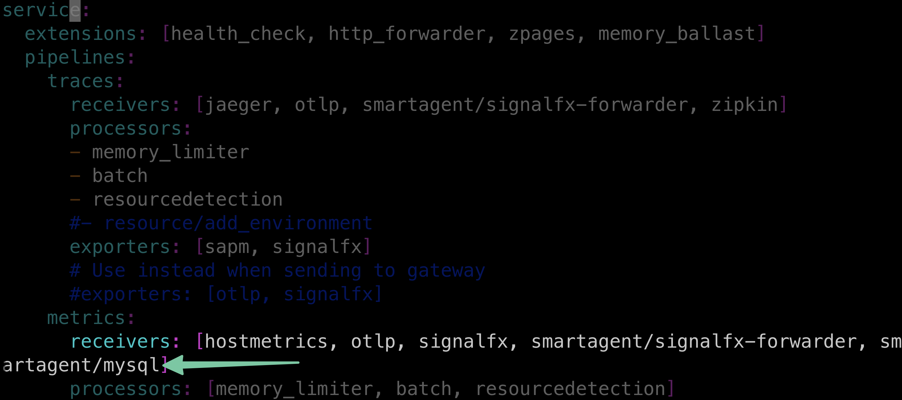

- Create a ApsaraDB RDS for MySQL 
- Create Account and Database in the newly created instance 
- Do infrastructure-alibaba-cloud > ecs > README.md steps
- In the ECS instance install mysql client `yum install mysql`
- Test account to the RDS database `mysql -h<the internal url from ApsaraRDS Database Connection tab remember to whitelist the ECS instance connecting to RDS> -P3306 -u<the account name when creating the ApsaraDB RDS instance Account> -p<the password when creating the ApsaraDB RDS instance Account>` 
- Add MySQL receiver to splunk-otel-collector agent_config in the ECS instance yaml file by following https://docs.splunk.com/Observability/gdi/mysql/mysql.html
- In the ECS instance do `vim /etc/otel/collector/agent_config.yaml`
- 
- 
- Restart the splunk-otel-collector `sudo systemctl restart splunk-otel-collector`

# Proof
- 

# Extra resources for managing mysql db
- https://alibaba-cloud.medium.com/how-to-manage-alibaba-mysql-database-from-cli-b87b6cd2ffc6