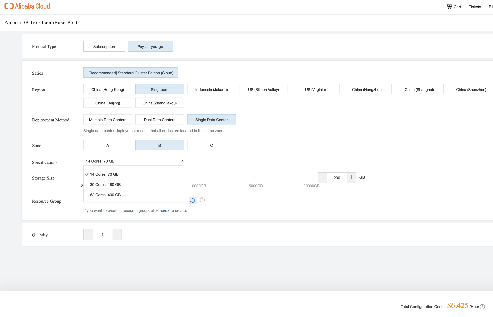
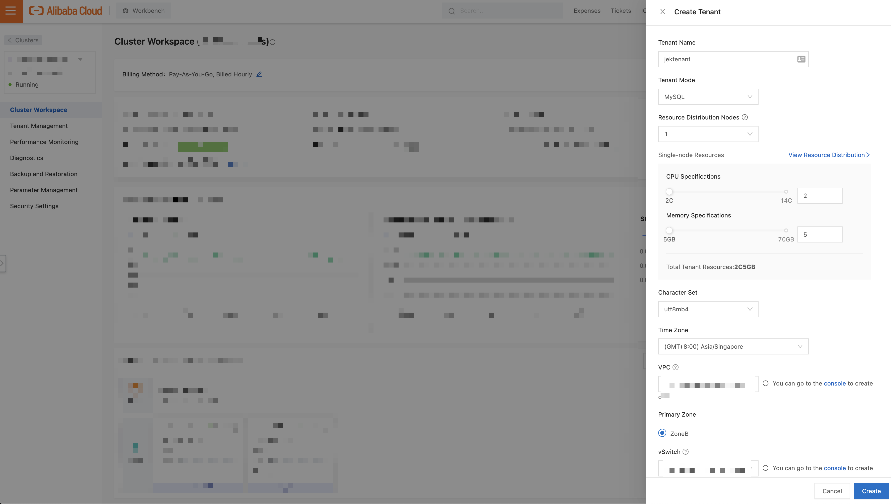
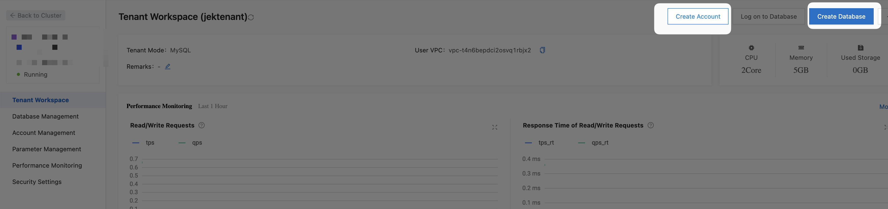
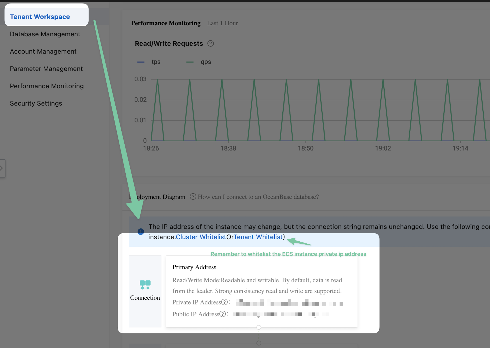
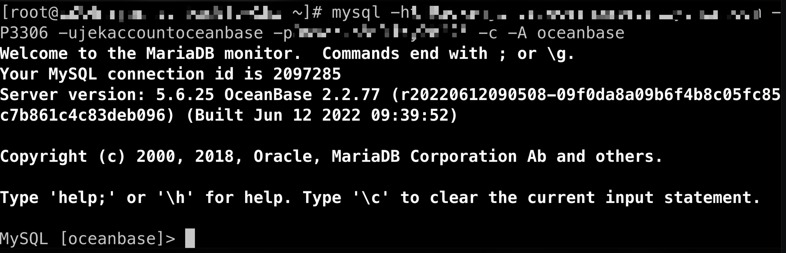
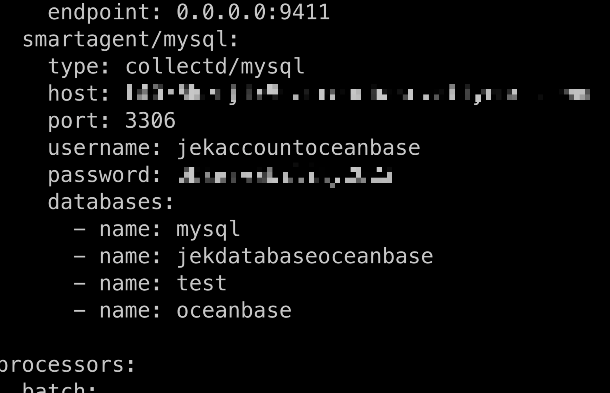
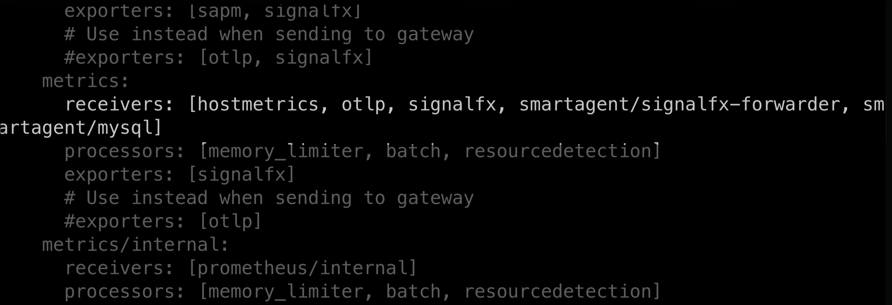

- Create ApsaraDB for Oceanbase cluster 
- Create a tenant in the newly created cluster 
- Create an Account and Database within the newly created tenant 
- Do infrastructure-alibaba-cloud > ecs > README.md steps
- Get the connection address from ApsaraDB for Oceanbase and remember to whitelist ECS instance private ip address. 
- In the ECS instance install mysql client `yum install mysql`
- Test account to the RDS database `mysql -h<the internal url from ApsaraRDS for Oceanbase Connection tab remember to whitelist the ECS instance private ip address for connecting to RDS> -P3306 -u<the account name when creating the ApsaraDB for Oceanbase instance Account> -p<the password when creating the ApsaraDB for Oceanbase instance Account> -c -A oceanbase` 
- Add MySQL receiver to splunk-otel-collector agent_config in the ECS instance yaml file by following https://docs.splunk.com/Observability/gdi/mysql/mysql.html
- In the ECS instance do `vim /etc/otel/collector/agent_config.yaml`
- 
- 

Set memory limit
```yml

```

Add to receiver
```yml
  smartagent/mysql:
    type: collected/mysql
    host: JJJJJJJJJ
    port: 3306
    username: YYYYYYY
    password: XXXXXXX
    databases:
      - name: mysql
      - name: test
      - name: oceanbase
      - name: ZZZZZZZZ
```

Add to pipeline
```yml
service:
  pipelines:
    metrics:
      receivers: [hostmetrics, otlp, signalfx, smartagent/signalfx-forwarder, smartagent/mysql]
```

Add debugging
```yml

```

- Restart the splunk-otel-collector `sudo systemctl restart splunk-otel-collector`

- Check the status `sudo systemctl status splunk-otel-collector`

# Troubleshoot
- View Splunk OTel Collector logs `journalctl -u splunk-otel-collector.service -e` or `journalctl -u splunk-otel-collector.service -f` or `journalctl --grep=jek-log -u splunk-otel-collector.service`


# Outcome: Did NOT get the metrics
- Troubleshoot...

# Resources
- https://help.aliyun.com/document_detail/331942.html