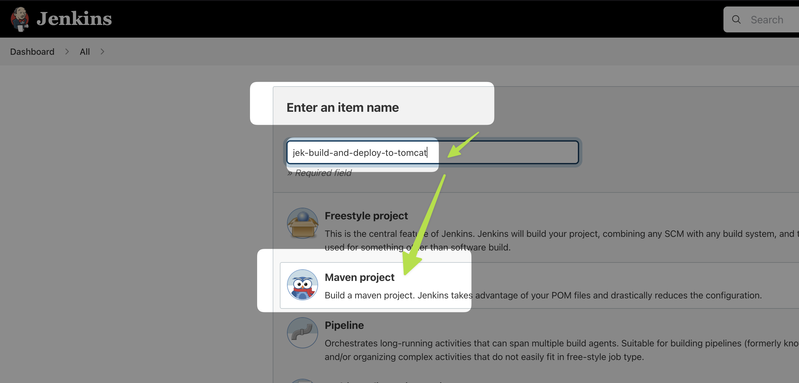
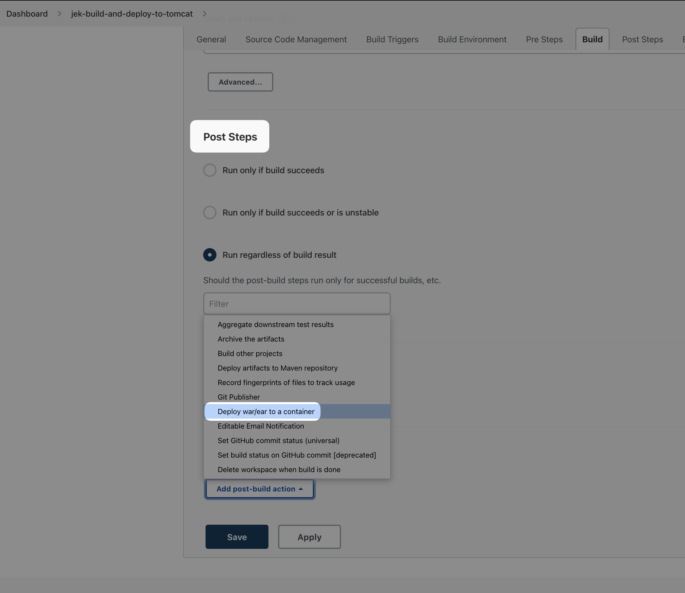
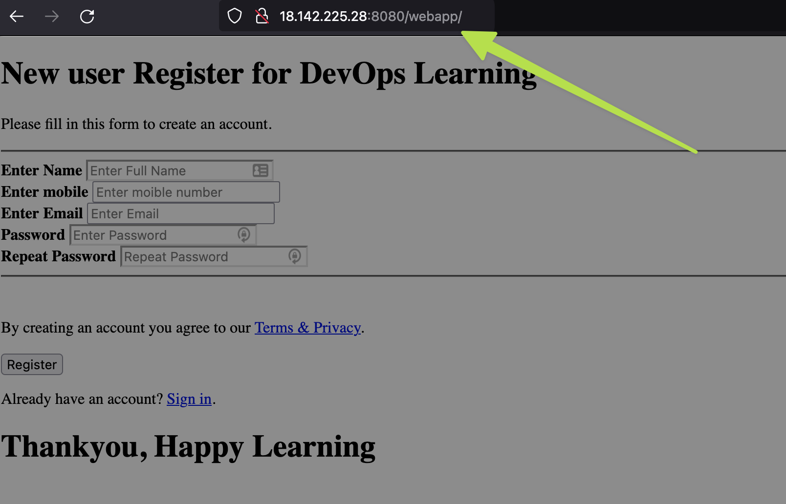

This is a step by step continuation of 
1. infrastructure-ci-cd/jenkins-metrics and
2. infrastructure-ci-cd/jenkins-with-git-to-pull-code-then-rollback-with-webhook
3. infrastructure-ci-cd/jenkins-build-java-code-using-maven
4. infrastructure-ci-cd/tomcat-metrics

# Install 'Deploy to container' Jenkins' Plugin
- 
- 

# Configure Tomcat server with Jenkins Credentials via Jenkins GUI
- In the infrastructure-ci-cd/tomcat-metrics section we added the tomcat credentials of username: `deployer` and password: `deployer`.
    - Recall this 
- 
- 

# Manually deploy artifacts (i.e. webapp.war) from Maven build to Tomcat server
- 
- 
- 
- 
- Manually click on Build Now.
- 
- Verify that the webapp.war file is deployed to Tomcat server 
    - `cd /opt/apache-tomcat-10.0.22/webapps/`
    - 
    - Also in Tomcat Manager App GUI via http://the-ip-address-of-tomcat:8080/manager/html we can verify that it has the webapp
    - 
    - Then we go to  http://the-ip-address-of-tomcat:8080/webapp to verify that it is working
    - 

# Automatically build and deploy artifacts (i.e. webapp.war) from Maven build to Tomcat server using Poll SCM
- This is a continuation from the above manual step.
- 
- 
- 
- 

# Conclusion
At the end of the whole series we would achieve auto build Java code with Maven (output webapp.war) and deploy to Tomcat server that is accessing to public internet.

# Ref
- OReilly DevOps Project - 2022: CI/CD with Jenkins Ansible Kubernetes by Valaxy Technologies