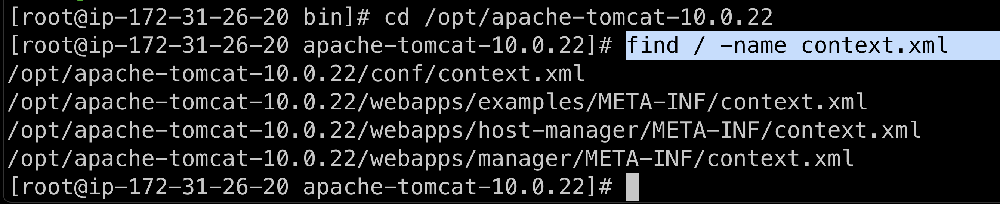

# Setup a Linux EC2 Instance
- Note that it is not Ubuntu EC2 instance. It is Amazon Linux EC2.
- Launch a new Amazon Linux EC2 Instance
- Choose something with at least 2 vCPU and 8 GB Memory
- Choose 20 GB storage instead of 8 GB storage.
- Add a second security group of TCP port 8080 
- Connect to the newly created Amazon Linux EC2 instance
- Use root user privilege `sudo su -`

# Install Epel & Java
- `amazon-linux-extras`
- `amazon-linux-extras install epel`
- `amazon-linux-extras install java-openjdk11`
- Check Java version `java -version`

# Install Tomcat
- `cd /opt`
- Search in browser e.g. Google for Tomcat download e.g. https://tomcat.apache.org/download-10.cgi 
- Download by clicking tar.gz
- Install Tomcat with e.g. `wget https://dlcdn.apache.org/tomcat/tomcat-10/v10.0.22/bin/apache-tomcat-10.0.22.tar.gz`
- Unzip e.g. `tar -xvzf apache-tomcat-10.0.22.tar.gz` 
- So now the folder is located at e.g. `ls /opt/apache-tomcat-10.0.22`

# Start Tomcat
- Go to e.g. `cd /opt/apache-tomcat-10.0.22/bin`
- Start tomcat `./startup.sh`

# Access Web UI on Port 8080
- `curl http://checkip.amazonaws.com`
- Open browser go to http://the-ec2-ip-address:8080
- 
- 

# Grant access to configure Tomcat Manager App from external browser
- `cd /opt/apache-tomcat-10.0.22`
- `find / -name context.xml`
- 
- `vim /opt/apache-tomcat-10.0.22/webapps/host-manager/META-INF/context.xml`
- 
- `vim /opt/apache-tomcat-10.0.22/webapps/manager/META-INF/context.xm`
- 
- Go to e.g. `cd /opt/apache-tomcat-10.0.22/conf`
- `vim tomcat-users.xml`
    - 
```xml
 <role rolename="manager-gui"/>
 <role rolename="manager-script"/>
 <role rolename="manager-jmx"/>
 <role rolename="manager-status"/>
 <user username="admin" password="admin" roles="manager-gui, manager-script, manager-jmx, manager-status"/>
 <user username="deployer" password="deployer" roles="manager-script"/>
 <user username="tomcat" password="s3cret" roles="manager-gui"/>
``` 

# Restart tomcat server for changes to take effect
- Go to e.g. `cd /opt/apache-tomcat-10.0.22/bin`
- Shutdown tomcat `./shutdown.sh`
- Start tomcat `./startup.sh`
- `curl http://checkip.amazonaws.com`
- Open browser go to http://the-ec2-ip-address:8080
- Log in to Tomcat Manager App using username `admin` password `admin`.

# Install OTel Collector
- Install Splunk OTel Collector https://docs.splunk.com/Observability/gdi/opentelemetry/opentelemetry.html

# Add Tomcat Receiver in OTel Collector Config
- Add Tomcat receiver to agent_config.yaml file https://docs.splunk.com/Observability/gdi/tomcat/tomcat.html
- 

# Jek learned setup from:
- https://github.com/yankils/Simple-DevOps-Project/blob/master/Tomcat/tomcat_installation.MD
- OReilly DevOps Project - 2022: CI/CD with Jenkins Ansible Kubernetes by Valaxy Technologies

# Other References for Tomcat:
- https://github.com/signalfx/splunk-otel-collector/tree/main/examples