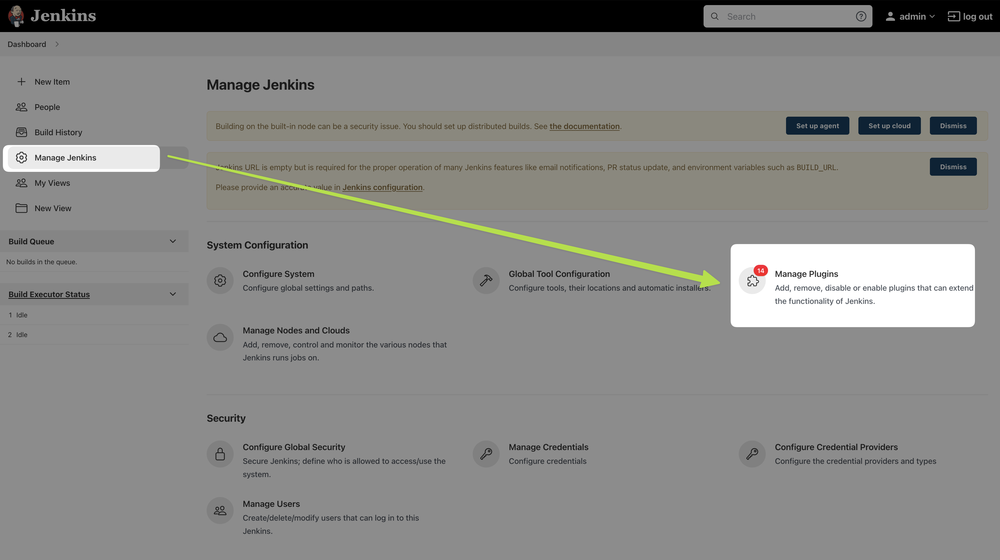

This is a continuation of infrastructure-ci-cd/jenkins-metrics

# Install Git on the Jenkins instance e.g. the Amazon Linux EC2 instance with Jenkins 
- Use root access `sudo su -`
- Install git `yum install git`
- `git --version`
- `whereis git` output says it is at `/usr/bin/git`

# Install Github Plugin on Jenkins via Jenkins GUI

# Configure Git on Jenkins GUI

# Configure Github repo link as new item via Jenkins GUI

- https://github.com/jek-bao-choo/learning-jenkins-code-pull

# Build project to pull code from Github

- Take note that in the above image we can see 
    - "Building in workspace `/var/lib/jenkins/workspace/pull-code-from-github`"
    - We can see that the repo is being pulled to `/var/lib/jenkins/workspace/pull-code-from-github`
    - Go to terminal do $ `ls /var/lib/jenkins/workspace/pull-code-from-github`
    - 

# Rollback to previous commit of code
WIP

# Redeploy to the latest version of code
WIP

# Use Splunk Observability detector webhook to rollback
WIP

# Prove
WIP

# Jek learned setup from:
- OReilly DevOps Project - 2022: CI/CD with Jenkins Ansible Kubernetes by Valaxy Technologies