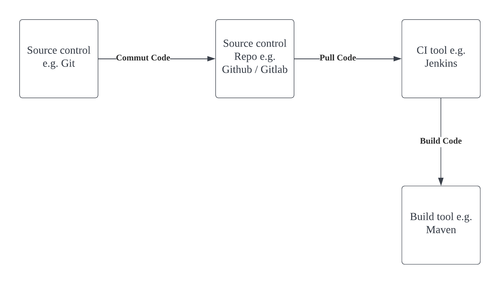

This is a continuation of 
1. infrastructure-ci-cd/jenkins-metrics and
2. infrastructure-ci-cd/git-with-jenkins-to-pull-code

# Setup Maven on Jenkins Server

# Setup environment variables i.e. `JAVA_HOME`, `M2`, `M2_HOME`

# Install Maven Plugin

# Configure Maven and Java

# Build the Java Project using Maven

# Prove