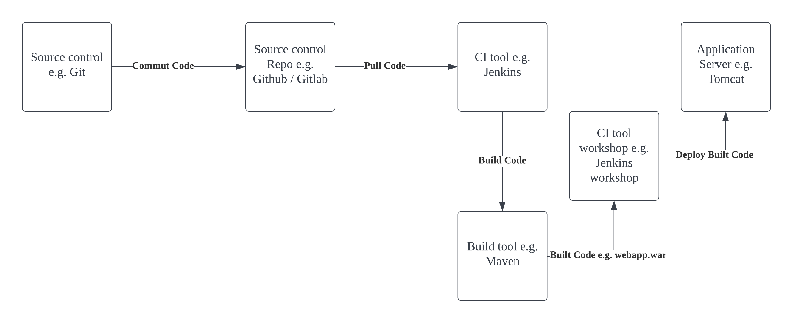

This is a step by step continuation of 
1. infrastructure-ci-cd/jenkins-metrics and
2. infrastructure-ci-cd/jenkins-with-git-to-pull-code-then-rollback-with-webhook
3. infrastructure-ci-cd/jenkins-build-java-code-using-maven
4. infrastructure-ci-cd/tomcat-metrics

# Install 'Deploy to container' Jenkins' Plugin

# Configure Tomcat server with Credentials

# Deploy artifacts from Maven build to Tomcat server

# Ref
