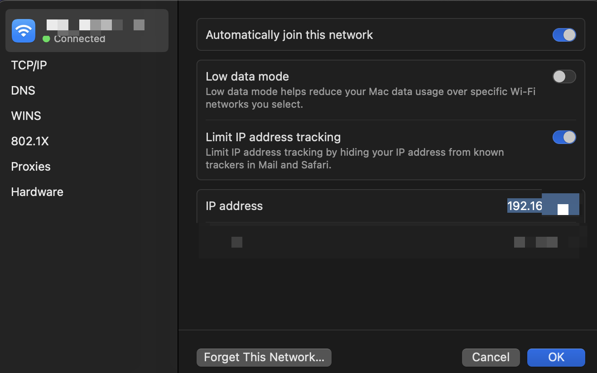
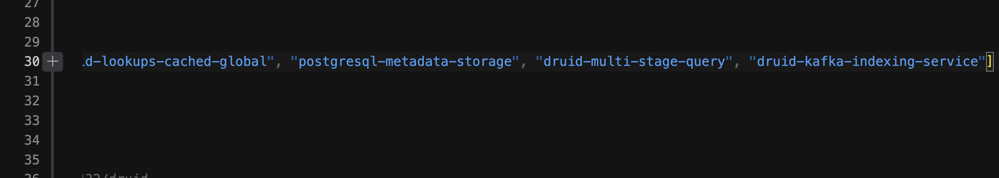
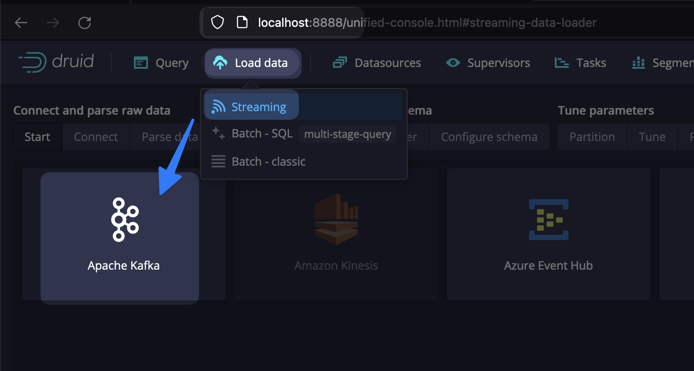
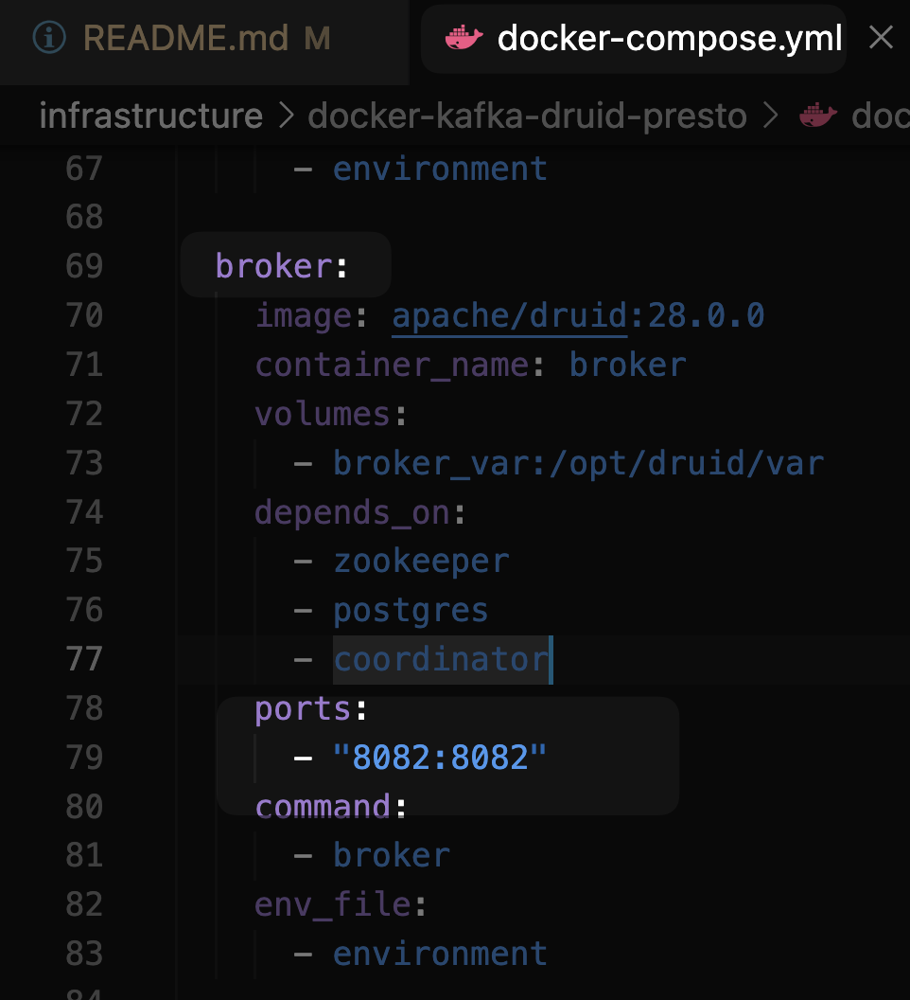
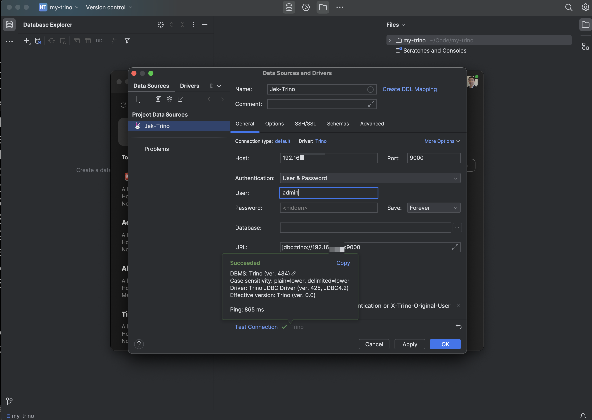

# Step 0
## Get network IP address


# Step 1A
Choose between Step 1A or Step 1B then move on to Step 2

## Start Kafka
`docker run --rm -d -p 9092:9092 -e ADV_HOST=192.168.XXX.XXX --name local-kafka lensesio/fast-data-dev:latest`

## Start Kafka UI
`docker run --rm -d -p 8000:8080 -e DYNAMIC_CONFIG_ENABLED=true --name kafka-ui provectuslabs/kafka-ui`

## Create Kafka cluster
Go to http://localhost:8000


If error connecting, try `advertised.listeners=PLAINTEXT://192.168.XXX.106:9092` in the above step and check out https://stackoverflow.com/questions/67763076/connection-to-node-1-127-0-0-19092-could-not-be-established-broker-may-not 

## Create Kafka topic


## Generate sample json for Kafka Topic to Druid
https://json-generator.com/
Druid requires date field in this format:

`date: '{{date(new Date(1970, 0, 1), new Date(),"YYYY-MM-dd HH:mm:ss")}}',`


# Step 1B (isn't working)
Choose between Step 1B or Step 1A then move on to Step 2. For now Step 1B isn't working

## ...
```bash
# https://docs.lenses.io/

docker pull lensesio/box

# Get a free development license here https://lenses.io/apache-kafka-docker/

docker run -e ADV_HOST=192.168.XXX.XXX \
       -e EULA="https://licenses.lenses.io/d/?id=< ENTER YOUR FREE DEVELOPMENT LICENSE KEY HERE >" \
       --rm -p 3030:3030 -p 9092:9092 lensesio/box:latest

# Access the UI from http://localhost:3030

# Default username and password is admin / admin
```
WIP. I will come back to this next time.

# Step 2

## Start Apache Druid
Follow the instruction to add docker-compose.yml and environment files in the folder 
- https://druid.apache.org/docs/latest/tutorials/docker/ 
- https://github.com/apache/druid/tree/master/distribution/docker

Include the `druid-kafka-indexing-service` in `druid.extensions.loadList` of the environment file  then run:

`docker-compose up -d`

Optionally can access the container with `docker exec -ti <id> sh`
    - There is also helm chart installation for k8s users. https://github.com/apache/druid/tree/master/helm/druid
Navigate to the web console at http://localhost:8888

## Load data from Kafka to Druid


`SELECT 
  "__time"
  FROM "druid"`


## Reference
udemy.com/course/apache-druid-complete-guide/learn/lecture/38970672#overview

---
# Step 3

## Create druid.properties for Trino's connector to Druid to use.

Create a `druid.properties` file following the instruction here https://trino.io/docs/current/connector/druid.html



Change out BROKER IP ADDRESS with computer network IP address
```
connector.name=druid
connection-url=jdbc:avatica:remote:url=http://<BROKER IP ADDRESS>:8082/druid/v2/sql/avatica/
```

# Step 4

## Create Trino
https://trino.io/docs/current/installation/containers.html

`docker run --rm -d -p 9000:8080 -v /Users/XXX/XXX/splunk-otel-example/infrastructure/docker-kafka-druid-trino/druid.properties:/etc/trino/catalog/druid.properties --name trino trinodb/trino`

Go to http://localhost:9000

## Use Trino CLI to query
`docker exec -it trino trino`

trino> `exit`

`docker exec -it trino trino --server 192.168.XXX.XXX:9000 --catalog druid --schema druid`

trino;druid> `show tables;`

trino;druid> `select * from druid l;`


## Try using Trino through Jetbrain's DataGrip. A easier to understand and navigate interface.



# Step 5 

## Add splunk-otel-java to read the Java metrics from Kafka, Druid, and Trino.
WIP...

---

# Reference
udemy.com/course/apache-druid-complete-guide/learn/lecture/38970666#overview