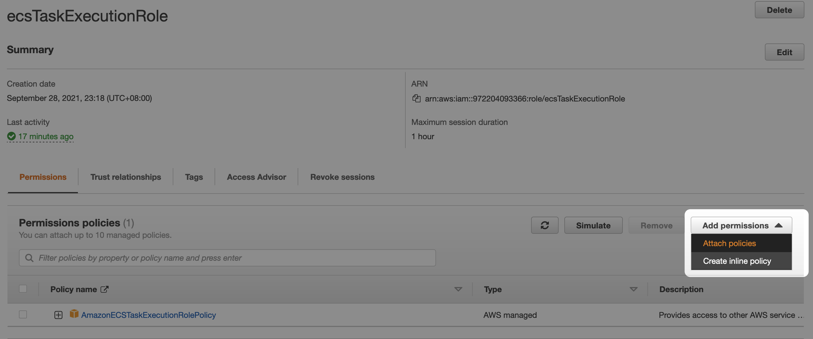

This is a continuation of ecs-ec2-default-otel-config setup.

The example approach to custom otel config is using Systems Manager Parameter Store. 
- Reference for ECS EC2: https://github.com/signalfx/splunk-otel-collector/tree/main/deployments/ecs/ec2#direct-configuration
- Reference for ECS Fargate: https://github.com/signalfx/splunk-otel-collector/tree/main/deployments/fargate#direct-configuration

# 1. Extend ecsTaskExecutionRole IAM permissions.
Go to IAM, to Roles, search for ecsTaskExecutionRole, and select it. 

Select Add permissions --> Attach Policies

Search for AmazonSSMReadOnlyAccess --> Attach Policies

This is similar for using S3 file i.e. search for S3ReadOnlyAccess

# 2. Create Systems Manager Parameter Store
Search for Systems Manager --> Go to Systems Manager

Ensure in the same region as ECS cluster and create Parameter Store.

# 3. Create new Task Definitions

# 4. Create new Task or Service using the new Task Definitions