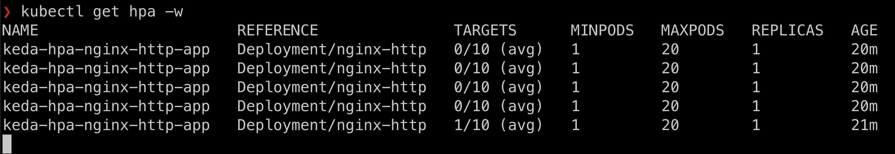
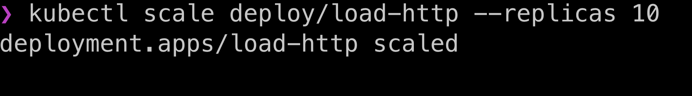

# Setup AKS
- Install Azure CLI on macOS  https://learn.microsoft.com/en-us/cli/azure/install-azure-cli-macos `brew update && brew install azure-cli`
- Login to your azure account `az login`
    - Set the cluster subscription `az account set --subscription XXXXX-XXXX-XXXX-XXXX`
- List all Azure Resource Groups https://learn.microsoft.com/en-us/cli/azure/group?view=azure-cli-latest `az group list`
    - Or create Azure Resource Group `export AZURE_RESOURCE_GROUP="JekAKSResource"`
    - Followed by `az group create --location southeastasia --name "${AZURE_RESOURCE_GROUP}" --tags Criticality=Low Env=Test Owner=email@email.com`

# Create and connect to AKS Cluster
- `export AKS_CLUSTER_NAME="JekAKSCluster"`
- Create AKS cluster https://learn.microsoft.com/en-us/cli/azure/aks?view=azure-cli-latest#az-aks-create `az aks create --resource-group "${AZURE_RESOURCE_GROUP}" --name "${AKS_CLUSTER_NAME}" --node-count 2`
- `az aks list`
- `az aks get-credentials --resource-group "${AZURE_RESOURCE_GROUP}" --name "${AKS_CLUSTER_NAME}"` 

# Install KEDA
- View the metrics server that is been setup in kube-system `kubectl get pod -A | grep -i metrics`
- Add Helm KEDA repo https://keda.sh/docs/2.10/deploy/#install `helm repo add kedacore https://kedacore.github.io/charts`
- `helm repo update`
- `kubectl create namespace keda`
- Helm 3 `helm install keda kedacore/keda --namespace keda`
- `helm install http-add-on kedacore/keda-add-ons-http --namespace keda`
- `kubectl get pods -n keda`
- Get custom resources `kubectl get crd | grep keda` 
- Create loadtest.yaml as seen in this folder
- `kubectl apply -f loadtest.yaml`
- `kubectl get crd`
- `kubectl get httpscaledobjects.http.keda.sh`
- `kubectl describe httpscaledobjects.http.keda.sh nginx-http`
- `kubectl get hpa`
- `kubectl logs deploy/nginx-http`
- `kubectl logs deploy/load-http`
- `kubectl get hpa -w`
- Another terminal `kubectl get pods -w`
- Third terminal, scale up load test `kubectl scale deploy/load-http --replicas 10`
- Observe the first two terminals to see it auto scale the deployment.
- Third terminal, scale down load test `kubectl scale deploy/load-http --replicas 0`
- `kubectl get pods`

# Proof
- 
- 
- 

# Clean Up
- `kubectl delete deployment.apps/nginx-http`
- `kubectl delete service/nginx-http-service`
- `kubectl delete httpscaledobject.http.keda.sh/nginx-http`
- `kubectl delete deployment.apps/load-http`
- Remove any KEDA's ScaledObjects and ScaledJob https://keda.sh/docs/2.10/deploy/#uninstall
```
kubectl delete $(kubectl get scaledobjects.keda.sh,scaledjobs.keda.sh -A \
  -o jsonpath='{"-n "}{.items[*].metadata.namespace}{" "}{.items[*].kind}{"/"}{.items[*].metadata.name}{"\n"}')
helm uninstall keda -n keda
```
- Uninstall KEDA via Helm Chart `helm uninstall -n keda keda`
- Delete the AKS cluster `az aks delete --resource-group "${AZURE_RESOURCE_GROUP}" --name "${AKS_CLUSTER_NAME}"`
- Delete the created Azure Resource Group https://learn.microsoft.com/en-us/cli/azure/group?view=azure-cli-latest#az-group-delete `az group delete --name "${AZURE_RESOURCE_GROUP}"`
