# Create a Splunk Cloud or Splunk Enterprise instance

- Create 1 events index called `otel_events`

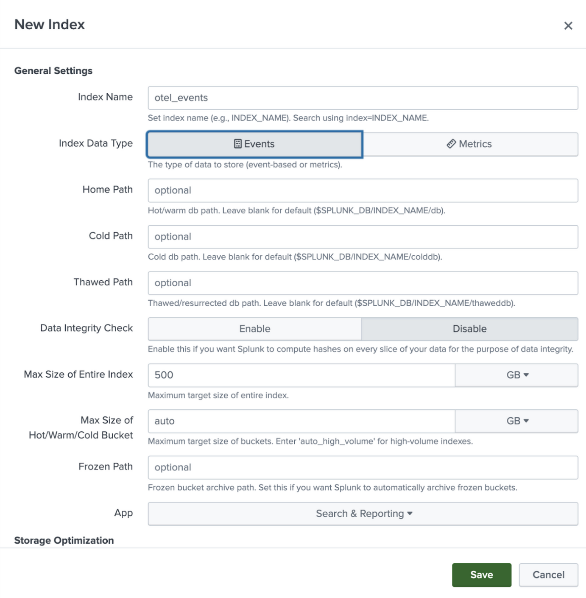

- Create a HEC token and save it.

# Setup AKS

- Install Azure CLI on macOS  https://learn.microsoft.com/en-us/cli/azure/install-azure-cli-macos `brew update && brew install azure-cli`
- Login to your azure account `az login`
    - Set the cluster subscription `az account set --subscription XXXXX-XXXX-XXXX-XXXX`
- List all Azure Resource Groups https://learn.microsoft.com/en-us/cli/azure/group?view=azure-cli-latest `az group list`
    - Or create Azure Resource Group `export AZURE_RESOURCE_GROUP="JekAKSResource"`
    - Followed by `az group create --location southeastasia --name "${AZURE_RESOURCE_GROUP}" --tags Criticality=Low Env=Test Owner=email@email.com`

# Create and connect to AKS Cluster

- Check that `ls -a ~/.ssh/` has file named `id_rsa.pub` and `id_rsa`.
    - if not create it using `ssh-keygen -t rsa -b 2048`

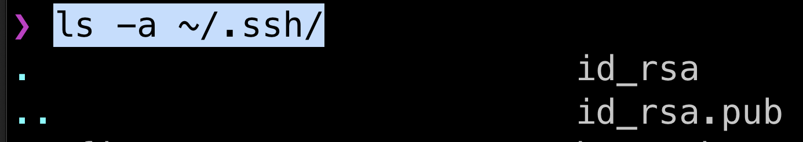

- `export AKS_CLUSTER_NAME="JekAKSCluster"`
- Create AKS cluster https://learn.microsoft.com/en-us/cli/azure/aks?view=azure-cli-latest#az-aks-create `az aks create --resource-group "${AZURE_RESOURCE_GROUP}" --name "${AKS_CLUSTER_NAME}" --node-count 3 --ssh-key-value ~/.ssh/id_rsa.pub --enable-node-public-ip`
    - Note: Assigning public IPs to AKS nodes can expose them to the internet, which might pose security risks. It's recommended to use a jump box or VPN for secure access in a production environment.
- `az aks list`
- `az aks get-credentials --resource-group "${AZURE_RESOURCE_GROUP}" --name "${AKS_CLUSTER_NAME}"` 
- Verify that the cluster is running `kubectl get nodes -o wide`
    - Ensure your NSG allows SSH (port 22) traffic. If you need to adjust NSG rules:

        - Go to the Azure portal.
        - Search for "NSG" or "Network Security Group".
        - Select the network security group associated with your AKS nodes.
        - Add an inbound security rule to allow SSH traffic.
        - Alternatively use CLI. Example of Creating an Inbound Security Rule via CLI: `az network nsg rule create --resource-group <MC_myResourceGroup_myAKSCluster_myLocation> --nsg-name <your-the-aks-agentpool-nsg> --name AllowSSH --protocol tcp --priority 1000 --destination-port-ranges 22 --access allow`
        
- SSH into the nodes `ssh -i ~/.ssh/id_rsa azureuser@< the external public id of the node >`


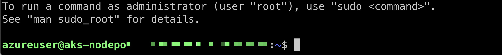


# Part 0 of 5: Initial setup

## Install OTel Collector Daemonset in AKS

- `helm repo add splunk-otel-collector-chart https://signalfx.github.io/splunk-otel-collector-chart`
- Create a v0-values.yaml

```yml
clusterName: "< your cluster name >"
logsEngine: otel
cloudProvider: "azure"
distribution: "aks"
splunkPlatform:
  endpoint: "https://< your instance id >.splunk.show:8088/services/collector"
  token: "< your hec token >"
  index: "otel_events"
  insecureSkipVerify: true
logsCollection:
  containers: 
    containerRuntime: "containerd"
    excludeAgentLogs: false
```

- `helm install jektestv0 -f v0-values.yaml splunk-otel-collector-chart/splunk-otel-collector`
- `kubectl logs ds/jektestv0-splunk-otel-collector-agent -f`
- Search for the log events using `index=otel_events` in Splunk Enterprise or Splunk Cloud

## Create nginx-http app and load-http app

- View the metrics server that is been setup in kube-system `kubectl get pod -A | grep -i metrics`
- `kubectl apply -f loadtest-v0.yaml`
- `kubectl describe pod nginx-http`
- `kubectl logs deploy/nginx-http -f`
    - Optionally, scale up load test `kubectl scale deploy/load-http --replicas 10`
- `kubectl describe load-http`
- `kubectl logs deploy/load-http`
- Scale down load test `kubectl scale deploy/load-http --replicas 0`
- Search for nginx-http logs using `index=otel_events sourcetype="kube:container:nginx-http" | reverse` in Splunk.

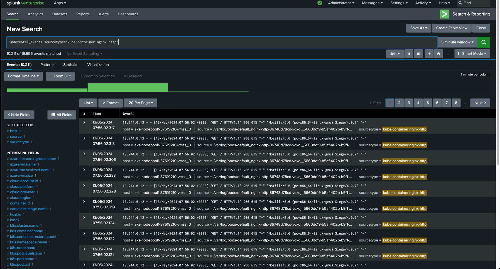
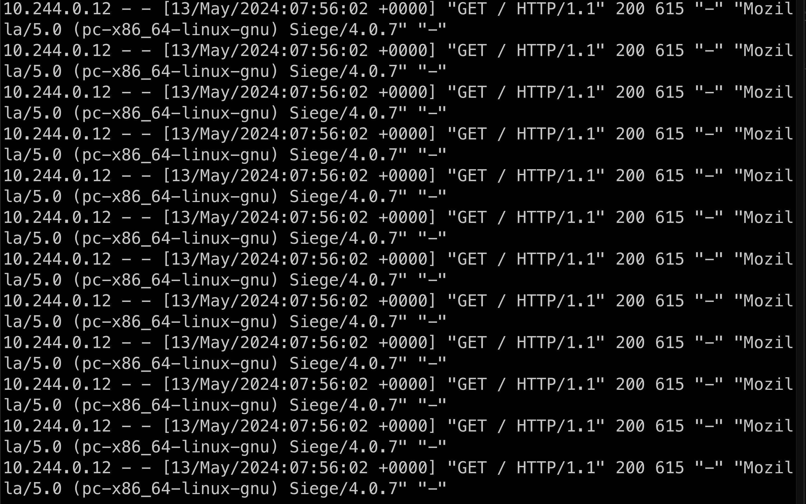

## Moving on to next part before that... read the FAQ

- Q: Is OpenTelemetry's `filelog` receiver and OpenTelemetry Collector Chart's `logsCollection`.
- A: Yes. 
    - The Filelog Receiver tails and parses logs from files. Although it’s not a Kubernetes-specific receiver, it is still the de facto solution for collecting any logs from Kubernetes. The Filelog Receiver is composed of Operators that are chained together to process a log. Each Operator performs a simple responsibility, such as parsing a timestamp or JSON. Configuring a Filelog Receiver is not trivial. If you’re using the OpenTelemetry Collector Helm chart you can use the logsCollection preset to get started.
    -  `logsCollection` preset requires the Filelog receiver be included in the Collector image, such as the Contrib distribution of the Collector. To enable this feature, set the presets.logsCollection.enabled property to true. When enabled, the chart will add a filelogreceiver to the logs pipeline. This receiver is configured to read the files where Kubernetes container runtime writes all containers’ console output (/var/log/pods/*/*/*.log).
    - Link 1: https://opentelemetry.io/docs/kubernetes/collector/components/#filelog-receiver 
    - Link 2: https://opentelemetry.io/docs/kubernetes/helm/collector/#logs-collection-preset

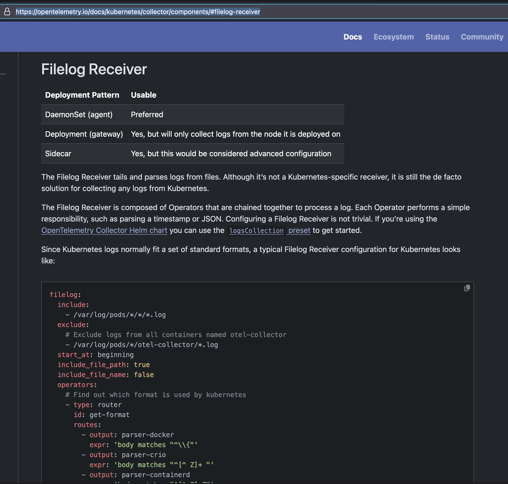


- Q: What is `logsCollection.extraFileLogs`?
- A: It's essentially `filelog` receiver with extra filelogs receiver we defined. Because there are default filelog receiver.

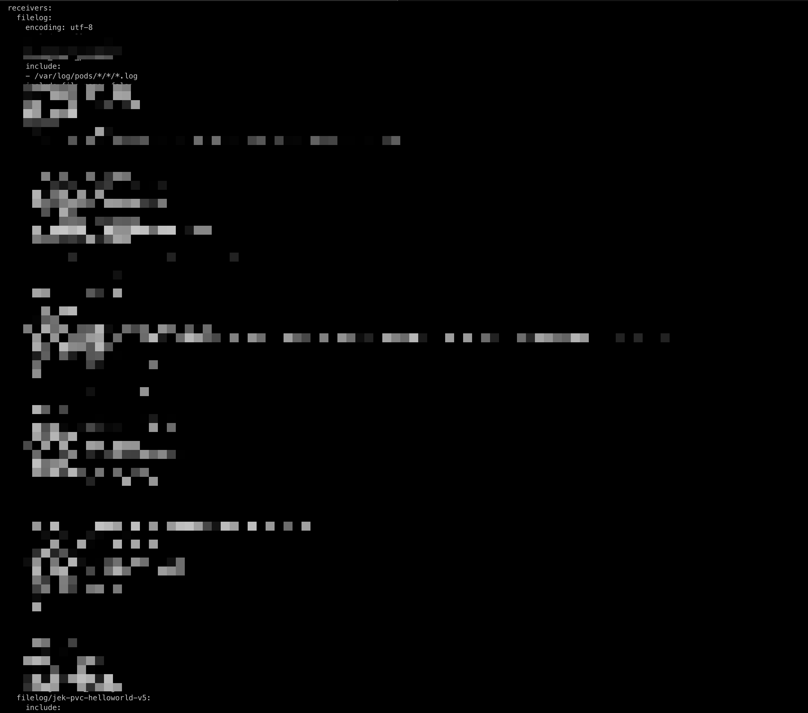

- Q: Does `logsCollection` setup filelog receiver in Gateway mode or ClusterReceiver mode?
- A: No. It setups in only Agent mode. Jek validated this answer on 16 May 2024.

# Part 1 of 6: ...

- `helm uninstall jektestv1`
- Go to all the nodes to create a folder called `jekv1` in `/var/log` folder.
- `kubectl get nodes -o wide`
- `ssh -i ~/.ssh/id_rsa azureuser@< the external public id of the node >`
- `sudo -s`
- `mkdir /var/log/jekv1`
- `kubectl apply -f loadtest-v1.yaml`
- `kubectl get pods -o wide`
- `kubectl get nodes -o wide`
- `ssh -i ~/.ssh/id_rsa azureuser@< the external public id of the node >`
- `ls -a /var/log/jekv1`
- Navigate to the hostPath directory: `cd /var/log/jekv1`
- View all the files that the nginx-http created using `ls -a` 

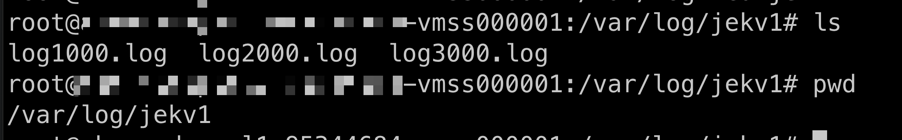

- `helm install jektestv1 -f v1-values.yaml splunk-otel-collector-chart/splunk-otel-collector`
- See the logs getting sent to Splunk

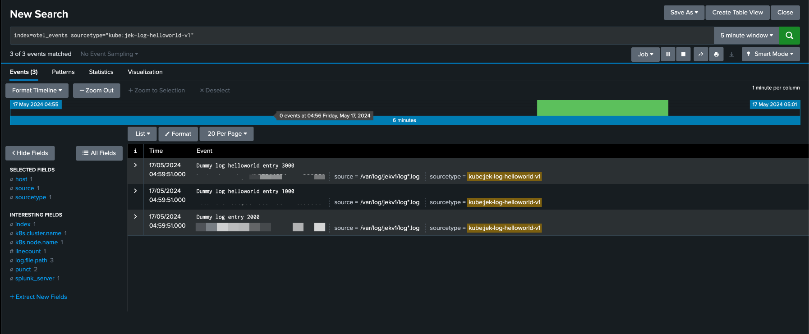

- This technique mounts a hostPath. It is not as good as the later IMO compared to using EmptyDir which mounts to the host machine. Here is an explanation:

- k8s `hostPath` (covered  in part 1 of 6 of this guide)
    - Use Cases:
        - Persistent Data: Suitable for scenarios where data needs to persist across Pod restarts or needs to be shared between multiple Pods.
        - Specific Host Files: Useful for accessing specific files or directories on the host system, such as logs or configuration files.
    - Advantages:
        - Persistence: Data remains on the host filesystem even if the Pod is deleted.
        - Shared Data: Multiple Pods can access the same data on the host.
    - Disadvantages:
        - Security Risks: Potentially exposes the host filesystem to Pods, which can pose security risks.
        - Node Affinity: Ties the Pod to a specific Node, reducing flexibility in scheduling and potentially impacting high availability.
        - Complexity: Requires careful management of the host’s file system and permissions.
- k8s `emptyDir` (covered in part 2 of 6 of this guide)
    - Use Cases:
        - Temporary Storage: Suitable for temporary data that doesn’t need to persist after the Pod’s lifecycle.
        - Scratch Space: Ideal for jobs that require scratch space, such as caching, intermediary data processing, or temporary files.
        - Ephemeral Data: Good for ephemeral data that can be recreated or regenerated easily.
    - Advantages:
        - Ephemeral: Data is automatically cleaned up when the Pod is deleted.
        - Isolation: Provides better isolation since each Pod has its own emptyDir volume.
        - Simplicity: Easy to set up without requiring access to the underlying host file system.
    - Disadvantages:
        - Data Persistence: Data is lost when the Pod is deleted, evicted, or moved to another Node.
        - Node Constraints: Data is stored on the Node’s local storage, which may be limited or subject to performance constraints.
- In short, in a production environment, `emptyDir` is generally preferred over `hostPath` for the following reasons:
    - Security: emptyDir provides better isolation and avoids exposing the host filesystem to the Pods, reducing security risks.
    - Flexibility: Pods using emptyDir can be rescheduled to different Nodes without worrying about data persistence on the host.
    - Simplicity: emptyDir volumes are easier to manage and do not require specific host filesystem configurations.
- However, if you need persistent storage or need to share data between multiple Pods or across Pod restarts, consider using more robust and production-grade solutions such as:
    - `PersistentVolume` `(PV)` and `PersistentVolumeClaim` `(PVC)` (covered in part 3 to 5 of this guide)
        - Provides a way to manage storage independently of the Pod lifecycle. Supports various backends like NFS, AWS EBS, GCE PD, and more.
    - `StatefulSets`
        - Ensures stable, unique network identities and persistent storage for Pods.


# Part 2 of 6: Collect Logs from Kubernetes Host (k8s node) Machines/Volumes using `EmptyDir` with `ExtraVolumes`, `ExtraVolumeMounts`, and `ExtraFileLogs`.

- Sometimes there will be a need to collect logs that are not emitted from pods via stdout/stderr, directly from the Kubernetes nodes. Common examples of this are collecting Kubernetes Audit logs off of customer managed Kubernetes nodes running the K8s API server, collecting common “/var/log” linux files for security teams, or grabbing logs that come from pods that dont write to stdouot/stderr and have mounted a hostPath, or emptyDir volume. 

    - The OTel Collector Helm chart provides an easy way to configure custom file paths using the extraFilelogs option.
- Add Volume to loadtest-v1.yaml, making it loadtest-v2.yaml
- `kubectl apply -f loadtest-v2.yaml`
- `kubectl logs deploy/nginx-http -f`
- `kubectl get pods -o wide`

- IMPORTANT pt 1 of 2 --> Volume's EmptyDir mounts a special location on the node reserved for ephemeral storage. You can find this location on the node by navigating to `/var/lib/kubelet/pods` on the node as root. In this folder you will see each Pod’s uid. 

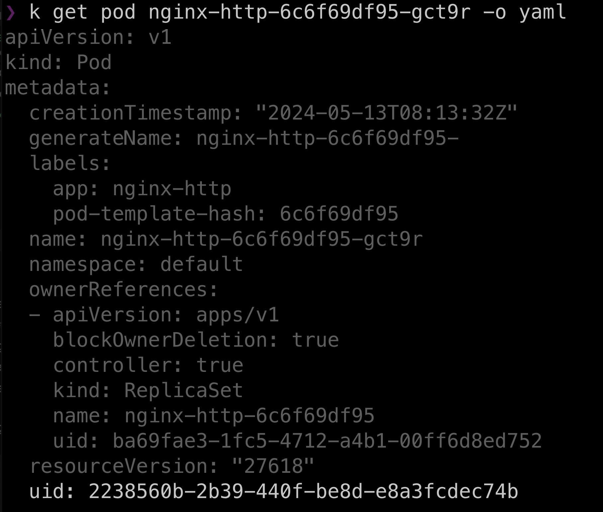

- `kubectl get pod nginx-http-< the complete name > -o yaml | grep uid`
- Remember that uid and ssh into the specific node and find it in the node folder of `/var/lib/kubelet/pods`

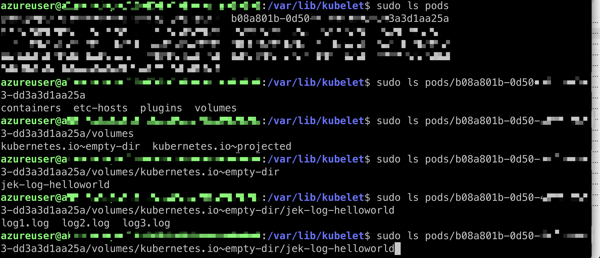

- The folder path on the specific AKS node follows this order `/var/lib/kubelet/pods` > my pod's UID > `volumes` > `kubernetes.io-empty-dir` > my volume name e.g. `jek-log-helloworld` > my log files such as `log1.log`.

- In order to monitor this directory with the OTel collector, we will need to use the extraVolumes and extraVolumeMounts settings in the Helm chart to wire up this path into our agent daemonset. 

- Add `extraVolumes` and `extraVolumeMounts` to v1-values.yaml, making it v2-values.yaml

```yml
agent:
  # Extra volumes to be mounted to the agent daemonset.
  # The volumes will be available for both OTel agent and fluentd containers.
  extraVolumes:
  - name: emptydir
    hostPath:
      path: /var/lib/kubelet/pods/
  extraVolumeMounts: 
  - name: emptydir
    mountPath: /tmp/emptydir
    readOnly: true
```

- IMPORTANT pt 2 of 2 --> This will mount the known emptyDir path from the node to our OTel agent so we can find it under /tmp/emptydir inside our pod filesystem, allowing us to create new filelog receiver inputs using the extraFileLogs section in our helm chart.

- Add `extraFileLogs` to v2-values.yaml

```yml
logsCollection:
  extraFileLogs:
    filelog/jek-log-helloworld:
      include: 
      - /tmp/emptydir/*/volumes/kubernetes.io~empty-dir/jek-log-helloworld/log*.log
      start_at: beginning
      storage: file_storage
      include_file_path: true
      include_file_name: false
      resource:
        com.splunk.index: otel_events
        com.splunk.source: /var/log/emptydir/jek-log-helloworld
        host.name: 'EXPR(env("K8S_NODE_NAME"))'
        com.splunk.sourcetype: kube:jek-log-helloworld
```

- `helm uninstall jektestv1`
- `helm install jektestv2 -f v2-values.yaml splunk-otel-collector-chart/splunk-otel-collector`
- scale up load test `kubectl scale deploy/load-http --replicas 1`


# Part 3 of 6: Sending logs to `Azure Storage Account's File Shares` through Persistent Volume (PV) and Persistent Volume Claims (PVC) and a copy to Splunk

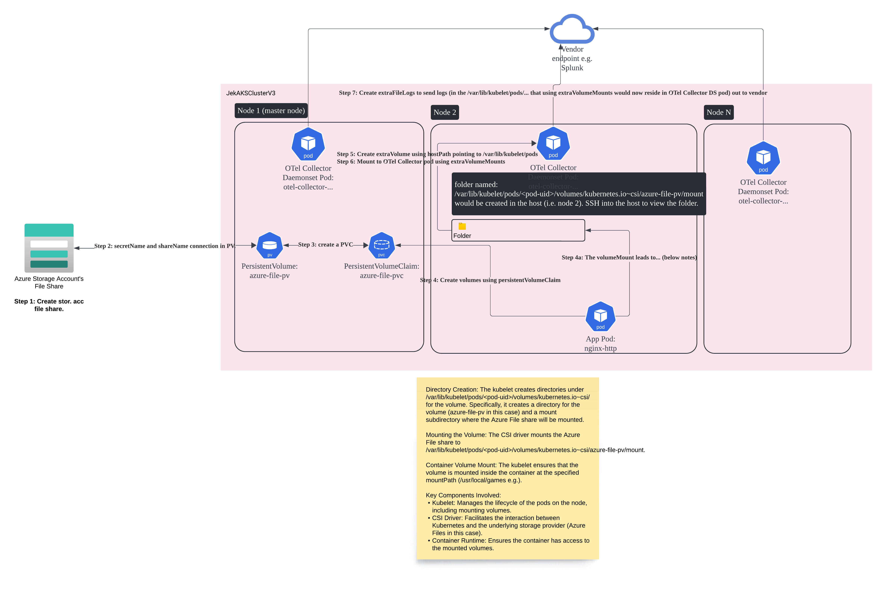

- Create an Azure Storage Account:
    - In the Azure portal, navigate to "Storage Accounts" and click on "Create".
    - Provide a unique name for your storage account, select the appropriate subscription, resource group, and location.
    - Choose the account kind as "StorageV2" and the replication option based on your requirements.
    - Click on "Review + create" and then "Create" to create the storage account.
- Create a File Share with a unique name in the newly created Azure Storage Account

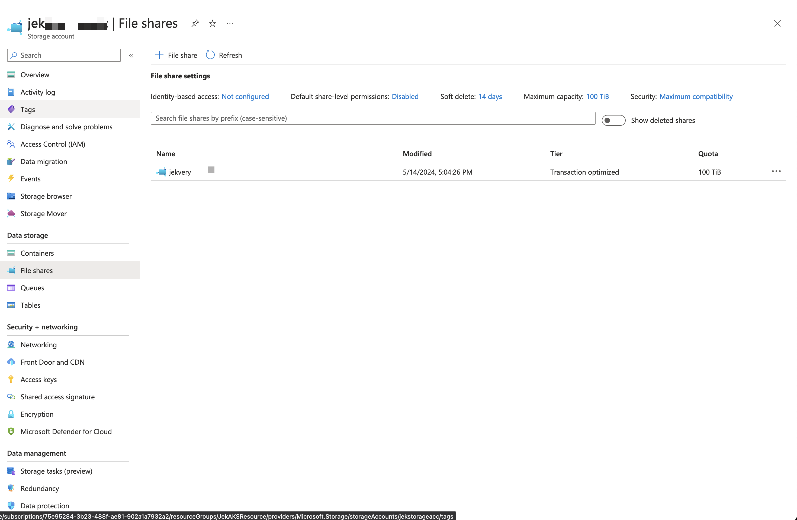

- Obtain the Storage Account Key:
    - Once the storage account is created, go to the "Access Keys" section in the storage account settings.
    - Copy one of the access keys (key1 or key2) as you will need it later.
- Create a Kubernetes Secret for Azure Files
    - Open a terminal or command prompt and run the following command to create a Kubernetes Secret that holds the Azure Storage Account name and access key:
    - `kubectl create secret generic azure-secret --from-literal=azurestorageaccountname=<storage-account-name> --from-literal=azurestorageaccountkey=<storage-account-key>`
    - Replace `<storage-account-name>` with your storage account name and `<storage-account-key>` with the access key you copied earlier.
- Create a Persistent Volume (PV) using Azure Files:
    - Create a YAML file named azure-file-pv.yaml with the following content

```yml
apiVersion: v1
kind: PersistentVolume
metadata:
  name: azure-file-pv
spec:
  capacity:
    storage: 5Gi
  accessModes:
    - ReadWriteMany
  storageClassName: ""
  azureFile:
    secretName: azure-secret
    shareName: myuniqueazurefilesharename
    readOnly: false
```

    - Adjust the `capacity.storage` value based on your requirements and provide a unique name for the `myuniqueazurefilesharename`.
- Apply the PV configuration by running the following command:
    - `kubectl apply -f azure-file-pv.yaml`
- Create a Persistent Volume Claim (PVC):
    - Create a YAML file named azure-file-pvc.yaml with the following content:
    
```yml
apiVersion: v1
kind: PersistentVolumeClaim
metadata:
  name: azure-file-pvc
spec:
  accessModes:
    - ReadWriteMany
  storageClassName: ""
  resources:
    requests:
      storage: 5Gi
```

    - Ensure that the spec.resources.requests.storage value matches the capacity defined in the PV.
    - Apply the PVC configuration by running the following command:
    - `kubectl apply -f azure-file-pvc.yaml`
- Use the PVC in your application:
    - In your application's deployment or pod specification, you can reference the PVC to use the Azure Files storage. Here's an example:

```yml
apiVersion: apps/v1
kind: Deployment
metadata:
  name: nginx-http
spec:
  selector:
    matchLabels:
      app: nginx-http
  replicas: 1
  template:
    metadata:
      labels:
        app: nginx-http
    spec:
      initContainers:  
        - name: createlogs  
          image: busybox  
          command:
            - sh
            - -c
            - |
              echo "Dummy jek pvc helloworld entry 7" > /usr/local/games/log7.log
              echo "Dummy jek pvc entry 8" > /usr/local/games/log8.log
              echo "Dummy jek pvc helloworld entry 9" > /usr/local/games/log9.log
          volumeMounts:  
            - name: jek-log-volume  
              mountPath: /usr/local/games
      containers:
        - name: nginx-http
          image: nginx
          resources:
            limits:
              memory: 256Mi
              cpu: 200m
          ports:
            - containerPort: 80
          volumeMounts:
              - mountPath: /usr/local/games
                name: jek-log-volume
      volumes:
        - name: jek-log-volume
          persistentVolumeClaim:
            claimName: azure-file-pvc
```

    - Adjust the `mountPath` based on where you want to mount the Azure Files storage in your container.
    - `kubectl apply -f loadtest-v3.yaml`
- Check it out:
    - `kubectl get pods -o wide`
    - `kubectl get pod nginx-http-< the complete name > -o yaml | grep uid`
    - `kubectl get node -o wide`
    - `ssh -i ~/.ssh/id_rsa azureuser@< the external public id of the node >`
    - `sudo -s`
    - Navigate to the mount directory: `ls -al /var/lib/kubelet/pods/<pod-uid>/volumes/kubernetes.io~csi/<pvc-uid>/mount`
    - `cd /var/lib/kubelet/pods/`

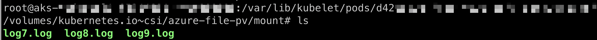


- Now send a copy of the `/var/lib/kubelet/pods/<pod-uid>/volumes/kubernetes.io~csi/<pvc-uid>/mount` logs to Splunk Cloud or Splunk Enterprise using `extraVolumes` and `extraVolumeMounts` 
- Amend v2-values.yaml, making it v3-values.yaml

```yml
agent:
  # Extra volumes to be mounted to the agent daemonset.
  # The volumes will be available for both OTel agent and fluentd containers.
  extraVolumes:
  - name: jekvolumev3
    hostPath:
      path: /var/lib/kubelet/pods/
  extraVolumeMounts: 
  - name: jekvolumev3
    mountPath: /tmp/jekazurecsiv3
    readOnly: true
```

- In the `extraFileLogs` of v3-values.yaml

```yml
logsCollection:
  extraFileLogs:
    filelog/jek-log-volume-v3:
      include: 
      - /tmp/jekazurecsiv3/*/volumes/kubernetes.io~csi/azure-file-pv/mount/log*.log
      start_at: beginning
      storage: file_storage
      include_file_path: true
      include_file_name: false
      resource:
        com.splunk.index: otel_events
        com.splunk.source: /var/log/emptydir/jek-log-volume-v3
        host.name: 'EXPR(env("K8S_NODE_NAME"))'
        com.splunk.sourcetype: kube:jek-log-volume-v3
```

- `helm uninstall jektestv2`
- `helm install jektestv3 -f v3-values.yaml splunk-otel-collector-chart/splunk-otel-collector`
- scale up load test `kubectl scale deploy/load-http --replicas 1`
- Observe which node is nginx running on `kubectl get pods -o wide` and go to the daemonset pod.

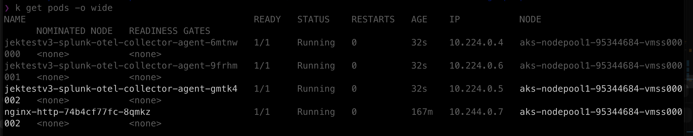

- `kubectl exec -i -t jektestv3-splunk-otel-collector-agent-< full name of the daemonset pod > -c otel-collector -- sh -c "clear; (bash || ash || sh)"`

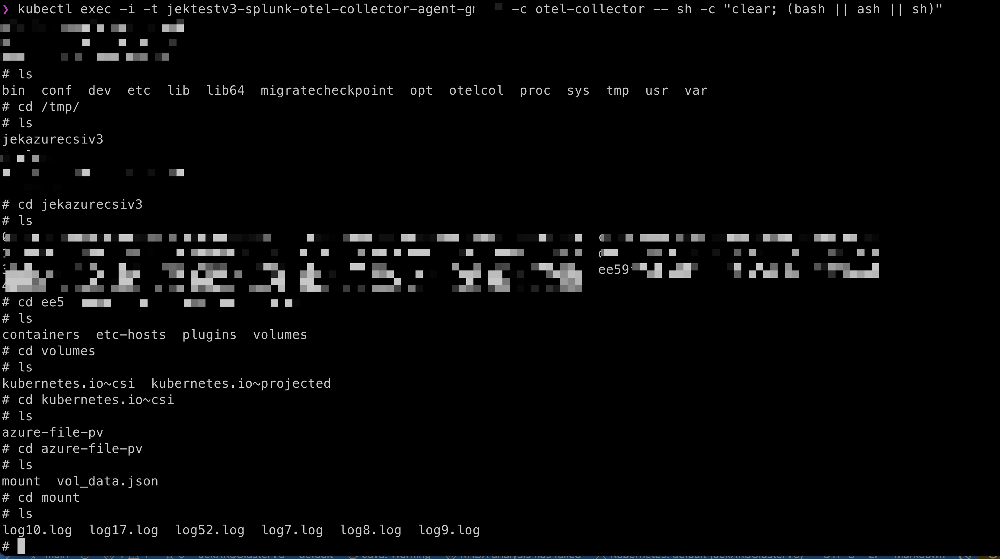
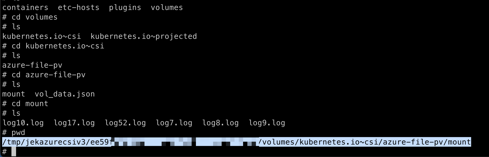

- The log files in the app pod on k8s node `...002` where in k8s node name `...02` (when SSH into the node) can see the following folder `/var/lib/kubelet/pods/<pod-uid>/volumes/kubernetes.io~csi/<pvc-uid>/mount` is mounted to the OTel Collector Daemonset's pod's container `otel-collector`'s folder `/tmp/jekazurecsiv3/<pod uid>/volumes/kubernetes.io~csi/azure-file-pv/mount/` as defined in the above `extraFileLogs` setting where the asterisk refers to all the `<pod uid>`.
    - The `extraVolumes` will use the hostpath i.e. the node path and mount the folder path as indicated. The path would be map to OTel Collector daemonset pod folder e.g. `/tmp/something...` through the use of `extraVolumeMounts`. After which, the OTel Collector will read the log files from the `extraVolumeMounts` path on the OTel Collector Daemonset pod using `extraFileLogs`. Consequently, OTel Collector will send it to Splunk Cloud or Splunk Enterprise using the selected log engine i.e. OTel in this example.

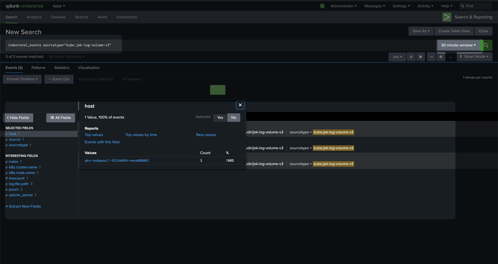

# Part 4 of 6: Use `persistentVolumeClaim` instead of `hostPath` in `extraVolumes`

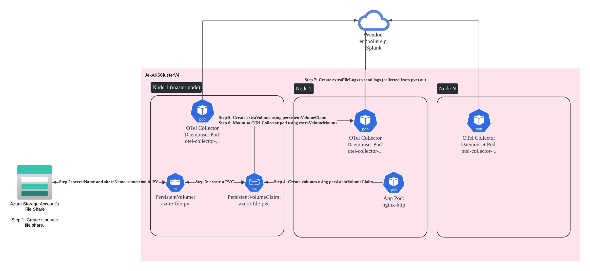

- `helm uninstall jektestv3`
- `kubectl apply -f loadtest-v4.yaml`
- Check that the `Azure Storage Account >> File Share` has the new log files that is created by loadtest-v4.yaml.

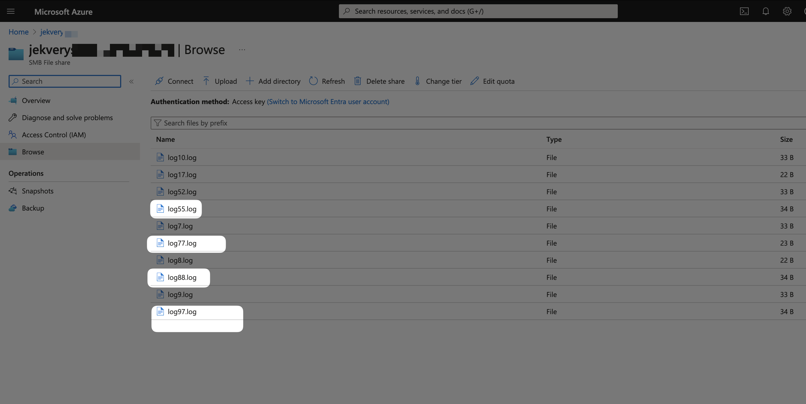

```yml
agent:
  extraVolumes:
  - name: jekvolumev4
    persistentVolumeClaim:
      claimName: azure-file-pvc
  extraVolumeMounts: 
  - name: jekvolumev4
    mountPath: /tmp/strictlyazurefilepvcv4
    readOnly: true
```

```yml
logsCollection:
  extraFileLogs:
    filelog/jek-log-volume-helloworld-v4:
      include: 
      - /tmp/strictlyazurefilepvcv4/log*.log
      start_at: beginning
      storage: file_storage
      include_file_path: true
      include_file_name: false
      resource:
        com.splunk.index: otel_events
        com.splunk.source: persistentVolumeClaim-azure-file-pvc/jek-vol-helloworld-v4
        host.name: 'EXPR(env("K8S_NODE_NAME"))'
        com.splunk.sourcetype: kube:jek-helloworld-v4
```

- `helm install jektestv4 -f v4-values.yaml splunk-otel-collector-chart/splunk-otel-collector`
- Observe which node is nginx running on `kubectl get pods -o wide` and go to the daemonset pod.
- `kubectl exec -i -t jektestv4-splunk-otel-collector-agent-< full name of the daemonset pod > -c otel-collector -- sh -c "clear; (bash || ash || sh)"`


- The logs are in Splunk too.

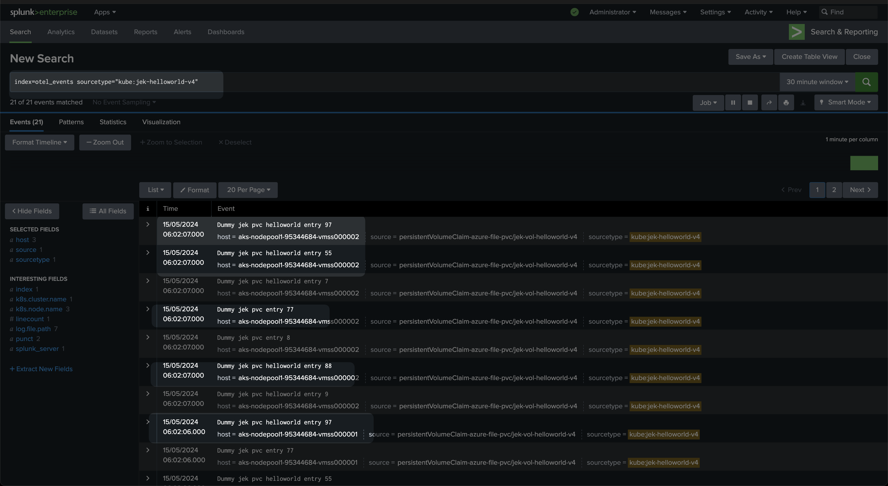


- Try to upload a file e.g. `log987654.log` to the your `Azure Storage Account's >> File Share` account and see it getting send to Splunk Cloud or Splunk Enterprise. This shows that using Persistent Volume Claim works well.

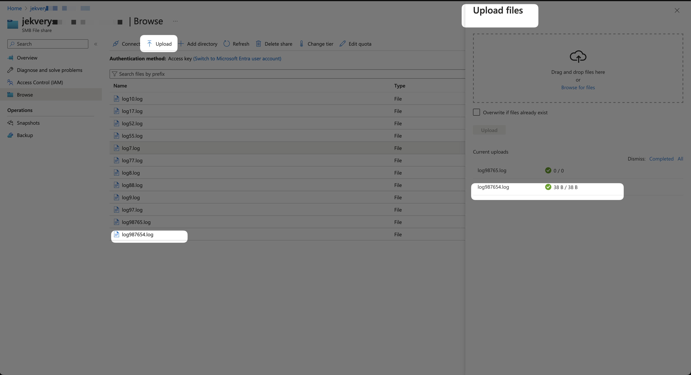
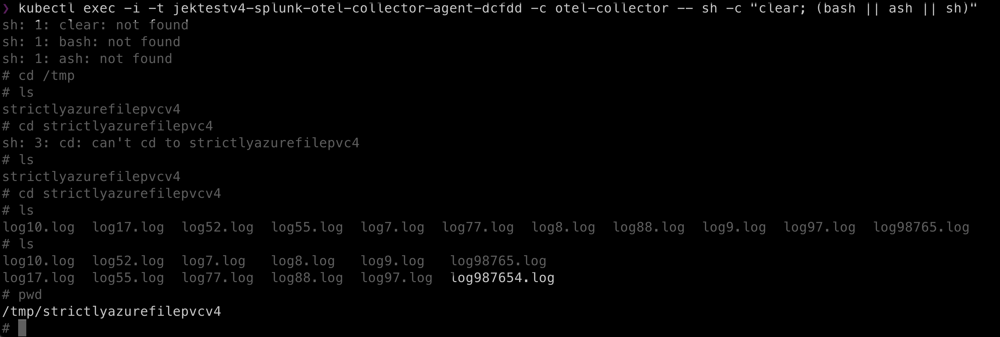
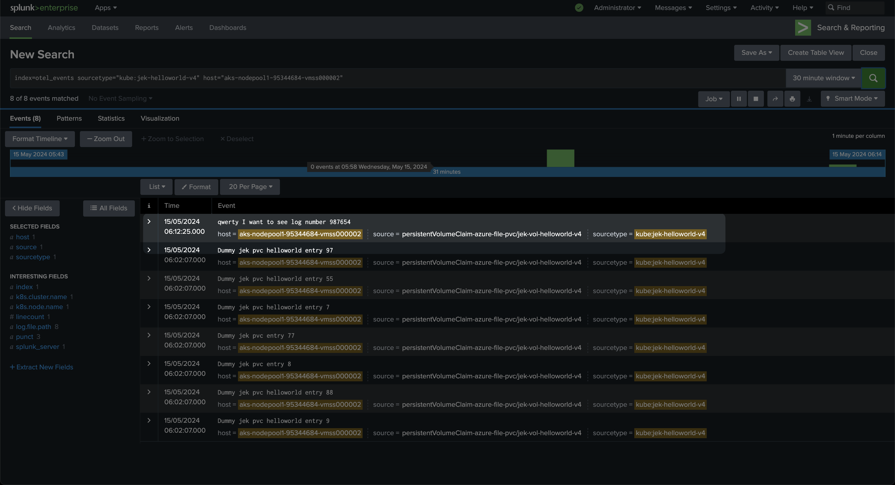

## Further proving that `extraVolumes` is reading from `PVC` i.e. directly from `Azure Storage Account's File Share`

- Delete the app deployments, associated pods and services `kubectl delete -f loadtest-v4.yaml`
- Create a unique log file content e.g. `log13579.log` and upload the file to `Azure Storage Account's File Share`.  Take note of the time in the screenshot that the file did not exist in Azure Storage Account's File Share yet. It's not in Splunk either.

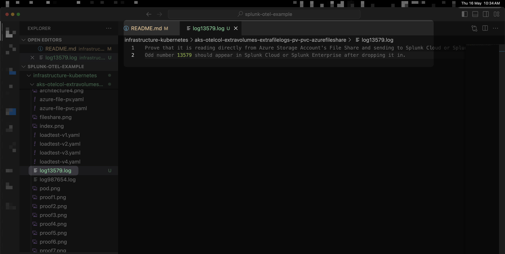
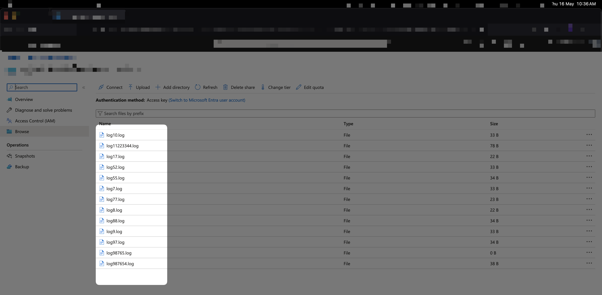
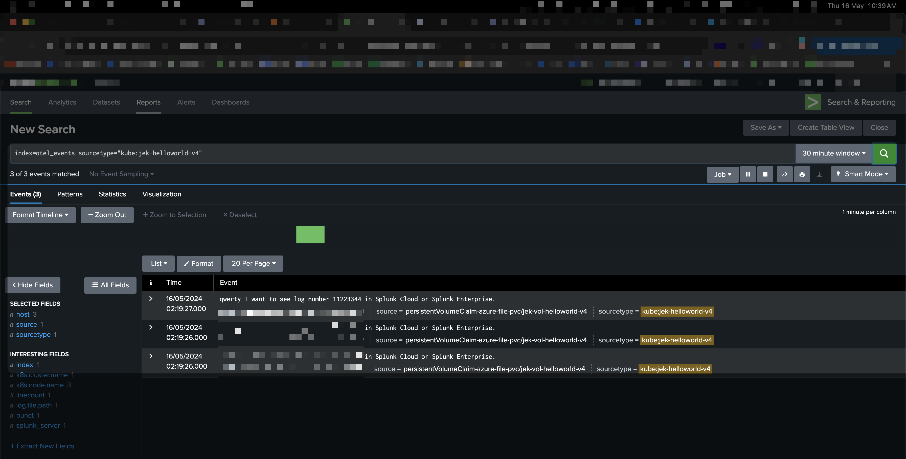

- Upload  `log13579.log` to Azure Storage Account's File Share.

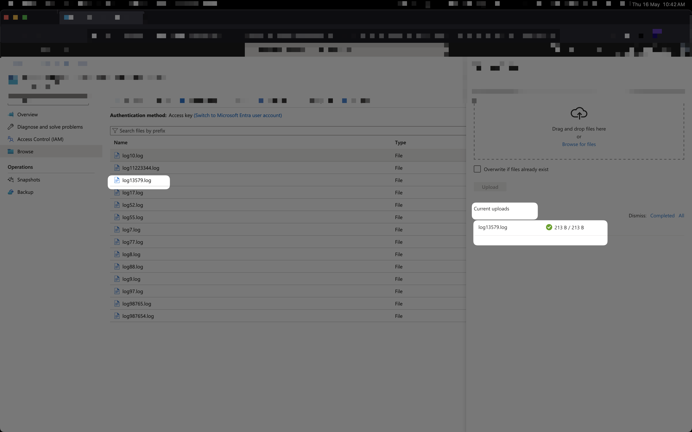
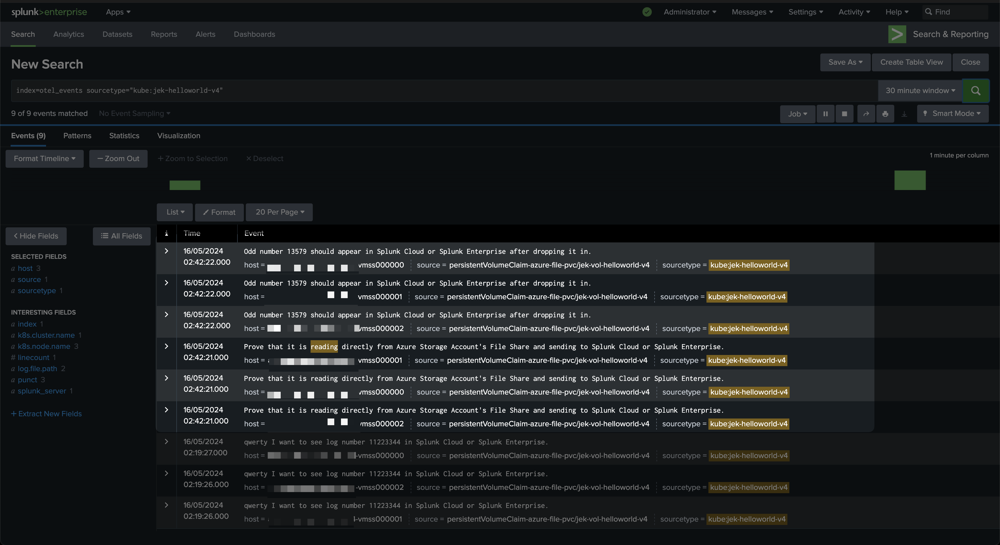

- You will notice three copies of the log13579.log are being sent. It is duplicated. It is reading from Azure Storage Account's File Share. But it is duplicated because each Daemonset runs the `extraVolumes` and `extraVolumeMounts` and then `extraFileLogs`. This is a problem. Next let's fix it.

# Part 5 of 6: Fix duplicated copies reading of logs from PVC by changing from `agent` (Daemonset) to `gateway` (Deployment with 1 replica only).

- `helm uninstall jektestv4`
- Create a unique log file content e.g. `log999888777.log` and upload the file to `Azure Storage Account's File Share`.
- Make the changes from `agent` to `gateway` (with 1 replica deployment) in `v5-values.yaml`.

```yml
agent:
  enabled: false
clusterReceiver:
  enabled: false
gateway:
  enabled: true
  replicaCount: 1
  resources:
    limits:
      cpu: 1
      # Memory limit value is used as a source for default memory_limiter configuration
      memory: 2Gi
  extraVolumes:
  - name: jekvolumev5
    persistentVolumeClaim:
      claimName: azure-file-pvc
  extraVolumeMounts: 
  - name: jekvolumev5
    mountPath: /tmp/mypvcv5
    readOnly: true
  config:
    receivers:
      filelog/jek-pvc-helloworld-v5:
        include:
        - /tmp/mypvcv5/log*.log
        start_at: beginning
        include_file_name: false
        include_file_path: true
        resource:
          com.splunk.index: otel_events
          com.splunk.source: persistentVolumeClaim-azure-file-pvc/jek-pvc-v5
          com.splunk.sourcetype: kube:jek-pvc-v5
          host.name: EXPR(env("K8S_NODE_NAME"))
    service:
      pipelines:
        logs/host:
          exporters:
          - splunk_hec/platform_logs
          processors:
          - memory_limiter
          - batch
          receivers:
          - filelog/jek-pvc-helloworld-v5
```

- `helm install jektestv5 -f v5-values.yaml splunk-otel-collector-chart/splunk-otel-collector`
- Observe which node is the gateway pod running on `kubectl get pods -o wide` and go to the gateway pod.
- `kubectl exec -i -t jektestv5-splunk-otel-collector-< full name of the daemonset pod > -c otel-collector -- sh -c "clear; (bash || ash || sh)"`
- The unique log file `log999888777.log` is mounted from Azure Storage Account's File Share to OTel Collector ClusterReceiver Pod.

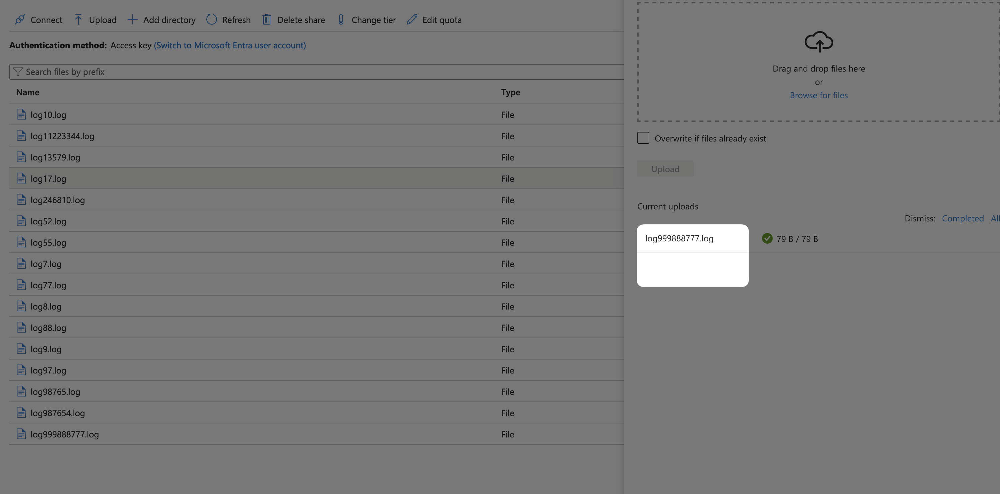
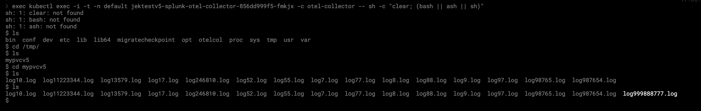


- No more duplicated because we are using Gateway with one deployment / 1 replica. If we have multiple replica then we will have duplicates. Personally. I prefer dealing directly using the `agent.extraVolumes` instead of `gateway.extraVolumes`. It's because `logsCollection` preset works OOTB with `agent` (daemonset mode) while `gateway` (deployment mode) needs to manage the pipelines and etc. Comparing `v4-values.yaml` to v5-values.yaml where in v5 I removed the file_storage because there are a lot to follow up when using that.


# Part 6 of 6: Optional... Further enhancement

- This provides us with a way for Kubernetes Platform admins to monitor volumes without the need for mounting the hostPath to the app containers directly (i.e. without using `extraVolumes` and `extraVolumeMounts` but using only `extraFileLogs` to read directly from app containers path). 
- While we have our logs coming in now, there is one thing to notice. We are missing some key metadata in these logs. We have the `k8s.cluster.name` and the `k8s.node.name` but you’ll notice, there is no `k8s.namespace.name` or  `k8s.pod.name`. There is no pod metadata at all, in fact. This is because when we pick up the log from the ephemeral path, we lose some of the info we would normally have gotten from the stdout/stderr path location. One thing we do have though, is the `k8s.pod.uid`. So let’s try and use this in conjunction with the `k8sattributes` processor we have in OTel Collector!
- First we will update our custom filelog receiver to use operators to extract metadata from the `log.file.path`

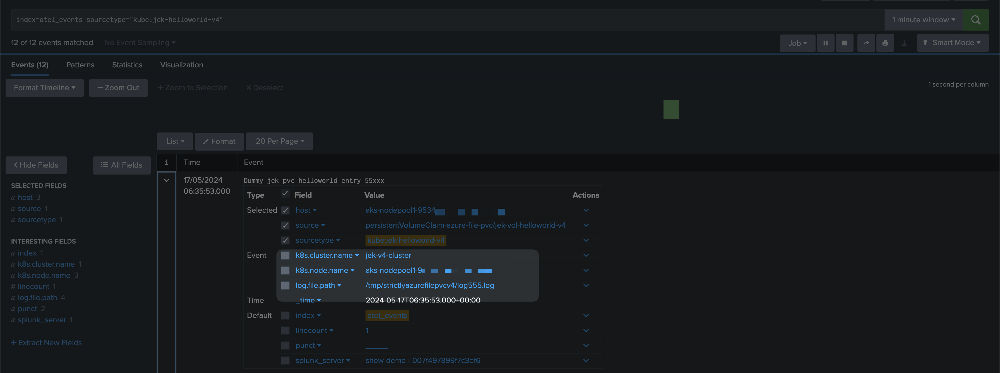

- `helm uninstall jektestv5`
- `kubectl delete -f loadtest-v4.yaml`
- Add other log info and add new lines to `loadtest-v< the new version >.yaml`
- `kubectl apply -f loadtest-v< the new version >.yaml`
- Use `v3-values.yaml` to create v6-values.yaml because `v5-values.yaml` is using not using `logsCollection`. I want to simply it by using the presets. Also the path of `v3-values.yaml` has more to extraction as demostration.

```yml
logsCollection:
  extraFileLogs:
    filelog/jek-log-volume-v6:
      include: 
      - /tmp/jekazurecsiv6/*/volumes/kubernetes.io~csi/azure-file-pv/mount/log*.log
      start_at: beginning
      storage: file_storage
      include_file_path: true
      include_file_name: false
      resource:
        com.splunk.index: otel_events
        com.splunk.source: /var/log/emptydir/jek-log-volume-v6
        host.name: 'EXPR(env("K8S_NODE_NAME"))'
        com.splunk.sourcetype: kube:jek-log-volume-v6
      operators:
      - parse_from: attributes["log.file.path"]
        regex: ^\/tmp\/jekazurecsiv6\/(?P<jek_pod_uid>[^\/]+)\/volumes\/kubernetes\.io\~csi\/(?P<jek_volume_name>[^\/]+)\/.+$
        type: regex_parser
```

- `helm install jektestv6 -f v6-values.yaml splunk-otel-collector-chart/splunk-otel-collector`

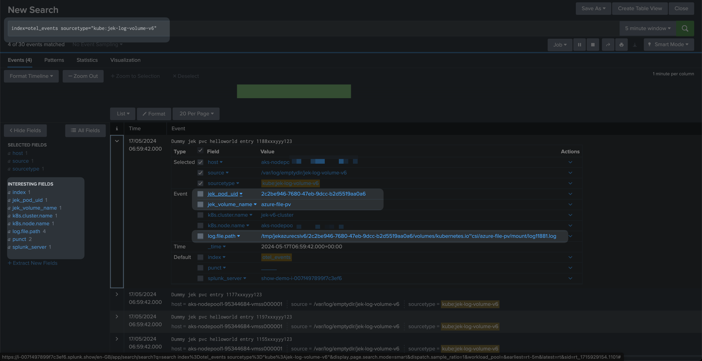

- Here we have used the regex_parser to extract the fields called `jek_pod_uid` and `jek_volume_name`. We then use the move operator to set them as resources called `k8s.pod.uid` and `k8s.volume.name`. 

```yml
logsCollection:
  extraFileLogs:
    filelog/jek-log-volume-v6:
      include: 
      - /tmp/jekazurecsiv6/*/volumes/kubernetes.io~csi/azure-file-pv/mount/log*.log
      start_at: beginning
      storage: file_storage
      include_file_path: true
      include_file_name: false
      resource:
        com.splunk.index: otel_events
        com.splunk.source: /var/log/emptydir/jek-log-volume-v6
        host.name: 'EXPR(env("K8S_NODE_NAME"))'
        com.splunk.sourcetype: kube:jek-log-volume-v6
      operators:
      - parse_from: attributes["log.file.path"]
        regex: ^\/tmp\/jekazurecsiv6\/(?P<jek_pod_uid>[^\/]+)\/volumes\/kubernetes\.io\~csi\/(?P<jek_volume_name>[^\/]+)\/.+$
        type: regex_parser
      - from: attributes.jek_pod_uid
        to: resource["k8s.pod.uid"]
        type: move
      - from: attributes.jek_volume_name
        to: resource["k8s.volume.name"]
        type: copy
```

- `helm uninstall jektestv6`
- `kubectl delete -f loadtest-v4.yaml`
- Add other log info and add new lines to `loadtest-v< the new version >.yaml`
- `kubectl apply -f loadtest-v< the new version >.yaml`
- `helm install jektestv6 -f v6-values.yaml splunk-otel-collector-chart/splunk-otel-collector`

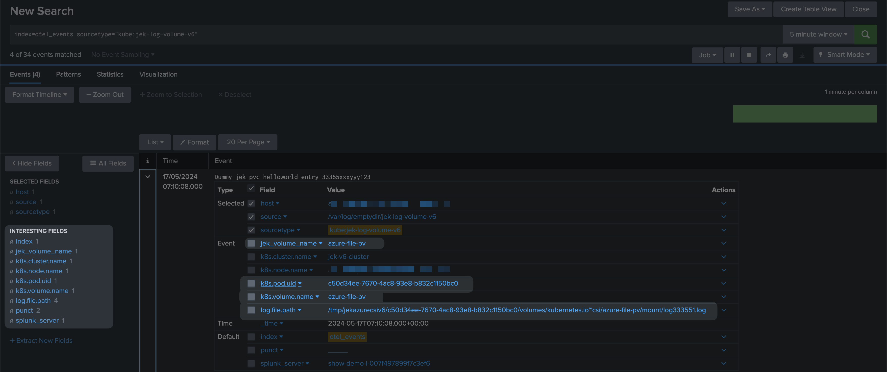

- Now let’s attempt to further customize our pipeline to use the `k8s.pod.uid` to enrich the event further with the `k8sattributes` processor. To accomplish this we will need to override the default logs/host pipeline to route our emptyDir sourced logs through the existing `k8sattributes` processor. 
- Add the `k8sattributes` to the processor.

```yml
agent:
  extraVolumes:
  - name: jekvolumev6
    hostPath:
      path: /var/lib/kubelet/pods/
  extraVolumeMounts: 
  - name: jekvolumev6
    mountPath: /tmp/jekazurecsiv6
    readOnly: true
  config:
    service:
      pipelines:
        logs/host:
          exporters:
          - splunk_hec/platform_logs
          processors:
          - memory_limiter
          - k8sattributes
          - batch
          - resource
          receivers:
          - filelog/jek-log-volume-v6
```

- `helm uninstall jektestv6`
- `kubectl delete -f loadtest-v4.yaml`
- Add other log info and add new lines to `loadtest-v< the new version >.yaml`
- `kubectl apply -f loadtest-v< the new version >.yaml`
- `helm install jektestv6 -f v6-values.yaml splunk-otel-collector-chart/splunk-otel-collector`
- And once we update our helm chart, you should now see extra metadata in the events. The only thing you won't see is container level info as we do not get the container name or id in the record to allow k8sattributes to enrich the container info, but this should provide enough key metadata for users to identify where the log came from.

BEFORE adding `k8sattributes` to the processor.

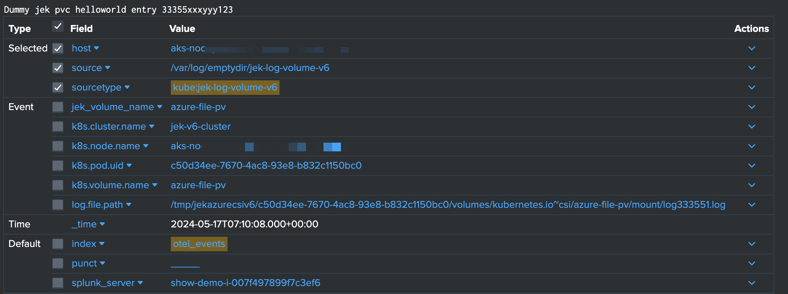

AFTER adding `k8sattributes` to the processor where the addition by `k8sattributes` is `k8s.namespace.name`, `k8s.pod.labels.app`, and `k8s.pod.name`.

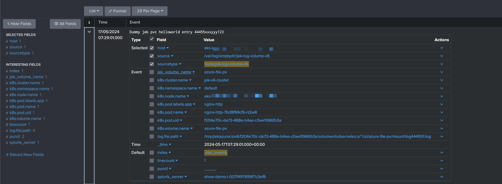


# Clean Up

- `kubectl delete deployment.apps/nginx-http`
- `kubectl delete service/nginx-http-service`
- `kubectl delete deployment.apps/load-http`
    - or `kubectl delete -f loadtest-v< the version >.yaml`
- Delete the AKS cluster `az aks delete --resource-group "${AZURE_RESOURCE_GROUP}" --name "${AKS_CLUSTER_NAME}"`
- Delete the created Azure Resource Group https://learn.microsoft.com/en-us/cli/azure/group?view=azure-cli-latest#az-group-delete `az group delete --name "${AZURE_RESOURCE_GROUP}"`
- Delete the Splunk Cloud or Splunk Enterprise instance
- Delete the Azure Storage Account's File Share
- Delete the Azure Storage Account


