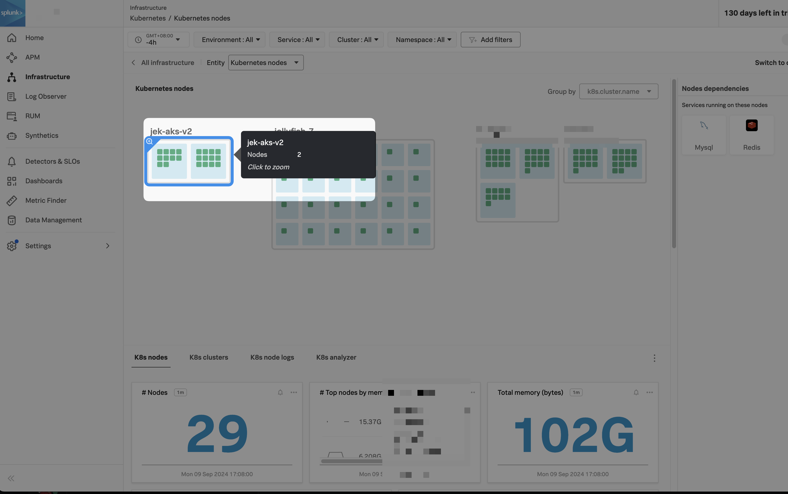

Work in progress. Not working yet.

Upgrade if existing
```bash
helm upgrade splunk-otel-collector splunk-otel-collector-chart/splunk-otel-collector --values values.yaml
```

or 

Install if it doesn't exist
```bash
helm install splunk-otel-collector splunk-otel-collector-chart/splunk-otel-collector --values values.yaml
```




After which test with sample app

```bash
kubectl apply -f sample-app.yaml

kubectl get deployment sample-app

kubectl port-forward deployment/sample-app 3010:8080

# Invoke success
curl http://localhost:3010/greeting

# Invoke general
curl http://localhost:3010

# View the logs to verify
kubectl logs deployment/sample-app

```
