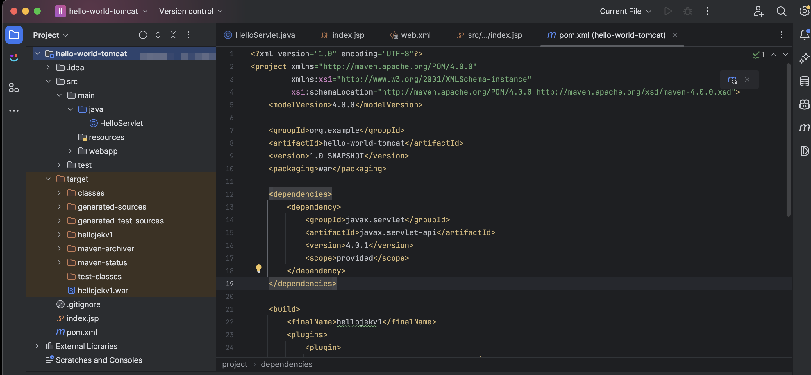
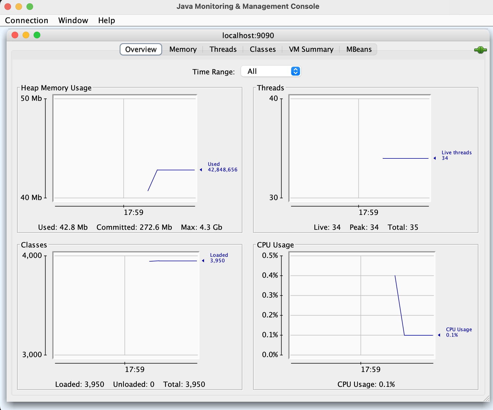

# Basic Java Hello World App using Maven on Tomcat.
1. Set Up Your Project Structure
Ensure your project follows the standard Maven directory structure:
```
MyApp
├── src
│   ├── main
│   │   ├── java
│   │   │   └── com
│   │   │       └── example
│   │   │           └── HelloServlet.java
│   │   ├── resources
│   │   └── webapp
│   │       ├── WEB-INF
│   │       │   └── web.xml
│   │       └── index.jsp
├── pom.xml
```

2. Create the pom.xml File
This is the Maven configuration file that specifies the project’s dependencies and build configuration.
```xml
<project xmlns="http://maven.apache.org/POM/4.0.0"
         xmlns:xsi="http://www.w3.org/2001/XMLSchema-instance"
         xsi:schemaLocation="http://maven.apache.org/POM/4.0.0 http://maven.apache.org/xsd/maven-4.0.0.xsd">
    <modelVersion>4.0.0</modelVersion>
    <groupId>com.example</groupId>
    <artifactId>MyApp</artifactId>
    <version>1.0-SNAPSHOT</version>
    <packaging>war</packaging>

    <dependencies>
        <dependency>
            <groupId>javax.servlet</groupId>
            <artifactId>javax.servlet-api</artifactId>
            <version>4.0.1</version>
            <scope>provided</scope>
        </dependency>
    </dependencies>

    <build>
        <finalName>myapp</finalName>
        <plugins>
            <plugin>
                <groupId>org.apache.maven.plugins</groupId>
                <artifactId>maven-war-plugin</artifactId>
                <version>3.3.1</version>
                <configuration>
                    <failOnMissingWebXml>false</failOnMissingWebXml>
                </configuration>
            </plugin>
        </plugins>
    </build>
</project>
```

3. Create the Servlet and Configuration Files
Create `HelloServlet.java` in src/main/java/com/example/.
```java
package com.example;

import java.io.IOException;
import javax.servlet.ServletException;
import javax.servlet.annotation.WebServlet;
import javax.servlet.http.HttpServlet;
import javax.servlet.http.HttpServletRequest;
import javax.servlet.http.HttpServletResponse;

@WebServlet("/hello")
public class HelloServlet extends HttpServlet {
    protected void doGet(HttpServletRequest request, HttpServletResponse response)
            throws ServletException, IOException {
        response.setContentType("text/html");
        response.getWriter().println("<h1>Hello, World!</h1>");
    }
}
```
Create web.xml in src/main/webapp/WEB-INF/.
```xml
<!DOCTYPE web-app PUBLIC
  "-//Sun Microsystems, Inc.//DTD Web Application 2.3//EN"
  "http://java.sun.com/dtd/web-app_2_3.dtd">

<web-app>
  <servlet>
    <servlet-name>HelloServlet</servlet-name>
    <servlet-class>HelloServlet</servlet-class>
  </servlet>
  <servlet-mapping>
    <servlet-name>HelloServlet</servlet-name>
    <url-pattern>/hello</url-pattern>
  </servlet-mapping>
</web-app>
```
Create index.jsp in src/main/webapp/.
```xml
<!DOCTYPE html>
<html>
<head>
  <title>My App</title>
</head>
<body>
  <h1>Welcome to My App</h1>
  <a href="hello">Say Hello</a>
</body>
</html>
```



4. Build the .war File
In the root directory of your project, run the following Maven command:
```bash
mvn clean package
```
The .war file will be created in the target directory.

5. Go to the Tomcat download page and download the latest version.
https://tomcat.apache.org/whichversion.html

6. Extract the downloaded archive to a desired directory.

7. Copy your .war file (e.g., myapp.war) to the webapps directory in your Tomcat installation. The webapps directory is located in the root directory of your Tomcat installation.

8. Start
```bash
./startup.sh
```

9. Go to http://localhost:8080

10. http://localhost:8080/hellojekv1/

11. http://localhost:8080/hellojekv1/hello


# Get Tomcat metrics by enabling JMX

Edit `catalina.sh` in /bin:

Open the catalina.sh file located in the bin directory of your Tomcat installation.

Add the following lines to set the CATALINA_OPTS environment variable. You can add these lines near the beginning of the file, right after the initial comments and before any of the main script commands. following lines to enable JMX:

```bash
CATALINA_OPTS="$CATALINA_OPTS -Dcom.sun.management.jmxremote"
CATALINA_OPTS="$CATALINA_OPTS -Dcom.sun.management.jmxremote.port=9090"
CATALINA_OPTS="$CATALINA_OPTS -Dcom.sun.management.jmxremote.ssl=false"
CATALINA_OPTS="$CATALINA_OPTS -Dcom.sun.management.jmxremote.authenticate=false"
```

These options configure JMX to run on port 9090 without SSL and authentication for simplicity. In a production environment, you should enable SSL and authentication.

Save the File and Restart Tomcat:

Stop Tomcat if it is running by executing shutdown.sh.
Start Tomcat again running or executing startup.sh.

##  Use JMX Client e.g. JConsole to Access Metrics

`jconsole` comes with the JDK. Open a terminal and type `jconsole`. If the JDK is not installed, you can install it via Homebrew: `brew install openjdk`

In the connection dialog, select `Remote Process`.

Enter the JMX service URL, which is typically `localhost:9090`.

Click `Connect`.




# Create the container image with Tomcat

Dockerfile: Create a Dockerfile to build the Docker image.
```
FROM tomcat:9.0
COPY target/hellojekv1.war /usr/local/tomcat/webapps/
```

Build the Docker Image:
```
docker build -t hellojekv1-tomcat .
```

Push the Docker image to a container registry like Docker Hub.
```
docker tag hellojekv1-tomcat:v2 jchoo/hellojekv1-tomcat
```
```
 docker push jchoo/hellojekv1-tomcat
```

# Create Kubernetes Deployment and Service

Create deployment.yaml.
```
apiVersion: apps/v1
kind: Deployment
metadata:
  name: myapp-deployment
spec:
  replicas: 1
  selector:
    matchLabels:
      app: myapp
  template:
    metadata:
      labels:
        app: myapp
    spec:
      containers:
      - name: myapp
        image: <your-dockerhub-username>/myapp-tomcat
        ports:
        - containerPort: 8080
```

Apply the Deployment and Service:
```bash
kubectl apply -f deployment.yaml
```

```
kubectl get services
```

Go to e.g. http://XXX.XXX.XXX.XXX/hellojekv1/ (replace XXX... with the external ips from the step of kubectl get svc)

Go to e.g. http://XXX.XXX.XXX.XXX/hellojekv1/hello (replace XXX... with the external ips from the step of kubectl get svc)

# Get Tomcat metrics by enabling JMX in k8s deployment.yaml
Apply the Deployment and Service:
```bash
kubectl delete -f deployment.yaml

kubectl apply -f deployment-jmx.yaml
```

Port forward to `kubectl port-forward deployment/hellojekv1-tomcat-jmx 9090:9090`

`jconsole` comes with the JDK. Open a terminal and type `jconsole`. If the JDK is not installed, you can install it via Homebrew: `brew install openjdk`

In the connection dialog, select `Remote Process`.

Enter the JMX service URL, which is typically `localhost:9090`.

# WIP...