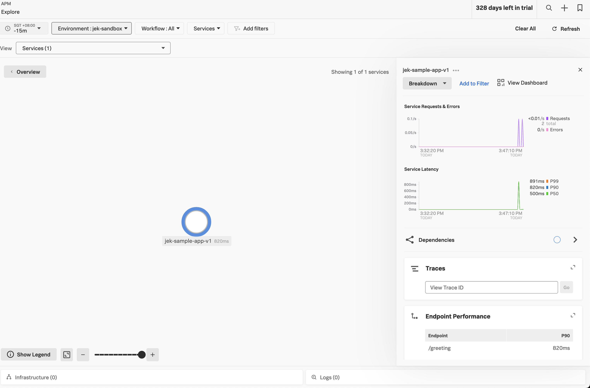

```bash
helm repo add splunk-otel-collector-chart https://signalfx.github.io/splunk-otel-collector-chart

helm repo update

kubectl create ns splunk-monitoring
```

# Install first set of gateway collector for traceID load balancing

```bash
helm install traceid-load-balancing-gateway splunk-otel-collector-chart/splunk-otel-collector -n splunk-monitoring --values traceid-load-balancing-otel-collector-gateway-values.yaml

helm ls -n splunk-monitoring

kubectl get deployment -n splunk-monitoring

kubectl get pods -n splunk-monitoring
```

# Install second set of gateway collector for tail sampling

```bash
helm install tail-sampling-gateway splunk-otel-collector-chart/splunk-otel-collector -n splunk-monitoring --values tail-sampling-otel-collector-gateway-values.yaml

helm ls -n splunk-monitoring

kubectl get deployment -n splunk-monitoring

kubectl get pods -n splunk-monitoring
```

# Test if trace can be sent from sample app --> tail sampling gateway --> Splunk
```bash
kubectl apply -f sample-app.yaml

kubectl port-forward deployment/sample-app 3009:8080

# Invoke success
curl http://localhost:3009/greeting

# Invoke general
curl http://localhost:3009

# View the logs to verify
kubectl logs deployment/sample-app
```
## Working Proof


# Test if trace can be sent from sample app --> traceID load balancing gateway --> tail sampling gateway --> Splunk
```

```