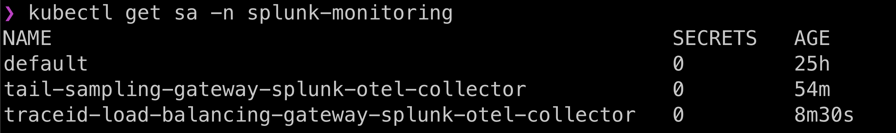
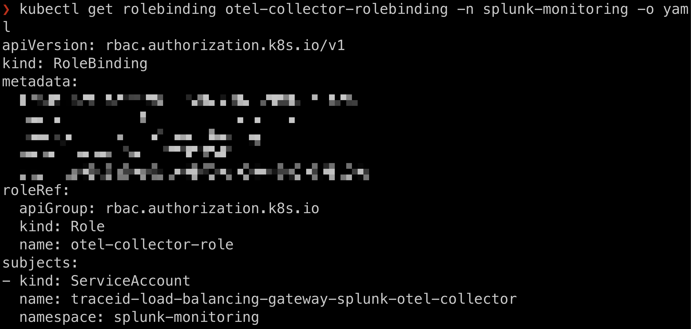
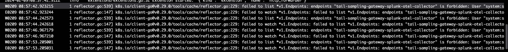

# Architecture


# References
- https://github.com/signalfx/splunk-otel-collector-chart/blob/main/examples/route-data-through-gateway-deployed-separately/route-data-through-gateway-deployed-separately-values.yaml
- https://github.com/open-telemetry/opentelemetry-collector-contrib/blob/main/processor/tailsamplingprocessor/README.md
    - "This processor requires all spans for a given trace to be sent to the same collector instance for the correct sampling decision to be derived. When scaling the collector, you'll then need to ensure that all spans for the same trace are reaching the same collector. You can achieve this by having two layers of collectors in your infrastructure: one with the load balancing exporter, and one with the tail sampling processor." <-- this is the reason why we need traceID load balancing exporter.
    - "The tail sampling processor samples traces based on a set of defined policies. All spans for a given trace MUST be received by the same collector instance for effective sampling decisions. Before performing sampling, spans will be grouped by trace_id. Therefore, the tail sampling processor can be used directly without the need for the groupbytraceprocessor." <-- This is the reason why we didn't use groupbytraceprocessor.
    - "While it's technically possible to have one layer of collectors with two pipelines on each instance, we recommend separating the layers in order to have better failure isolation." <-- This is the reason the architecture diagram uses two layers of collectors instead of one layer of collectors.
    - "This processor must be placed in pipelines after any processors that rely on context, e.g. k8sattributes. It reassembles spans into new batches, causing them to lose their original context." <-- This is the reason we place it after k8sattributes in the pipeline.
- https://github.com/open-telemetry/opentelemetry-collector-contrib/blob/main/exporter/loadbalancingexporter/README.md
    - Example https://github.com/open-telemetry/opentelemetry-collector-contrib/blob/main/exporter/loadbalancingexporter/example/otel-agent-config.yaml

```bash
helm repo add splunk-otel-collector-chart https://signalfx.github.io/splunk-otel-collector-chart

helm repo update

kubectl create ns splunk-monitoring

# Create a role called otel-collector-role in namespace splunk-monitoring
# But if you want them to be namespace indifferent, you create a clusterRole instead of a role.
kubectl apply -f role.yaml

kubectl get role -n splunk-monitoring

kubectl get role otel-collector-role -n splunk-monitoring -o yaml
```

# Install first layer of gateway collector for traceID load balancing

```bash
helm install traceid-load-balancing-gateway splunk-otel-collector-chart/splunk-otel-collector -n splunk-monitoring --values traceid-load-balancing-otel-collector-gateway-values.yaml

helm ls -n splunk-monitoring

kubectl get deployment -n splunk-monitoring

kubectl get pods -n splunk-monitoring

# Check that the traceid-load-balancing-gateway-splunk-otel-collector is created
kubectl get sa -n splunk-monitoring
```


```bash
# After the role is bind the role to the service account
kubectl apply -f role-binding.yaml

kubectl get rolebinding -n splunk-monitoring

kubectl get rolebinding otel-collector-rolebinding -n splunk-monitoring -o yaml

kubectl get rolebindings \
-n splunk-monitoring  \
-o custom-columns='KIND:kind,NAMESPACE:metadata.namespace,NAME:metadata.name,SERVICE_ACCOUNTS:subjects[?(@.kind=="ServiceAccount")].name'

# Restart  the deployment to force it picks up the rolebindings
kubectl rollout restart deployment traceid-load-balancing-gateway-splunk-otel-collector -n splunk-monitoring
```



# Install second layer of gateway collector for tail sampling

```bash
helm install tail-sampling-gateway splunk-otel-collector-chart/splunk-otel-collector -n splunk-monitoring --values tail-sampling-otel-collector-gateway-values.yaml

helm ls -n splunk-monitoring

kubectl get deployment -n splunk-monitoring

kubectl get pods -n splunk-monitoring
```

# Test if trace can be sent from sample app --> tail sampling gateway --> Splunk
```bash
kubectl apply -f sample-app-sending-to-tail-sampling-gateway.yaml

kubectl get deployment sample-app

kubectl port-forward deployment/sample-app 3009:8080

# Invoke success
curl http://localhost:3009/greeting

# Invoke general
curl http://localhost:3009

# View the logs to verify
kubectl logs deployment/sample-app
```
## Working Proof


# Test if trace can be sent from sample app --> traceID load balancing gateway --> tail sampling gateway --> Splunk
```bash
# Please uncomment in traceid-load-balancing-otel-collector-gateway-values.yaml the commented parts where gateway >> config stuff and do a helm upgrade
helm upgrade traceid-load-balancing-gateway splunk-otel-collector-chart/splunk-otel-collector -n splunk-monitoring --values traceid-load-balancing-otel-collector-gateway-values.yaml

kubectl get deployment -n splunk-monitoring

kubectl logs deployment/traceid-load-balancing-gateway-splunk-otel-collector -n splunk-monitoring

# the Splunk environment is changed to v2 in the deployment sample-app-sending-to-traceid-load-balancing-gateway.yaml file
kubectl apply -f sample-app-sending-to-traceid-load-balancing-gateway.yaml

kubectl port-forward deployment/sample-app 3009:8080

# Invoke success
curl http://localhost:3009/greeting

# Invoke general
curl http://localhost:3009

# View the logs to verify
kubectl logs deployment/sample-app
```
## Working Proof


# Test if tail sampling gateway is sampling
```bash
# Please uncomment in tail-sampling-otel-collector-gateway-values.yaml the commented parts where gateway >> config stuff and do a helm upgrade
helm upgrade tail-sampling-gateway splunk-otel-collector-chart/splunk-otel-collector -n splunk-monitoring --values tail-sampling-otel-collector-gateway-values.yaml

kubectl get deployment -n splunk-monitoring

kubectl logs deployment/tail-sampling-gateway-splunk-otel-collector -n splunk-monitoring

kubectl port-forward deployment/sample-app 3009:8080

# Invoke success
curl http://localhost:3009/greeting

# Invoke general
curl http://localhost:3009

# View the logs to verify
kubectl logs deployment/sample-app

kubectl logs deployment/tail-sampling-gateway-splunk-otel-collector -n splunk-monitoring
```

# Error
Don't worry if you get error message like this
```
W0209 08:59:30.307222       1 reflector.go:539] k8s.io/client-go@v0.29.0/tools/cache/reflector.go:229: failed to list *v1.Endpoints: endpoints "tail-sampling-gateway-splunk-otel-collector" is forbidden: User "system:serviceaccount:splunk-monitoring:traceid-load-balancing-gateway-splunk-otel-collector" cannot list resource "endpoints" in API group "" in the namespace "splunk-monitoring"
E0209 08:59:30.307262       1 reflector.go:147] k8s.io/client-go@v0.29.0/tools/cache/reflector.go:229: Failed to watch *v1.Endpoints: failed to list *v1.Endpoints: endpoints "tail-sampling-gateway-splunk-otel-collector" is forbidden: User "system:serviceaccount:splunk-monitoring:traceid-load-balancing-gateway-splunk-otel-collector" cannot list resource "endpoints" in API group "" in the namespace "splunk-monitoring"
W0209 08:59:31.896678       1 reflector.go:539] k8s.io/client-go@v0.29.0/tools/cache/reflector.go:229: failed to list *v1.Endpoints: endpoints "tail-sampling-gateway-splunk-otel-collector" is forbidden: User "system:serviceaccount:splunk-monitoring:traceid-load-balancing-gateway-splunk-otel-collector" cannot list resource "endpoints" in API group "" in the namespace "splunk-monitoring"
E0209 08:59:31.896714       1 reflector.go:147] k8s.io/client-go@v0.29.0/tools/cache/reflector.go:229: Failed to watch *v1.Endpoints: failed to list *v1.Endpoints: endpoints "tail-sampling-gateway-splunk-otel-collector" is forbidden: User "system:serviceaccount:splunk-monitoring:traceid-load-balancing-gateway-splunk-otel-collector" cannot list resource "endpoints" in API group "" in the namespace "splunk-monitoring"
W0209 08:59:33.849069       1 reflector.go:539] k8s.io/client-go@v0.29.0/tools/cache/reflector.go:229: failed to list *v1.Endpoints: endpoints "tail-sampling-gateway-splunk-otel-collector" is forbidden: User "system:serviceaccount:splunk-monitoring:traceid-load-balancing-gateway-splunk-otel-collector" cannot list resource "endpoints" in API group "" in the namespace "splunk-monitoring"
E0209 08:59:33.849099       1 reflector.go:147] k8s.io/client-go@v0.29.0/tools/cache/reflector.go:229: Failed to watch *v1.Endpoints: failed to list *v1.Endpoints: endpoints "tail-sampling-gateway-splunk-otel-collector" is forbidden: User "system:serviceaccount:splunk-monitoring:traceid-load-balancing-gateway-splunk-otel-collector" cannot list resource "endpoints" in API group "" in the namespace "splunk-monitoring"
```

This error just mean that you ServiceAccount and your Role are not bind properly.
```
kubectl get rolebindings \
-n splunk-monitoring  \
-o custom-columns='KIND:kind,NAMESPACE:metadata.namespace,NAME:metadata.name,SERVICE_ACCOUNTS:subjects[?(@.kind=="ServiceAccount")].name'
```
