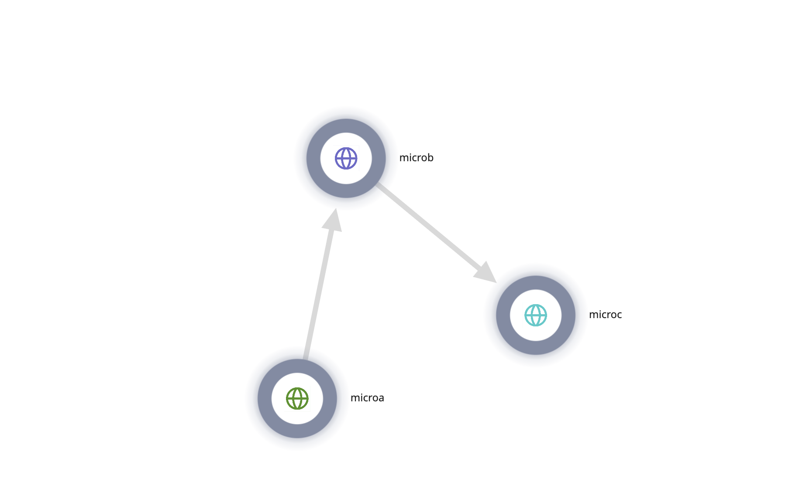
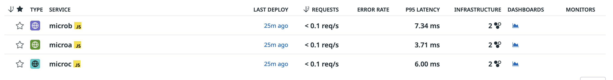

EKS EC2 Cluster
```
eksctl create cluster \
--name=jek-eks-ec2-cluster-<add a date> \
--nodegroup-name=jek-eks-ec2-workers \
--version=1.21 \
--node-type=t3.large \
--nodes 2 \
--region=ap-southeast-1 \
--tags=Env=test \
--tags=Criticality=low \
--tags=Owner=email@email.com \
--managed \
--dry-run
```

DataDog Agent to Kubernetes https://docs.datadoghq.com/containers/kubernetes/installation
 - Tried Operator but didn't work for tracing. Hence revert to Helm chart installation

Follow the guide in DataDog to install APM.

Deploy a few microservices in the folder of /apm two levels up of this folder. Remember to align the deployment.yaml in this folder to the folder of /apm

```
kubectl apply -f deployment.yaml
```

```
kubectl port-forward svc/microservice-a-service 8080:80
```

```
curl localhost:8080/a
```

```
kubectl logs deploy/microservice-d
```




---

Instal Upstream OTel Collector 
https://opentelemetry.io/docs/kubernetes/helm/collector/

```
helm repo add open-telemetry https://open-telemetry.github.io/opentelemetry-helm-charts

helm repo update

helm pull --untar open-telemetry/opentelemetry-collector

cd open-telemetry

vim values.yaml

helm install my-opentelemetry-collector open-telemetry/opentelemetry-collector --values values.yaml

```

```
kubectl port-forward svc/microservice-a-service 8080:80
```

```
curl localhost:8080/a
```

```
kubectl logs deploy/microservice-d
```