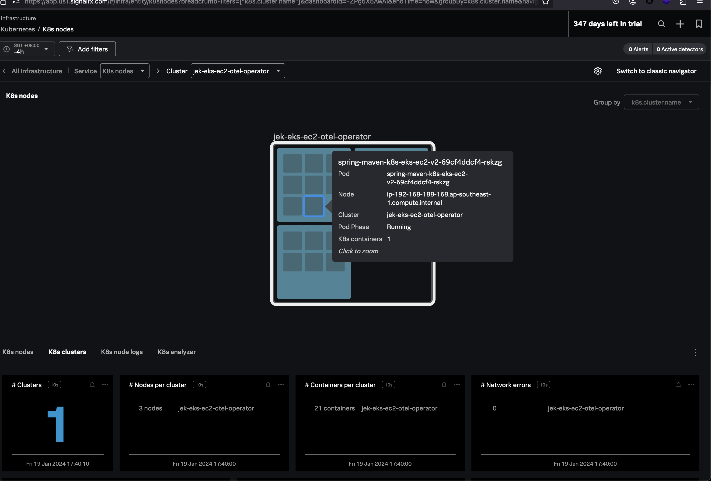
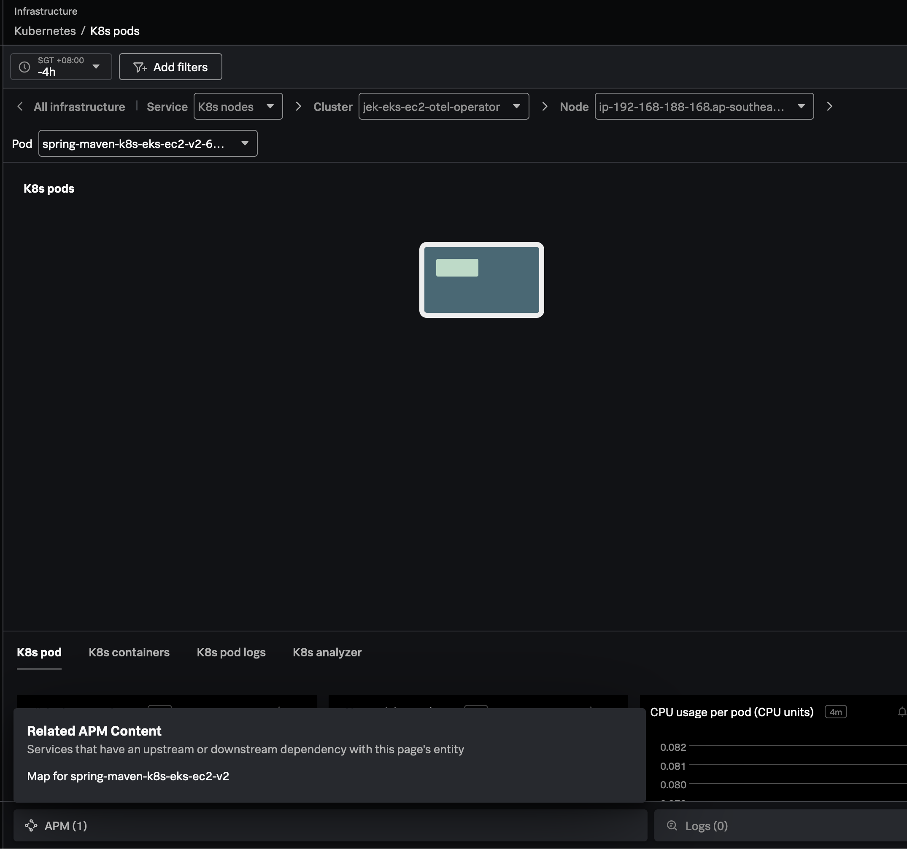
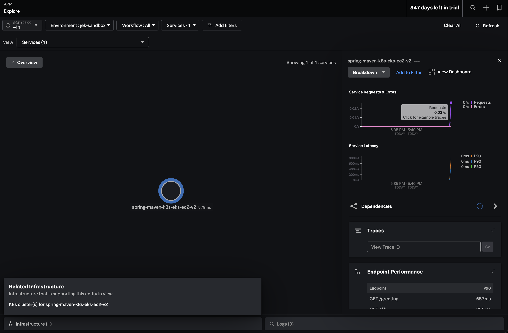
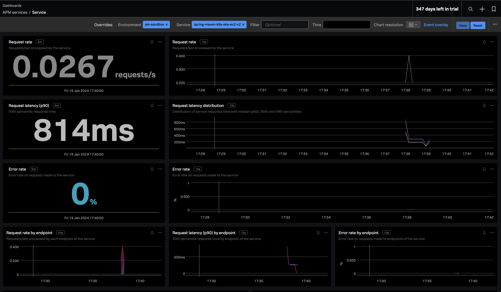
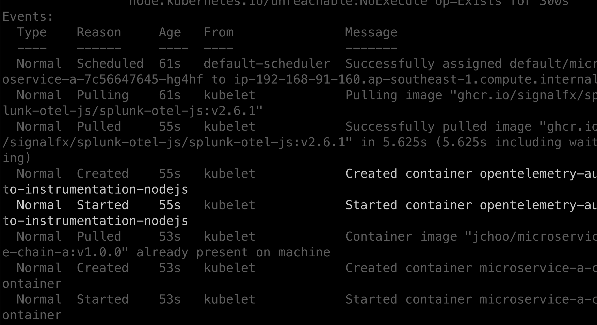
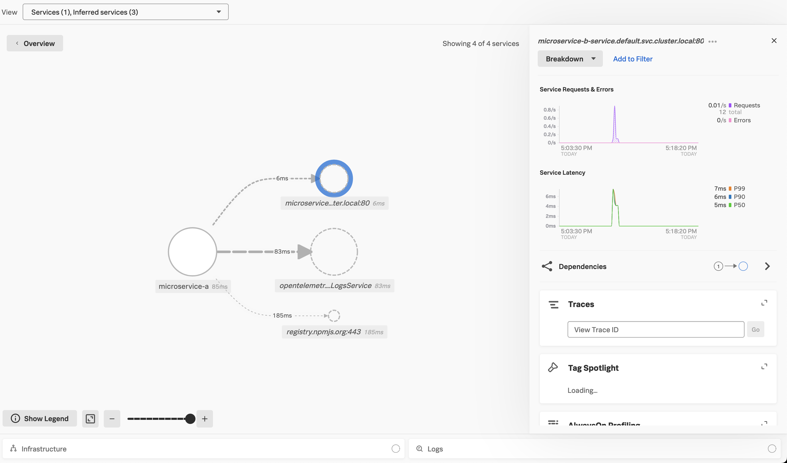
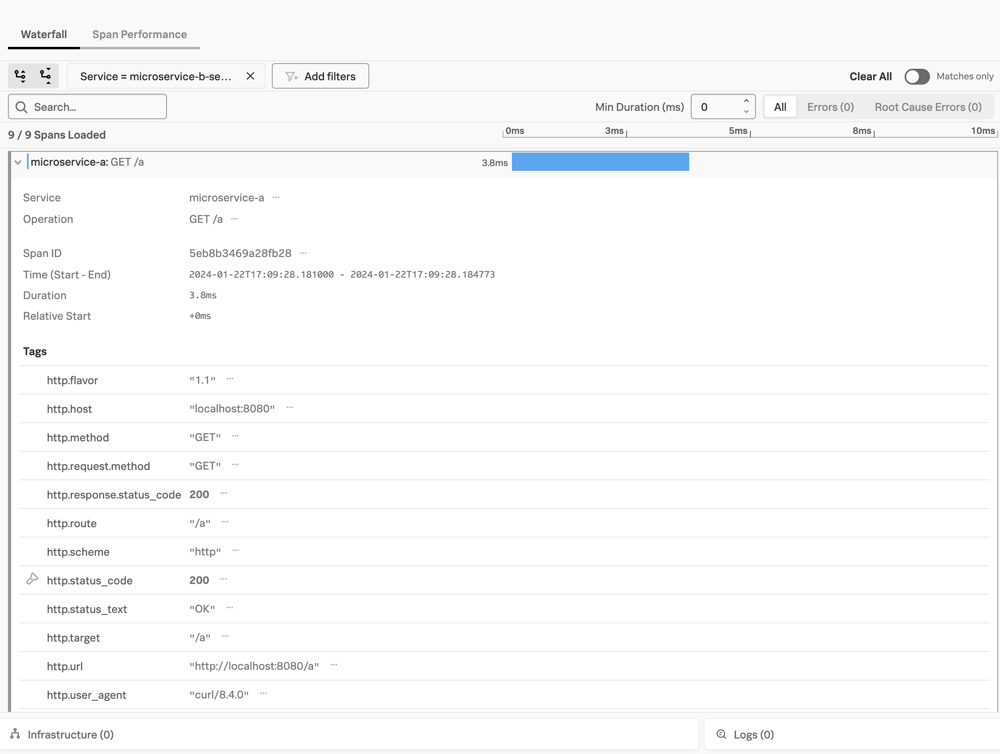

1. https://github.com/signalfx/splunk-otel-collector-chart/blob/main/docs/auto-instrumentation-install.md <-- This is the most important resource of all.
2. https://docs.splunk.com/observability/en/gdi/opentelemetry/zero-config.html <- Useful
3. https://github.com/open-telemetry/opentelemetry-operator#controlling-instrumentation-capabilities
4. https://github.com/signalfx/splunk-otel-collector-chart/blob/main/examples/enable-operator-and-auto-instrumentation/otel-demo-nodejs.md
5. https://github.com/signalfx/splunk-otel-collector-chart/blob/main/examples/enable-operator-and-auto-instrumentation/README.md

---

1. https://docs.splunk.com/observability/en/gdi/get-data-in/application/nodejs/configuration/advanced-nodejs-otel-configuration.html <-- useful for Nodejs auto instrumentation configuration
2. https://docs.splunk.com/observability/en/gdi/get-data-in/application/nodejs/nodejs-otel-requirements.html <-- the library environment naming 
3. https://github.com/open-telemetry/opentelemetry-js-contrib/tree/main/plugins/node <-- the latest Node.js OTel plugin libraries 
4. https://docs.splunk.com/observability/en/gdi/opentelemetry/auto-instrumentation/auto-instrumentation-nodejs-k8s.html

---
# Deploy a few apps without instrumentation agents

## Java
- `kubectl apply -f java-deployment.yaml`
- `kubectl get deployment spring-maven-k8s-eks-ec2-v2 -o yaml`
- `kubectl port-forward deployment/spring-maven-k8s-eks-ec2-v2 3009:8080`
- `curl http://localhost:3009/greeting` Invoke success
- `curl http://localhost:3009` Invoke failure


## Node.js
- `kubectl apply -f nodejs-deployment.yaml`
- `kubectl port-forward svc/microservice-a-service 8080:80`
- `curl localhost:8080/a`

---

# Deploy OTel Collector Operator

- Ensure that you have installed and configured the Helm 3.6 client.
- `helm repo add splunk-otel-collector-chart https://signalfx.github.io/splunk-otel-collector-chart`
- `helm repo update`
- `kubectl get pods -l app=cert-manager --all-namespaces` Check if a cert-manager is already installed by looking for cert-manager pods.
- Create values.yaml and if cert-manager is deployed, make sure to remove certmanager.enabled=true to the list of values to set.
- `kubectl create ns splunk-monitoring`
- `helm install -n splunk-monitoring splunk-otel-collector splunk-otel-collector-chart/splunk-otel-collector -f values.yaml`
- `helm ls -n splunk-monitoring`
- `kubectl get pods -n splunk-monitoring`
- `kubectl get mutatingwebhookconfiguration.admissionregistration.k8s.io`
- `kubectl get otelinst -n splunk-monitoring -o yaml`
    - `kubectl get otelinst {instrumentation_name} -n splunk-monitoring -o yaml`

Proof


---


- Instrument Application by Setting an Annotation

# Java app
- `kubectl patch deployment <my deployment name> -n <my namespace> -p '{"spec": {"template":{"metadata":{"annotations":{"instrumentation.opentelemetry.io/inject-java":"otel/splunk-otel-collector"}}}} }'` This is Java example
  - `kubectl get deployment spring-maven-k8s-eks-ec2-v2 -o yaml`
  - `kubectl describe pod/spring-maven-k8s-eks-ec2-v2-<the pod name> -n default`
  - `kubectl patch deployment spring-maven-k8s-eks-ec2-v2 -n default -p '{"spec": {"template":{"metadata":{"annotations":{"instrumentation.opentelemetry.io/inject-java":"splunk-monitoring/splunk-otel-collector"}}}} }'`
  - `kubectl get deployment spring-maven-k8s-eks-ec2-v2 -o yaml`
- `kubectl describe pod <my application pod name> -n <my namespace>` verify that there is initcontainer added
    - `kubectl describe pod/spring-maven-k8s-eks-ec2-v2-<the pod name>  -n default`

# Node.js app
- `kubectl patch deployment <my deployment name> -n <my namespace> -p '{"spec": {"template":{"metadata":{"annotations":{"instrumentation.opentelemetry.io/inject-nodejs":"otel/splunk-otel-collector"}}}} }'` This is Java example
  - `kubectl get deployment spring-maven-k8s-eks-ec2-v2 -o yaml`
  - `kubectl describe pod/spring-maven-k8s-eks-ec2-v2-<the pod name> -n default`
  - `kubectl patch deployment spring-maven-k8s-eks-ec2-v2 -n default -p '{"spec": {"template":{"metadata":{"annotations":{"instrumentation.opentelemetry.io/inject-java":"splunk-monitoring/splunk-otel-collector"}}}} }'`
  - `kubectl get deployment spring-maven-k8s-eks-ec2-v2 -o yaml`
- `kubectl describe pod <my application pod name> -n <my namespace>` verify that there is initcontainer added
    - `kubectl describe pod/spring-maven-k8s-eks-ec2-v2-<the pod name>  -n default`

Proof




# Node.js app
- `kubectl describe pod <my application pod name> -n <my namespace>` verify that there is NO initcontainer added
- `kubectl patch deployment <my deployment name> -n default -p '{"spec": {"template":{"metadata":{"annotations":{"instrumentation.opentelemetry.io/inject-nodejs":"otel/splunk-otel-collector"}}}} }'` This is NodeJS example.
    - `kubectl get deployment microservice-a -o yaml`
    - `kubectl describe pod microservice-a-< the pod name >`
    - `kubectl patch deployment microservice-a -n default -p '{"spec": {"template":{"metadata":{"annotations":{"instrumentation.opentelemetry.io/inject-nodejs":"splunk-monitoring/splunk-otel-collector"}}}} }'`
    - `kubectl get deployment microservice-a -o yaml`
- `kubectl describe pod <my application pod name> -n <my namespace>` verify that there is initcontainer added





# Add Node.js OTel plugin libraries
- `kubectl set env deployment/<my-deployment> OTEL_INSTRUMENTATION_<NAME>_ENABLED=true`
    - `kubectl set env deployment/microservice-a OTEL_INSTRUMENTATION_GRPC_ENABLED=true` <-- an example

---

* Note: For proper ingestion of trace telemetry data, the deployment.environment attribute must be present in the exported traces. There are two ways to set this attribute:

    - Use the optional environment configuration in values.yaml.
    - Use the Instrumentation spec (operator.instrumentation.spec.env) with the environment variable OTEL_RESOURCE_ATTRIBUTES.
    - Go auto-instrumentation does not support multi-container pods.
    - A container cannot be instrumented with multiple languages.
   - The instrumentation.opentelemetry.io/container-names annotation will be disregarded if a language container name annotation is set.

---

### Troubleshooting the Operator and Cert Manager

#### 0. Verify init containers added and started as well as environment variables
```
kubectl describe pod <application_pod_name> -n <namespace>
```

#### 1. Check the logs for failures

**Operator Logs:**

```bash
kubectl logs -l app.kubernetes.io/name=operator -n splunk-monitoring
```

**Cert-Manager Logs:**

```bash
kubectl logs -l app=certmanager -n splunk-monitoring
kubectl logs -l app=cainjector -n splunk-monitoring
kubectl logs -l app=webhook -n splunk-monitoring
```

#### 2. Cert-Manager Issues

If the operator seems to be hanging, it could be due to the cert-manager not auto-creating the required certificate. To troubleshoot:

- Check the health and logs of the cert-manager pods for potential issues.
- Consider restarting the cert-manager pods.
- Ensure that your cluster has only one instance of cert-manager, which should include `certmanager`, `certmanager-cainjector`, and `certmanager-webhook`.

For additional guidance, refer to the official cert-manager documentation:
- [Troubleshooting Guide](https://cert-manager.io/docs/troubleshooting/)
- [Uninstallation Guide](https://cert-manager.io/v1.2-docs/installation/uninstall/kubernetes/)

#### 3. Validate Certificates

Ensure that the certificate, which the cert-manager creates and the operator utilizes, is available.

```bash
kubectl get certificates -n splunk-monitoring
# NAME                                          READY   SECRET                                                           AGE
# splunk-otel-collector-operator-serving-cert   True    splunk-otel-collector-operator-controller-manager-service-cert   5m
```

#### 4. Using a Self-Signed Certificate for the Webhook

The operator supports various methods for managing TLS certificates for the webhook. Below are the options available through the operator, with a brief description for each. For detailed configurations and specific use cases, please refer to the operator’s
[official Helm chart documentation](https://github.com/open-telemetry/opentelemetry-helm-charts/blob/main/charts/opentelemetry-operator/values.yaml).

1. **(Default Functionality) Use certManager to Generate a Self-Signed Certificate:**
  - Ensure that `operator.admissionWebhooks.certManager` is enabled.
  - By default, the OpenTelemetry Operator will use a self-signer issuer.
  - This option takes precedence over other options when enabled.
  - Specific issuer references and annotations can be provided as needed.

2. **Use Helm to Automatically Generate a Self-Signed Certificate:**
  - Ensure that `operator.admissionWebhooks.certManager` is disabled and `operator.admissionWebhooks.autoGenerateCert` is enabled.
  - When these conditions are met, Helm will automatically create a self-signed certificate and secret for you.

3. **Use Your Own Self-Signed Certificate:**
  - Ensure that both `operator.admissionWebhooks.certManager` and `operator.admissionWebhooks.autoGenerateCert` are disabled.
  - Provide paths to your own PEM-encoded certificate, private key, and CA cert.

**Note**: While using a self-signed certificate offers a quicker and simpler setup, it has limitations, such as not being trusted by default by clients.
This may be acceptable for testing purposes or internal environments. For complete configurations and additional guidance, please refer to the provided link to the Helm chart documentation.