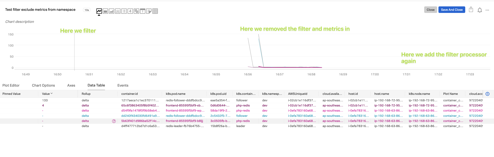

#My setup
- Using EKS EC2 Agent mode
- splunk-otel-collector-0.46.0 version

#10 Steps
1. Create EKS EC2 cluster using eksctl
Because eksctl tool will create K8s Control Plane (master nodes, etcd, API server, etc), worker nodes, VPC, Security Groups, Subnets, Routes, Internet Gateway, etc.
```bash
eksctl create cluster \
--name=jek-eks-ec2-cluster-<add a date> \
--nodegroup-name=jek-eks-ec2-workers \
--version=1.21 \
--node-type=t3.xlarge \
--nodes 2 \
--region=ap-southeast-1 \
--tags=environment=jek-sandbox \
--tags=jek-environment=sandbox \
--managed \
--dry-run
```


2. Check that the cluster is created
```bash
eksctl get cluster

aws eks describe-cluster --name jek-eks-ec2-cluster-<add a date> --region ap-southeast-1
```

3. Install Splunk OTel Collector Chart using Helm Chart in namespace `default`


4. Deploy Kubernetes official example app https://github.com/kubernetes/examples/tree/master/guestbook in namespace `dev`
```bash
# 1 Create database (redis) master pods
kubectl -n dev apply -f https://k8s.io/examples/application/guestbook/redis-leader-deployment.yaml

# 2 Create database (redis) master service
kubectl -n dev apply -f https://k8s.io/examples/application/guestbook/redis-leader-service.yaml

# 3 Create redatabase (redis)dis slave pods
kubectl -n dev apply -f https://k8s.io/examples/application/guestbook/redis-follower-deployment.yaml

# 4 Create database (redis) slave service
kubectl -n dev apply -f https://k8s.io/examples/application/guestbook/redis-follower-service.yaml

# 5 Create app (guestbook) pods
kubectl -n dev apply -f https://k8s.io/examples/application/guestbook/frontend-deployment.yaml

# 6 Create app (guestbook) service
kubectl -n dev apply -f https://k8s.io/examples/application/guestbook/frontend-service.yaml

# 7 View the app on browser at http://localhost:8080 using port forwarding
kubectl -n dev port-forward svc/frontend 8080:80

# 8 Scale to more pods
kubectl -n dev scale deployment frontend --replicas=5
```

6. Verify in Splunk O11y portal that the metrics are coming through from `dev` namespace

7. Remove metrics from dev namespace
Upgrade helm chart with these supplied values in namespace `default`.
```bash
helm upgrade <Release name> splunk-otel-collector-chart/splunk-otel-collector -f values.yaml
```

8. Verify in Splunk O11y portal that the metrics are NOT coming through from `dev` namespace
```
My personal testing note. 
v1 ... v5 notes not taken... This is a good reminder to take notes with every config change.

v6 - try not having agent config instead cluster receiver.
Expect dev no metrics, kube-system has metrics.
Assert dev has metrics, kube-system has metrics. 
Hence this means that need to add filter to both cluster receiver and agent.

v7 - Remove metrics/agent:
Expect dev no metrics, kube-system has metrics.
Assert dev no metrics, kube-system has metrics.
Hence this means that we don't need metrics/agent

v8 - Remove metrics/collector
Expect dev no show in infrastructure map
Assert dev no show in infrastructure map
hence can remove metrics/collector

v9 - remove cluster receiver config to see if dev will show
Expect dev to show in infrastructure map
Assert dev showed in infrastructure map
hence it seemed to sad it is working

v10 - add back cluster receiver config and
Expect dev no show in infrastructure map
Assert dev no show in infras map
Hence it seemed to be correct the config

v11 - remove agent config and
expect dev container cpu metrics to come in
assert dev container cpu metrics to come in
Hence settings correct

v12 - add agent config
expect dev container cpu metrics to not show
assert dev container cpu metrics to now show
Hence the settings correct
```

9. Clean up Kubernetes official example app
```bash
# Delete all
kubectl delete deployment -l app=redis
kubectl delete service -l app=redis
kubectl delete deployment frontend
kubectl delete service frontend
```

10. Clean up EKS EC2 using eksctl
```bash
# View the eks cluster name
eksctl get cluster

# Delete the EKS cluster
eksctl delete cluster jek-eks-ec2-cluster-<the date>
```

#Misc

- Ref: https://github.com/signalfx/splunk-otel-collector-chart
- Proof: 
- Proof: 
- Last updated: 29 Mar 2022
