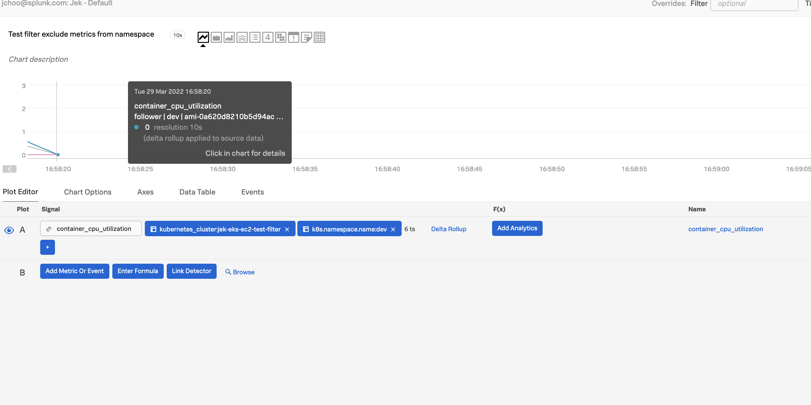

#My setup


#N Steps
1. Create EKS EC2 cluster using eksctl
Because eksctl tool will create K8s Control Plane (master nodes, etcd, API server, etc), worker nodes, VPC, Security Groups, Subnets, Routes, Internet Gateway, etc.
```bash
eksctl create cluster \
--name=jek-eks-ec2-cluster-<add a date> \
--nodegroup-name=jek-eks-ec2-workers \
--version=1.21 \
--node-type=t3.xlarge \
--nodes 2 \
--region=ap-southeast-1 \
--tags=environment=jek-sandbox \
--tags=jek-environment=sandbox \
--managed \
--dry-run
```


2. Check that the cluster is created
```bash
eksctl get cluster

aws eks describe-cluster --name jek-eks-ec2-cluster-<add a date> --region ap-southeast-1
```

3. Install Splunk OTel Collector Chart using Helm Chart in namespace `default`


4. Deploy Kubernetes official example app https://github.com/kubernetes/examples/tree/master/guestbook in namespace `dev`
```bash
# 1 Create database (redis) master pods
kubectl -n dev apply -f https://k8s.io/examples/application/guestbook/redis-leader-deployment.yaml

# 2 Create database (redis) master service
kubectl -n dev apply -f https://k8s.io/examples/application/guestbook/redis-leader-service.yaml

# 3 Create redatabase (redis)dis slave pods
kubectl -n dev apply -f https://k8s.io/examples/application/guestbook/redis-follower-deployment.yaml

# 4 Create database (redis) slave service
kubectl -n dev apply -f https://k8s.io/examples/application/guestbook/redis-follower-service.yaml

# 5 Create app (guestbook) pods
kubectl -n dev apply -f https://k8s.io/examples/application/guestbook/frontend-deployment.yaml

# 6 Create app (guestbook) service
kubectl -n dev apply -f https://k8s.io/examples/application/guestbook/frontend-service.yaml

# 7 View the app on browser at http://localhost:8080 using port forwarding
kubectl -n dev port-forward svc/frontend 8080:80

# 8 Scale to more pods
kubectl -n dev scale deployment frontend --replicas=5
```

6. Verify in Splunk O11y portal that the metrics are coming through from dev namespace

7. Remove metrics from dev namespace
Update helm chart with these supplied values in namespace `default`.

8. Verify in Splunk O11y portal that the metrics are NOT coming through from dev namespace


N. Clean up Kubernetes official example app
```bash
# Delete all
kubectl delete deployment -l app=redis
kubectl delete service -l app=redis
kubectl delete deployment frontend
kubectl delete service frontend
```

N + 1. Clean up EKS EC2 using eksctl
```bash
# View the eks cluster name
eksctl get cluster

# Delete the EKS cluster
eksctl delete cluster jek-eks-ec2-cluster-<the date>
```

#Misc

- Ref: https://github.com/signalfx/splunk-otel-collector-chart
- Proof: 
- Last updated: 15 Feb 2022