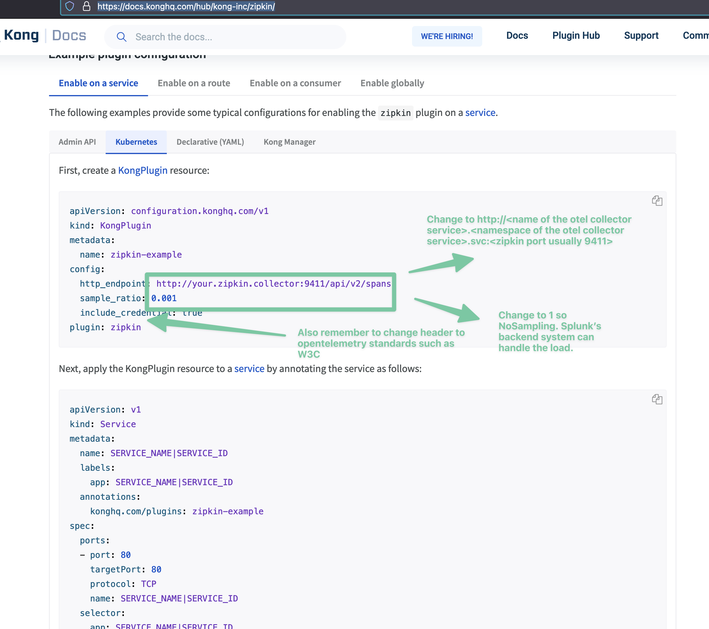

# For Kong EE v2 to enable Zipkin plugin

- If you are using Kong EE v2, then Zipkin plugin is the option for traces https://docs.konghq.com/hub/kong-inc/zipkin/.
    - Because OpenTelemetry plugin is available for Kong EE v3.
- If you are using Kong EE v3, then OpenTelemetry plugin is the option and future for traces.

# Before enabling Zipkin plugin for Kong EE v2

- Make sure to install splunk-otel-collector-chart
- When installing splunk-otel-collector-chart remember to select gateway mode.
```bash
helm install --set cloudProvider='aws' --set distribution='eks' --set splunkObservability.accessToken='<the token redacted>' --set clusterName='jek-eks-ec2-cluster' --set splunkObservability.realm='<the realm redacted>' --set splunkObservability.logsEnabled='true' --generate-name splunk-otel-collector-chart/splunk-otel-collector --set splunkObservability.profilingEnabled='true' --set gateway.enabled='true' --set gateway.replicaCount=2 --set gateway.resources.limits.cpu=2 --set gateway.resources.limits.memory=4Gi
```
- Or if using terraform in the main.tf add
```javascript
// gateway.enabled is required to create a service
set {
    name = "gateway.enabled"
    value = "true"
}

// default is 3. Feel free to increase or decrease.
// If you are using the default then don't need to add gateway.replicaCount
// Remember to have N +1 redundancy. 
set {
    name = "gateway.replicaCount"
    value = 3
}

// default is 4.
// Feel free to increase or decrease.
// If you are using the default then don't need to add this set value
// However, the ratio is always 1 cpu to 2Gi of memory. So increasing this always requires increasing memory
set {
    name = "gateway.resources.limits.cpu"
    value = 4
}

// default is 8Gi. 
// Feel free to increase or decrease.
// If you are using the default then don't need to add this set value
// However, the ratio is always 1 cpu to 2Gi of memory. So increasing this always requires increasing cpu
set {
    name = "gateway.resources.limits.memory"
    value = 8Gi
}
```

# Enabling splunk-otel-collector gateway mode would create a service

- Test the service assuming it is in namespace splunk-system
```bash
kubectl get services -n splunk-system
```
If the service name is called splunk-otel-collector then create a tmp pod to send traces to the service through Zipkin port 9411.

```bash
kubectl create ns tmp

kubectl run tmp --image=nginx:alpine -n tmp

kubectl exec -n tmp -it tmp -- curl -OL https://raw.githubusercontent.com/openzipkin/zipkin/master/zipkin-lens/testdata/yelp.json

kubectl exec -n tmp -it tmp -- curl -v -X POST http://splunk-otel-collector.splunk-system.svc:9411 -H'Content-Type: application/json' -d @yelp.json
```

# Enable Zipkin plugin

- Follow this guide to enable Zipkin plugin https://docs.konghq.com/hub/kong-inc/zipkin/
- What to end for http_endpoint using `http://<name of the service>.<namespace of the service>.svc:<zipkin port>` 
    - e.g. `http://splunk-otel-collector.splunk-system.svc:9411`
- After that set the config such as `config.header_type` and `config.default_header_type` to `w3c` for consistency with OpenTelemetry standards.
It should look like this for the sample
```yml
apiVersion: configuration.konghq.com/v1
kind: KongPlugin
metadata:
  name: zipkin-example
config: 
  http_endpoint: http://splunk-otel-collector.splunk-system.svc:9411
  header_type: w3c
  default_header_type: w3c
  sample_ratio: 1
  include_credential: true
plugin: zipkin

```
