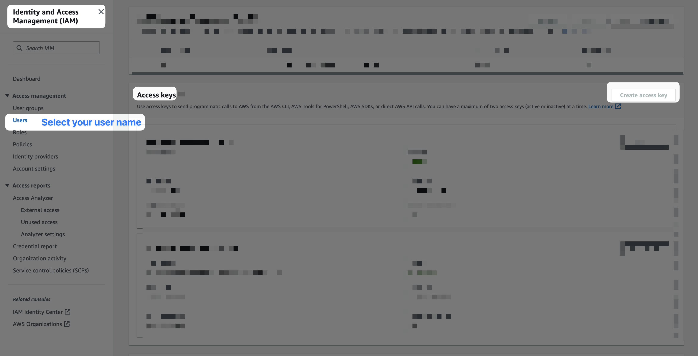
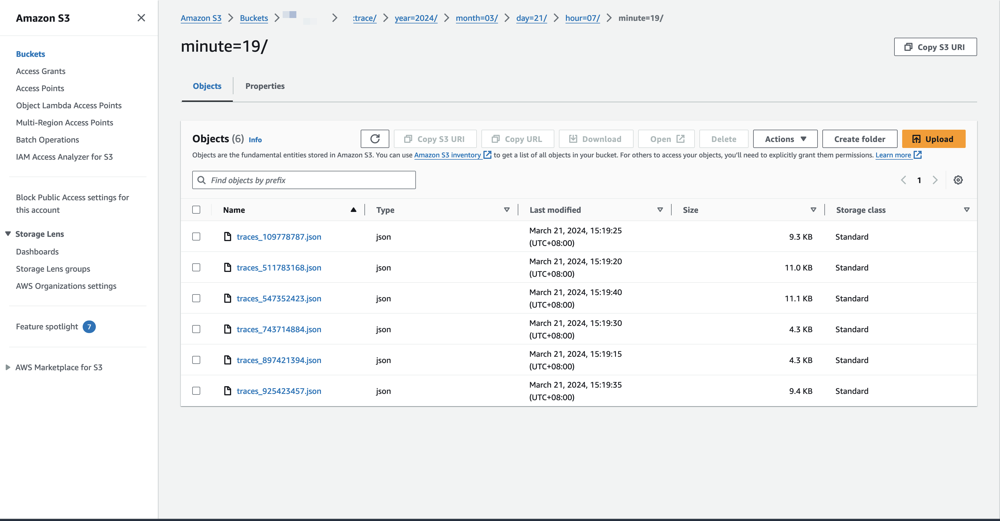

# Create your AWS S3 bucket. 
Try to adhere to S3 bucket naming rules https://docs.aws.amazon.com/AmazonS3/latest/userguide/bucketnamingrules.html

# Create your AWS access key



# Add Splunk realm and access token to values.yaml

```
# Add your Splunk realm, access cloud, AWS ACCESS ID, AWS ACCESS KEY, and AWS S3 Bucket name to values.yaml

kubectl create ns splunk-monitoring

helm install otel-to-s3 splunk-otel-collector-chart/splunk-otel-collector -n splunk-monitoring --values values.yaml
```

# Deploy sampleapp

```
kubectl apply -f sampleapp.yaml

kubectl get deployment sample-app

kubectl port-forward deployment/sample-app 3009:8080

# Invoke success
curl http://localhost:3009/greeting

# Invoke general
curl http://localhost:3009/jek-server-error

# View the logs to verify
kubectl logs deployment/sample-app
```

# Proof
