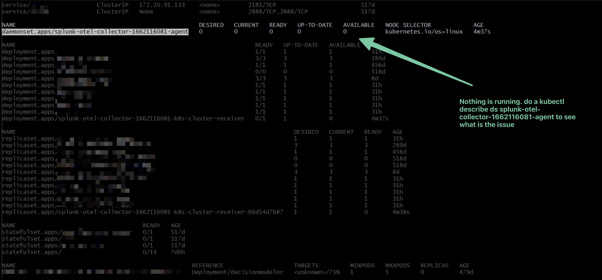
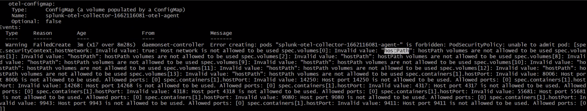
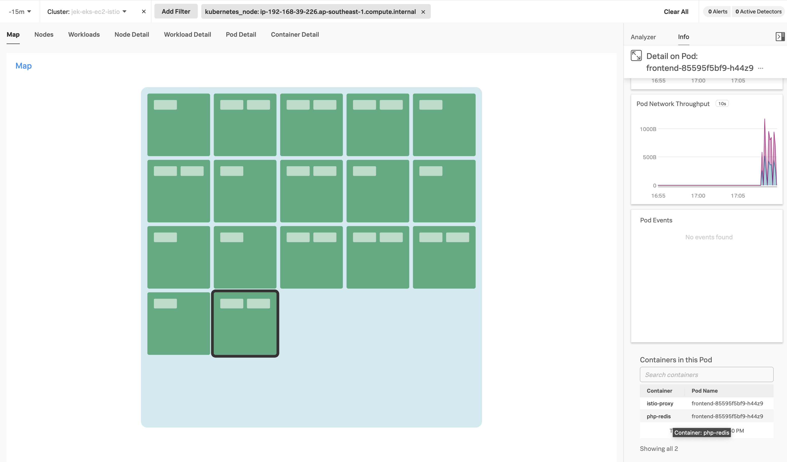

# EKS EC2 Cluster Setup Guide

This guide walks through setting up an Amazon EKS cluster with EC2 worker nodes, including the deployment of a sample application and Splunk OpenTelemetry Collector.

## Prerequisites (if using KMS Key for SSH)

### KMS Key Setup
1. Create a KMS key in AWS KMS (if you don't already have one) via the AWS Management Console or AWS CLI:
   ```bash
   aws kms create-key --description "EKS Secret Encryption Key"
   ```
   Note the KeyId from the output.

## Cluster Creation and Configuration

### 1. Create EKS EC2 Cluster
Use eksctl to create the Kubernetes Control Plane (master nodes, etcd, API server) and supporting infrastructure (worker nodes, VPC, Security Groups, Subnets, Routes, Internet Gateway).

Using CLI parameters:
```bash
eksctl create cluster \
  --name=jek-eks-ec2-cluster \
  --nodegroup-name=jek-eks-ec2-workers \
  --version=1.29 \
  --node-type=t3.large \
  --nodes 2 \
  --region=ap-southeast-1 \
  --tags=Env=test \
  --tags=Criticality=low \
  --tags=Owner=email@email.com \
  --managed \
  --dry-run
```

Alternatively, using a configuration file:
```bash
eksctl create cluster -f ./eks-config.yaml --dry-run
```

### 2. Verify Cluster Creation
Check cluster status:
```bash
eksctl get cluster

aws eks describe-cluster --name jek-eks-ec2-cluster-<add a date> --region ap-southeast-1
```

### 3.Verify encryption configuration (if using KMS Key for SSH)
Verify encryption configuration:
```bash
kubectl get storageclasses
```
You should see that the default storage class is using "secretbox" as the encryption provider.

Test secret encryption:
```bash
kubectl create secret generic test-secret --from-literal=password=mysecretpassword
kubectl get secret test-secret -o yaml
```
The output should show that the secret data is encrypted. This confirms that all Kubernetes secrets in your EKS cluster are encrypted at rest using your specified KMS key.

### 3. Install Splunk OTel Collector Chart
(Section to be completed)

## Sample Application Deployment

### 4. Deploy Kubernetes Guestbook Example
Follow these steps to deploy the official Kubernetes example application from [GitHub](https://github.com/kubernetes/examples/tree/master/guestbook):

1. Create Redis master deployment:
   ```bash
   kubectl apply -f https://k8s.io/examples/application/guestbook/redis-leader-deployment.yaml
   ```

2. Create Redis master service:
   ```bash
   kubectl apply -f https://k8s.io/examples/application/guestbook/redis-leader-service.yaml
   ```

3. Create Redis follower deployment:
   ```bash
   kubectl apply -f https://k8s.io/examples/application/guestbook/redis-follower-deployment.yaml
   ```

4. Create Redis follower service:
   ```bash
   kubectl apply -f https://k8s.io/examples/application/guestbook/redis-follower-service.yaml
   ```

5. Create frontend deployment:
   ```bash
   kubectl apply -f https://k8s.io/examples/application/guestbook/frontend-deployment.yaml
   ```

6. Create frontend service:
   ```bash
   kubectl apply -f https://k8s.io/examples/application/guestbook/frontend-service.yaml
   ```

7. Access the application:
   ```bash
   kubectl port-forward svc/frontend 8080:80
   ```
   Visit http://localhost:8080 in your browser

8. Scale the application:
   ```bash
   kubectl scale deployment frontend --replicas=5
   ```

## Cleanup

### 5. Remove Sample Application
```bash
kubectl delete deployment -l app=redis
kubectl delete service -l app=redis
kubectl delete deployment frontend
kubectl delete service frontend
```

### 6. Delete EKS Cluster
```bash
# View cluster name
eksctl get cluster

# Delete cluster
eksctl delete cluster jek-eks-ec2-cluster-<the date>
```

## Troubleshooting

### PodSecurityPolicy (PSP) Issues



To resolve PodSecurityPolicy issues:
- Deploy the default EKS policy following the [AWS EKS documentation](https://docs.aws.amazon.com/eks/latest/userguide/pod-security-policy.html)

## References

- Splunk OpenTelemetry Collector Chart: [GitHub Repository](https://github.com/signalfx/splunk-otel-collector-chart)
- Proof of Implementation:
  

*Last updated: 15 Feb 2022*
