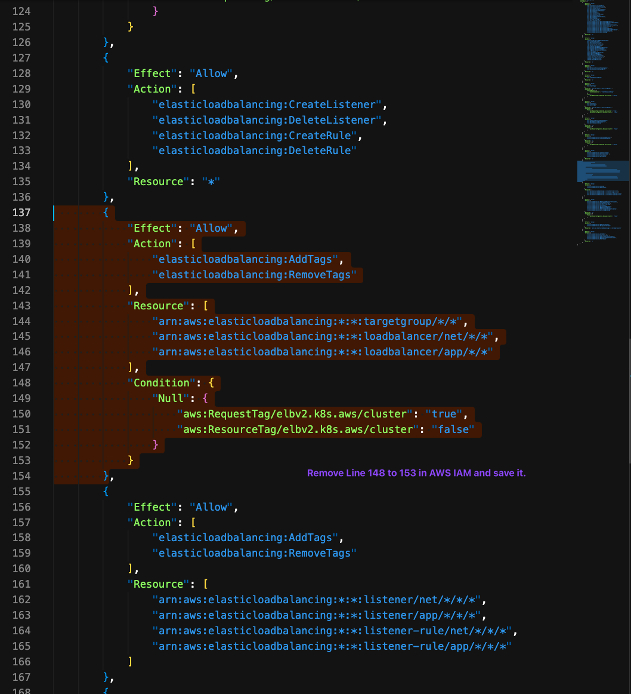
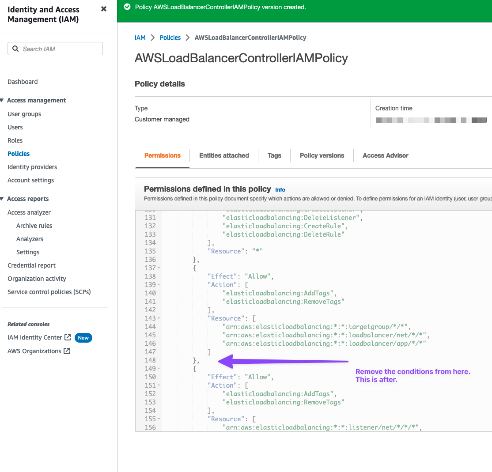
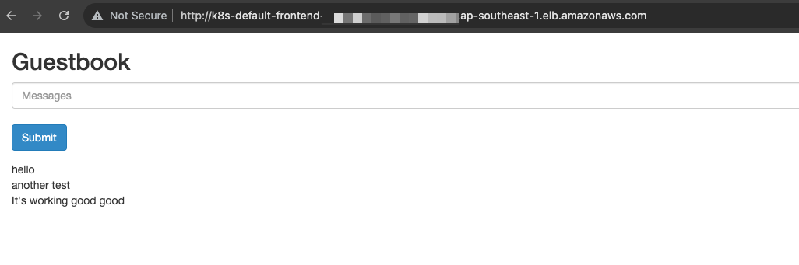

# Setup

- Create EKS Fargate cluster https://eksctl.io/usage/fargate-support/?h=fargate using EKSCLI:
```bash
# Dry Run
eksctl create cluster \
--name=jek-eks-fargate-cluster-< add a date > \
--region=ap-southeast-1 \
--tags=Owner=jek \
--tags=Criticality=low \
--tags=Env=sandbox \
--fargate \
--dry-run

# Actual
eksctl create cluster \
--name=jek-eks-fargate-cluster-< add a date > \
--region=ap-southeast-1 \
--tags=Owner=jek \
--tags=Criticality=low \
--tags=Env=sandbox \
--fargate

#
eksctl get cluster

# 
eksctl get fargateprofile --cluster jek-eks-fargate-cluster-<add a date> -o yaml

# 
eksctl get fargateprofile --cluster jek-eks-fargate-cluster-<add a date> -o json
``````

- Deploy Kubernetes official example app https://github.com/kubernetes/examples/tree/master/guestbook
```bash
# 1 Create database (redis) master pods
kubectl apply -f https://k8s.io/examples/application/guestbook/redis-leader-deployment.yaml

# 2 Create database (redis) master service
kubectl apply -f https://k8s.io/examples/application/guestbook/redis-leader-service.yaml

# 3 Create redatabase (redis)dis slave pods
kubectl apply -f https://k8s.io/examples/application/guestbook/redis-follower-deployment.yaml

# 4 Create database (redis) slave service
kubectl apply -f https://k8s.io/examples/application/guestbook/redis-follower-service.yaml

# 5 Create app (guestbook) pods
kubectl apply -f https://k8s.io/examples/application/guestbook/frontend-deployment.yaml

# 6 Create app (guestbook) service
kubectl apply -f https://k8s.io/examples/application/guestbook/frontend-service.yaml

# 7 View the app on browser at http://localhost:8080 using port forwarding
kubectl port-forward svc/frontend 8080:80

# 8 Scale to more pods
kubectl scale deployment frontend --replicas=5

# 9 Scale down the number of frontend Pods
kubectl scale deployment frontend --replicas=2

``````

- Ensure the above steps are working before proceeding. The above steps are from https://github.com/kubernetes/examples/tree/master/guestbook

- Create AWS ALB Application Load Balancer https://docs.aws.amazon.com/eks/latest/userguide/aws-load-balancer-controller.html
```bash
# Installing the AWS Load Balancer Controller add-on
curl -O https://raw.githubusercontent.com/kubernetes-sigs/aws-load-balancer-controller/v2.4.7/docs/install/iam_policy.json

# Create an IAM policy using the policy downloaded in the previous step.
# Do not worry if you encounter: 
# An error occurred (EntityAlreadyExists) when calling the CreatePolicy operation: A policy called AWSLoadBalancerControllerIAMPolicy already exists. Duplicate names are not allowed.
# This means you have it. You can skip this step.
aws iam create-policy \
    --policy-name AWSLoadBalancerControllerIAMPolicy \
    --policy-document file://iam_policy.json

# Get cluster name
eksctl get cluster

# Get VPC ID
eksctl get cluster jek-eks-fargate-cluster-< the date you set way above> -o yaml | grep VpcId

# Associate IAM OIDC Provder
eksctl utils associate-iam-oidc-provider --region=ap-southeast-1 --cluster=jek-eks-fargate-cluster-< the date you set way above > --approve

# Create the iamserviceaccount for AWS Load Balancer Controller
eksctl create iamserviceaccount \
  --cluster=jek-eks-fargate-cluster-< the date you set way above > \
  --namespace=kube-system \
  --name=aws-load-balancer-controller \
  --role-name AmazonEKSLoadBalancerControllerRole \
  --attach-policy-arn=arn:aws:iam::< your account id >:policy/AWSLoadBalancerControllerIAMPolicy \
  --approve

# helm repo add eks https://aws.github.io/eks-charts
helm repo add eks https://aws.github.io/eks-charts

# 
helm repo update eks

# 
helm install aws-load-balancer-controller eks/aws-load-balancer-controller \
  -n kube-system \
  --set clusterName=jek-eks-fargate-cluster-< the date you set way above > \
  --set serviceAccount.create=false \
  --set serviceAccount.name=aws-load-balancer-controller \
  --set region=ap-southeast-1 \
  --set vpcId=< your vpc id >

# Verify that the controller is installed and all running
kubectl get deployment -n kube-system aws-load-balancer-controller
``````

- Add the time of writing this guide, creating AWS Load Balancer Controller add-on has bugs. So there is workaround to fix it. https://github.com/aws-ia/terraform-aws-eks-blueprints-addons/issues/200

BEFORE
```json
        {
            "Effect": "Allow",
            "Action": [
                "elasticloadbalancing:AddTags",
                "elasticloadbalancing:RemoveTags"
            ],
            "Resource": [
                "arn:aws:elasticloadbalancing:*:*:targetgroup/*/*",
                "arn:aws:elasticloadbalancing:*:*:loadbalancer/net/*/*",
                "arn:aws:elasticloadbalancing:*:*:loadbalancer/app/*/*"
            ],
            "Condition": {
                "Null": {
                    "aws:RequestTag/elbv2.k8s.aws/cluster": "true",
                    "aws:ResourceTag/elbv2.k8s.aws/cluster": "false"
                }
            }
        }
```


---

AFTER
```json
        {
            "Effect": "Allow",
            "Action": [
                "elasticloadbalancing:AddTags",
                "elasticloadbalancing:RemoveTags"
            ],
            "Resource": [
                "arn:aws:elasticloadbalancing:*:*:targetgroup/*/*",
                "arn:aws:elasticloadbalancing:*:*:loadbalancer/net/*/*",
                "arn:aws:elasticloadbalancing:*:*:loadbalancer/app/*/*"
            ]
        }
```



- Add Application load balancing on Amazon EKS Fargate
```bash
# MANDATORY: Have at least one public or private subnet in your cluster VPC.

# MANDATORY: Have the AWS Load Balancer Controller deployed on your cluster. For more information, see Installing the AWS Load Balancer Controller add-on (as done above). We recommend version 2.4.7 or later.

# Delete app (guestbook) service
kubectl delete svc frontend

# Create a frontend-service.yaml
# Put this content into frontend-service.yaml
apiVersion: v1
kind: Service
metadata:
  name: frontend
  labels:
    app: guestbook
    tier: frontend
spec:
  type: NodePort
  ports:
  - port: 80
    targetPort: 80
    protocol: TCP
  selector:
    app: guestbook
    tier: frontend

# Create a modified app (guestbook) service
kubectl apply -f frontend-service.yaml

# Create a frontend-ingress.yaml
# Put this content into frontend-ingress.yaml
apiVersion: networking.k8s.io/v1
kind: Ingress
metadata:
  name: frontend
  annotations:
    alb.ingress.kubernetes.io/scheme: internet-facing
    alb.ingress.kubernetes.io/target-type: ip
spec:
  ingressClassName: alb
  rules:
    - http:
        paths:
        - path: /
          pathType: Prefix
          backend:
            service:
              name: frontend
              port:
                number: 80

# Create a ingress ALB
kubectl apply -f frontend-ingress.yaml

``````

- Get the address `kubectl get ingress`
```bash
NAME       CLASS   HOSTS   ADDRESS                                                                      PORTS   AGE
frontend   alb     *       k8s-default-frontend-XXXXXXXXXXXXXXXXXX.ap-southeast-1.elb.amazonaws.com   80      115m
``````


- View logs to see anything amiss `kubectl logs -f -n kube-system -l app.kubernetes.io/instance=aws-load-balancer-controller`

- Clean up Kubernetes official example app
```bash
#
kubectl delete ingress frontend
kubectl delete deployment -l app=redis
kubectl delete service -l app=redis
kubectl delete deployment frontend
kubectl delete service frontend

# 
helm delete aws-load-balancer-controller -n kube-system
``````

- Clean up EKS EC2 using eksctl
```bash
# View the eks cluster name
eksctl get cluster

# Delete the EKS cluster
eksctl delete cluster jek-eks-fargate-cluster-<the date>
``````

# Proof
It's using ALB to access the app

