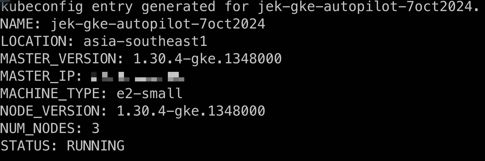
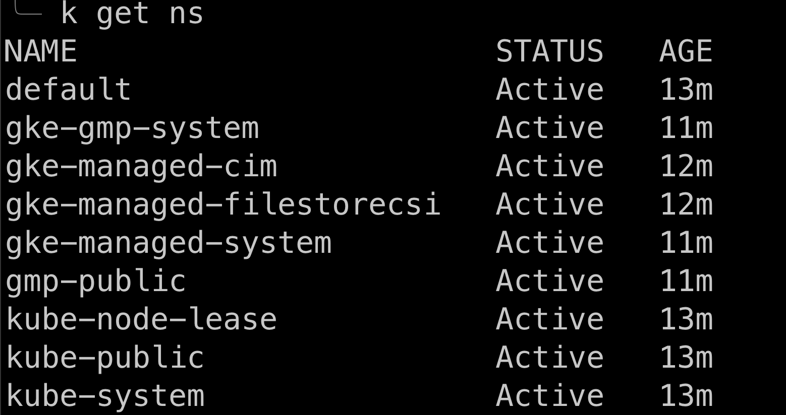
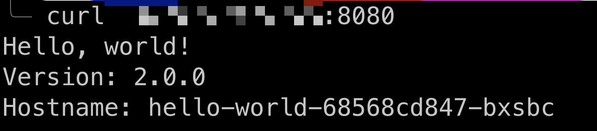

# Getting started with GCP CLI:

- Install the Google Cloud SDK: https://cloud.google.com/sdk/docs/install
`gcloud init`

- Authenticate: `gcloud auth login`

- List organisation: `gcloud organizations list`

- List project: `gcloud projects list`

- Set project: `gcloud config set project YOUR_PROJECT_ID`

- If no project then reate a project: `gcloud projects create PROJECT_ID`


# Service Accounts:

- GCP uses service accounts and credentials, not API keys

- Create service account: `gcloud iam service-accounts create jek-service-account`

- List service account: `gcloud iam service-accounts list`

- Generate key: `gcloud iam service-accounts keys create KEY_FILE --iam-account=SA_NAME@PROJECT_ID.iam.gserviceaccount.com`

# Create GKE autopilot cluster:

```bash
gcloud container clusters create-auto jek-gke-autopilot-<TODAY_DATE> \        ─╯
  --region=asia-southeast1 \
  --project=<PROJECT_ID>
```


- Check if GKE plugin: `gke-gcloud-auth-plugin --version`
- Install the GKE plugin: `gcloud components install gke-gcloud-auth-plugin`
- Verify the installation: `gke-gcloud-auth-plugin --version`
- Update the kubectl configuration to use the plugin:

```bash
gcloud container clusters get-credentials jek-gke-autopilot-<TODAY_DATE> \
    --region=asia-southeast1
```


- View cluster details: `gcloud container clusters describe jek-gke-autopilot-<TODAY_DATE> --region=asia-southeast1`
- Check node pools: `gcloud container node-pools list --cluster=jek-gke-autopilot-<TODAY_DATE> --region=asia-southeast1`

# Deploy application

Follow this guide to deploy https://kubernetes.io/docs/tutorials/stateless-application/expose-external-ip-address/

`kubectl apply -f https://k8s.io/examples/service/load-balancer-example.yaml`

`kubectl expose deployment hello-world --type=LoadBalancer --name=my-service
`

`kubectl get services my-service`

`kubectl describe services my-service`

`curl http://<external-ip>:<port>`



# Install OTel Collector Chart

`helm repo add splunk-otel-collector-chart https://signalfx.github.io/splunk-otel-collector-chart
`

`helm repo update`

```bash
helm install splunk-otel-collector --set="cloudProvider=gcp,distribution=gke/autopilot,splunkObservability.accessToken=<_YOUR_ACCESS_TOKEN_>,clusterName=jek-gke-autopilot-20241007,splunkObservability.realm=<_YOUR_REALM_>,gateway.enabled=false,environment=jek-sandbox" splunk-otel-collector-chart/splunk-otel-collector
```

## Increase the priority

- https://cloud.google.com/kubernetes-engine/docs/how-to/deploying-workloads-overview#daemons

- Sometimes Splunk OTel Collector agent daemonset can have problems scheduling in Autopilot If you run into these issues, you can assign the daemonset a higher priority class, this will make sure that the daemonset pods are always present on each node https://github.com/signalfx/splunk-otel-collector-chart/blob/main/docs/advanced-configuration.md#gke-autopilot-support.

- Create a new priority class for Splunk OTel Collector agent:

```bash
cat <<EOF | kubectl apply -f -
apiVersion: scheduling.k8s.io/v1
kind: PriorityClass
metadata:
  name: splunk-otel-agent-priority
value: 1000000
globalDefault: false
description: "Higher priority class for Splunk OpenTelemetry Collector pods."
EOF
```

- Use the created priority class in the helm install/upgrade command: with `--set="priorityClassName=splunk-otel-agent-priority"` cli argument or add the following line to your custom values.yaml:

```yml
priorityClassName: splunk-otel-agent-priority
```

or 

```bash

helm install splunk-otel-collector --set="cloudProvider=gcp,distribution=gke/autopilot,splunkObservability.accessToken=<_YOUR_ACCESS_TOKEN_>,clusterName=jek-gke-autopilot-20241007,splunkObservability.realm=<_YOUR_REALM_>,gateway.enabled=false,environment=jek-sandbox,priorityClassName=splunk-otel-agent-priority" splunk-otel-collector-chart/splunk-otel-collector
```


# Delete OTel Collector Chart

```bash

helm uninstall otel-collector

```


# Delete application

`kubectl delete services my-service`

`kubectl delete deployment hello-world`

# Delete GKE autopilot cluster

- List project: `gcloud projects list`

```bash
gcloud container clusters delete jek-gke-autopilot-<TODAY_DATE> \
  --region=asia-southeast1 \
  --project=<PROJECT_ID>
```

- List clusters: `gcloud container clusters list --project=<PROJECT_ID>`

- List compute resources: `gcloud compute instances list --project=<PROJECT_ID>`

- List network resources: `gcloud compute networks list --project=<PROJECT_ID>`