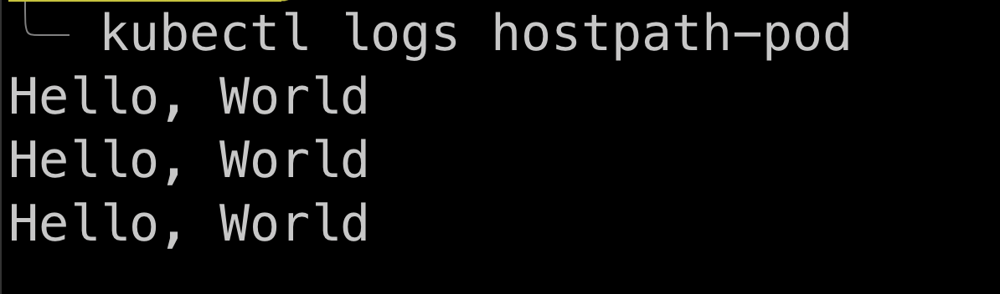
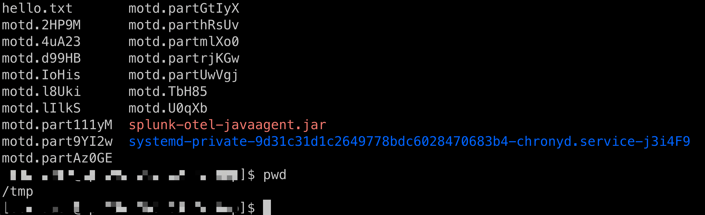
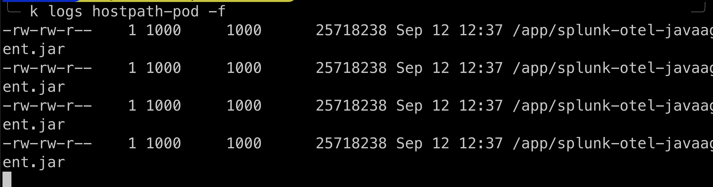

# Testing hostPath volume type

SSH into your K8s node local machine run: `echo "Hello, World" > /tmp/hello.txt`

--

In another terminal, run:

```bash
kubectl get nodes -o wide
```

In test.yaml change the node name to the node where you ran the above command. Then change the node name:

```yml
  nodeSelector:
    kubernetes.io/hostname: <your-node-name>
```

Then in that 2nd terminal (not the SSH terminal) deploy the app:

```bash
kubectl apply -f test.yaml

kubectl get pods

kubectl logs hostpath-pod
```



A few important notes:

- The hostPath volume type is generally not recommended for production use as it relies on the file existing at the specified path on the node.
- This method only works if the Pod is scheduled on the specific node where the file exists.
- For more flexible and production-ready solutions, consider using Persistent Volumes (PV) and Persistent Volume Claims (PVC) or other storage solutions like NFS.

---

# Now do with a javaagent app:

SSH into your K8s node local machine download the javaagent by running: 
`curl -L https://github.com/signalfx/splunk-otel-java/releases/latest/download/splunk-otel-javaagent.jar -o /tmp/splunk-otel-javaagent.jar`



In another terminal, run:

```bash
kubectl get nodes -o wide
```

In test.yaml change the node name to the node where you ran the above command. Then change the node name:

```yml
  nodeSelector:
    kubernetes.io/hostname: <your-node-name>
```

Then in that 2nd terminal (not the SSH terminal) deploy the app:

```bash
kubectl apply -f test-javaagent.yaml

kubectl get pods

kubectl logs hostpath-pod
```



---

# Now add javaagent to Java app:


